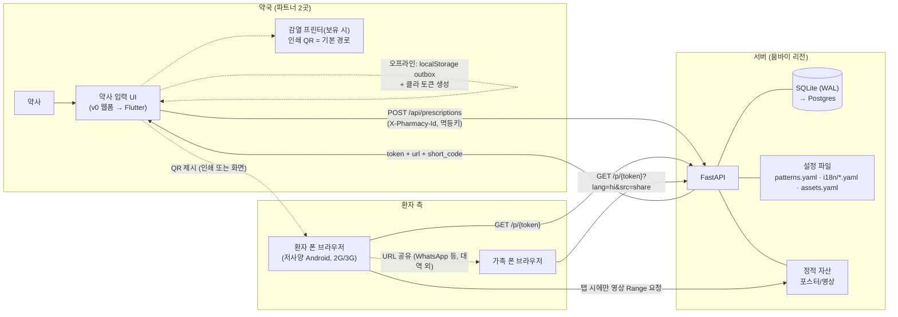
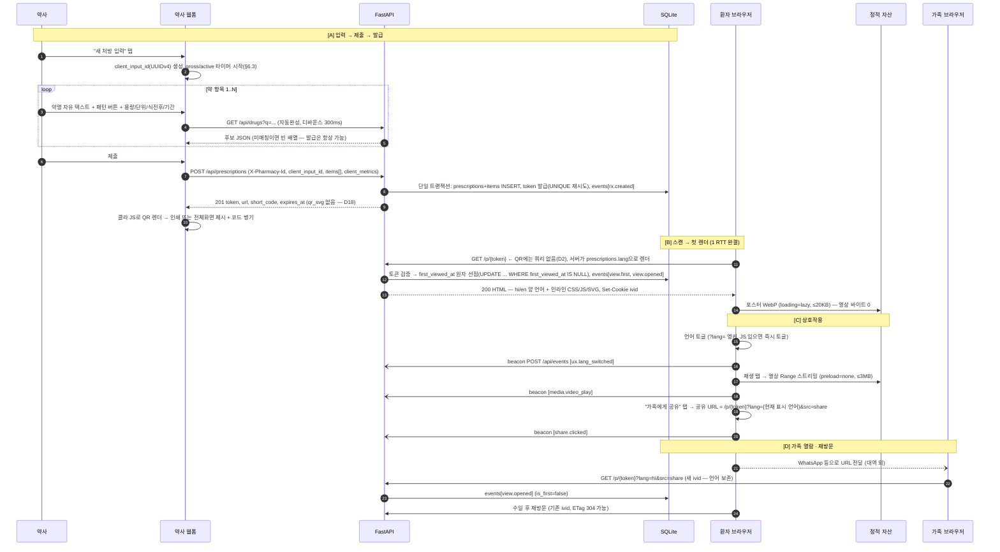
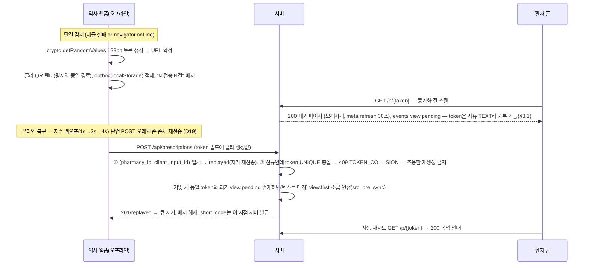
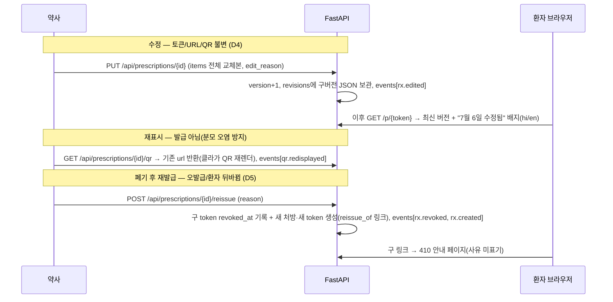
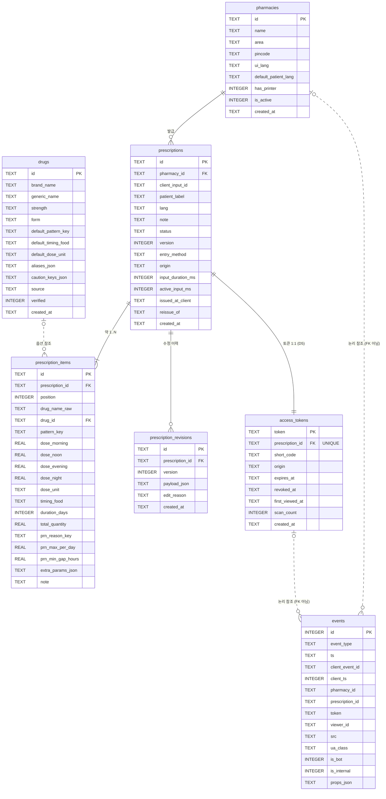
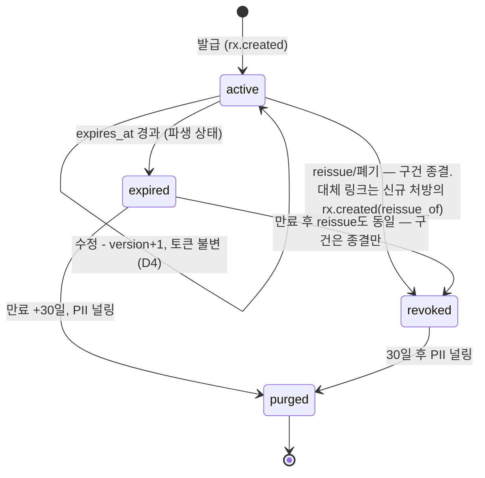

# indoro 데이터플로우 설계 v1.0

**TL;DR**

1. 관통 플로우: 약사 웹폼 입력(항목당 20~40초 목표) → `POST /api/prescriptions`(멱등) → 128-bit 토큰 URL을 **클라이언트가 QR 렌더** → 환자 스캔 → 1 RTT 서버렌더 HTML(hi/en 동봉, ≤80KB) → 가족 공유.
2. M1 KPI는 이원화: **도달률**(token당 D+7 내 최초 유효 조회 ÷ 발급, 목표 30%)과 **자가 열람률**(발급 30분 후 재열람) — 둘 다 서버 이벤트만으로 계산. 보조로 **입력률(커버리지)** 을 운영 절차로 수집.
3. 패턴·i18n·미디어 레지스트리는 DB가 아니라 **레포 내 설정 파일(YAML)** — "패턴 추가 = 파일 항목 추가". DB는 7테이블(pharmacies, prescriptions, items, revisions, access_tokens, drugs, events)로 축소.
4. 오프라인 발급은 A안 유지하되 경량화: **localStorage outbox + 클라 QR + 단건 POST 순차 재전송**(batch·service worker·IndexedDB 제거). 미존재 토큰은 200 대기 페이지.
5. reissue는 전 섹션에서 **"새 처방 + 새 토큰, 구건 종결(1:1)"** 로 통일. purge는 revisions까지 널링하되 약명 원문은 보존(잔존물 목록에 정직하게 명시).
6. QR 페이로드는 쿼리 없는 `https://{domain}/p/{token}` 만(버전 산정은 V4-M 기준). 프린터 보유 약국은 **인쇄 QR이 기본 경로**, 화면 제시는 폴백.
7. rate limit은 v0에서 `/c` 실패 경로 하나만(CGNAT 전제). ip_hash·suspect_self_scan·약사 UI 비콘·CI 게이트·커서 페이징은 전부 후순위로 이동.
8. 최우선 미결정: **파일럿 지역 확정 = 1차 언어·영상 자산 언어 확정**(힌디 벨트 여부).

---

## 1. 개요와 액터/시스템 맵

### 1.1 액터/시스템 맵



- **약사**: 수기 처방전을 보고 **항목당 20~40초** 내 구조화 입력(처방 전체가 아님 — §6.3). 기기 설정값 `pharmacy_id`로 식별(계정 없음).
- **환자/가족**: 앱 설치 없이 QR 스캔 → 모바일 웹뷰 열람. URL 소지 = 열람 권한(bearer). 저문해 전제 — 아이콘·숫자·색·음성 중심.
- **서버**: 처방 구조화 저장, 토큰 발급, 환자 HTML 렌더, 계측 이벤트의 단일 저장소. 패턴·i18n·미디어 정의는 기동 시 설정 파일에서 메모리 로드.

### 1.2 설계 원칙 (전 섹션 관통)

1. **핵심 지표는 서버측 이벤트만으로 계산** — 도달률·자가 열람률은 `GET /p/{token}` 처리 중 동기 기록으로만 산출. 클라 beacon은 보조 지표 전용(유실 허용).
2. **지표의 단위는 사람이 아니라 토큰** — 계정 없는 환경에서 사람은 식별 불가. token당 최초 유효 조회 1회 = 도달.
3. **멱등성이 곧 지표 정확성** — 재시도가 토큰을 중복 발급하면 분모가 오염된다.
4. **환자 웹뷰는 1 RTT 페인트** — 외부 블로킹 리소스 0, 영상은 탭 전 0바이트. 네트워크가 첫 응답 후 끊겨도 복약 안내는 성립.
5. **DB-optional / 패턴은 데이터** — 약명은 자유 텍스트가 정본. 패턴·언어·자산 추가는 코드 수정이 아니라 **설정 파일 항목 추가 + 재배포**.
6. **v0는 관통이 전부** — 파일럿 2곳 규모에서 측정 가능한 효과가 없는 자동화·최적화는 만들지 않는다(§9.2).

### 1.3 통합 결정 레지스터

| # | 쟁점 | 결정 | 근거 (한 줄) |
|---|---|---|---|
| D1 | 환자 라우트 경로 | **`/p/{token}`** (`/rx/` 기각) | URL이 짧을수록 QR 모듈 수가 줄어 저해상도 카메라 스캔 성공률이 오른다 |
| D2 | 토큰·QR 페이로드 | **128-bit `secrets.token_urlsafe(16)`=22자. QR에는 쿼리 없는 `https://{domain}/p/{token}`만 인코딩** | V3-M byte 용량은 42바이트 — 도메인이 아주 짧아야 경계선이므로 **설계는 V4-M(62바이트) 기준**으로 여유 확보. `?lang=`은 QR에서 제외(서버가 `prescriptions.lang`으로 기본 렌더) |
| D3 | short_code | **Crockford Base32 8자(40-bit), 표시 `K7F3-9Q2M`, 전 기간 재사용 금지** | 6자(30-bit)는 동일 rate limit에서 적중 기대가 약 1,000배라 기각 |
| D4 | 처방 수정 정책 | **토큰·URL 불변 + 버전 업, 렌더는 항상 최신** | 정정 전 용량이 구 링크에 잔존하는 것이 최악의 실패 모드 |
| D5 | 폐기(오발급) | **reissue = 새 처방 + 새 토큰 생성, 구 처방·구 토큰은 종결(410). 처방:토큰 = 1:1** | 접근 차단이 필요한 상황이며, 1:1이어야 파생 status 정의가 성립(§5.2) |
| D6 | TTL | **`expires_at = max(30일, max(duration_days)+7일)`, 상한 90일** | "최소 1개월" 충족 + 복용 중 링크 사망 방지 + DPDP 보존 최소화 |
| D7 | 오프라인 발급 | **A안 경량판: 클라 128-bit 토큰 사전생성 + localStorage outbox + 클라 QR 렌더** (SW·IndexedDB 제외) | 복구 후 발급(C안)은 환자 이탈 = 영구 미도달로 KPI 직접 훼손. SW는 v0 최대 디버깅 비용 축 |
| D8 | 미존재 토큰 응답 | **200 대기 페이지(30초 자동 재시도)** — 미존재/동기화 대기 구분 없음 | A안 구조상 서버가 둘을 구분 불가 + 토큰 존재 여부가 열거 공격에 미노출 |
| D9 | PK | **UUIDv7 TEXT**, `events.id`만 INTEGER | 시간 정렬 인덱스 지역성 + 클라 선발급 멱등 + 표준성 |
| D10 | 멱등키 | **`client_input_id`(UUIDv4), 폼 오픈 시 생성**, `UNIQUE(pharmacy_id, client_input_id)` | 더블탭·타임아웃 재전송·오프라인 재업로드가 전부 같은 키를 공유 |
| D11 | 이벤트 네이밍 | **`영역.동작` 네임스페이스** (`rx.created`, `view.first` …) | 개방 어휘 확장과 이벤트 사전 관리에 유리 |
| D12 | 언어 전환 | **hi/en 양 언어 HTML 동봉 + `?lang=` 앵커 링크 기본, JS 있으면 즉시 토글. 공유 URL에는 현재 언어를 `?lang=`으로 포함** | JS 꺼진 환경에서도 전환 성립 + 가족에게 언어가 보존됨 |
| D13 | 환자 메타 수집 | **`patient_label`(선택 별칭)만. 나이대·성별·전화번호 미수집** | 렌더에 필수가 아닌 필드는 만들지 않는 것이 DPDP 최소수집의 구현체 |
| D14 | 식전후 | **패턴과 독립 축(`timing_food`)** | 같은 BD라도 식전/식후가 갈리므로 결합하면 패턴 수 폭발 |
| D15 | 뷰어 식별 | **`ivid` 쿠키(무의미 난수 128-bit, 1년) 하나만** — ip_hash·일별 솔트·suspect_self_scan·localStorage 미러링 미도입 | KPI가 token 단위라 지표 손실 0. CGNAT로 IP 기반 판별은 어차피 무력 |
| D16 | 비콘 엔드포인트 | **`POST /api/events`, 항상 204, 환자 웹뷰 전용** | 계측 오류를 환자 웹뷰에 절대 되돌리지 않는다. 약사측 이벤트는 서버 기록으로 대체 |
| D17 | 설정 데이터 위치 | **패턴·i18n·미디어 레지스트리 = 레포 내 YAML 파일, 기동 시 메모리 로드. 런타임 쓰기가 있는 `drugs`만 DB** | 3인 팀에 원격 SQLite 편집 경로가 없음. "행 추가" 가설은 "파일 항목 추가 + 재배포"로 동일 성립 |
| D18 | QR 렌더 | **클라 JS 단일 경로(온·오프라인 공용, ~5KB 인라인). 서버 qr_svg 미생성** | 렌더 경로 2개 = 스캔 가능성 검증 2번 + 응답마다 수 KB 낭비 |
| D19 | 오프라인 업로드 | **batch API 삭제. outbox flush = 단건 POST 오래된 순 순차 재전송** | 단건 POST가 이미 멱등·수렴적이라 batch와 의미론 동일 |
| D20 | M1 KPI | **도달률(30% 목표) + 자가 열람률 이원화. 입력시간은 항목당 active 기준** | 약사 대리 스캔·카운터 인터럽트·다약제 처방이 지표를 오염시키지 않게 |
| D21 | QR 제시 방식 | **프린터 보유 약국은 인쇄 QR(약봉투 부착)이 기본, 화면 제시는 폴백** | 카운터 체류 시간 제약과 화면 반사·모아레·밝기 문제를 동시 제거 |
| D22 | Rate limit | **v0는 `/c` 실패 경로만 제한. 나머지 라우트는 무제한(후순위)** | 본토큰 보안은 엔트로피 전담 — rate limit과 "한 몸"인 것은 40-bit short_code뿐 |

---

## 2. 운영 시나리오와 핵심 E2E 시퀀스

### 2.1 카운터 운영 시나리오 (입력·제시 시점)

인도 소매 약국 카운터는 피크 시간에 1~2명이 조제·계산·응대를 동시에 수행하고, 환자 체류 시간은 계산 전후 수십 초다. **"언제 입력하고 언제 QR을 주는가"가 도구 생존을 결정**하므로 타임라인을 명시한다.

| 카운터 단계 | indoro 동작 | 근거 |
|---|---|---|
| ① 처방전 접수 | — | |
| ② 조제 (스트립 절단·봉투 담기) | **입력 시작** — 조제 대기/병행 시간을 활용. 폼은 항목 단위 저장이므로 응대 인터럽트에 안전 | 환자 앞 실시간 입력(60~120초)은 뒷줄을 밀리게 해 약사가 도구를 포기한다 |
| ②' 조제 중 | 각 스트립/봉투에 **항목 번호를 유성펜으로 기입**(1, 2, 3…) — 웹뷰 카드의 색+숫자와 대응(§3.5) | 기존의 "스트립에 1-0-1 볼펜 기입" 관행에 얹는 것이라 교육 비용 낮음 |
| ③ 계산 | 제출 → 발급 완료 화면(항목별 번호 재표시 + QR) | |
| ④ 약 전달 | **QR 제시**: (a) 프린터 보유 → 인쇄 QR(ECC Q, ≥2cm)을 약봉투에 부착 — **기본 경로**. (b) 프린터 없음 → 태블릿 화면 전체화면 제시 — 폴백 | 인쇄 QR은 환자가 카운터를 떠난 뒤에도 스캔 기회가 유지됨 |

- 온보딩 체크리스트에 **감열/라벨 프린터 보유 여부**를 포함하고, 보유 약국은 인쇄 경로를 M1 기본으로 운영한다(연동 방식은 미결정 §10-3).
- "환자가 카운터에 서서 기다려주는가"는 검증되지 않은 전제이므로, 화면 제시 약국의 스캔 실패·이탈은 첫 주에 집중 관찰한다(§2.4 스캔 실패 계측).

### 2.2 메인 플로우: 입력 → 발급 → 스캔 → 열람 → 공유 → 재방문



### 2.3 오프라인 발급 (A안 경량판)

**실행 전제 (온보딩 요구사항으로 문서화)**:
- 약사 기기는 **Chrome 최신 + SIM(모바일 데이터) 탑재 기기**로 지정 — Wi-Fi 전용 태블릿 금지(약국 브로드밴드 단독 장애 시 outbox가 장시간 flush되지 못해 환자가 대기 페이지에 갇히는 시나리오 차단).
- 폼 초기화 시 `crypto.getRandomValues` 존재를 확인하고, **미존재면 오프라인 발급 기능을 비활성화**하고 "복구 후 발급"(C안)으로 폴백한다. **`Math.random` 폴백 금지**(코드리뷰 기준 — D2의 엔트로피 전제가 조용히 붕괴하는 유일한 경로).
- 운용 수칙: **"폼 탭을 닫지 마세요"** — SW 없는 v0에서 오프라인 중 브라우저 재시작 = 신규 발급 불능(감수 리스크 §7.4-3', 근본 해법은 Flutter 로컬 영속 §10-11).



- **토큰 충돌 처리(중요)**: 409 시 클라가 조용히 토큰을 재생성하지 않는다 — 그 QR은 이미 환자에게 제시된 상태이므로, 재생성은 "이미 환자 손에 있는 약속을 깨는" 행위다(short_code 사전 생성을 기각한 것과 같은 근거). 409 건은 **약사 확인 목록**에 올리고 "환자 재스캔 필요(신규 발급)" 절차를 안내한다. 단, 128-bit 공간에서 실충돌 확률은 0에 수렴하므로 이 경로는 사실상 방어적 코드다(발생 시 클라 RNG 결함 신호로 취급해 조사).
- short_code는 **사전 생성하지 않는다**(40-bit 공간의 클라 충돌은 실확률이 있다). 오프라인 건은 QR 전용, 화면 표기는 "QR만" 모드(§10-9).
- 약사 교육 스크립트에 포함: 대기 페이지를 만난 환자에게는 **"지금 안 열리면 집에서 다시 열어보세요"** 를 구두 안내 — 저문해 사용자는 첫 실패를 재시도하지 않는다.

### 2.4 수정 / 재표시 / 폐기 재발급



최초 발급 성공 이동은 `/rx/{id}/qr?from=issue`를 사용한다. QR 화면은 이 일회성 표지를 즉시 `history.replaceState`로 지우고 재표시 API를 부르지 않는다. 이후 직접 재방문·새로고침에서만 `GET /api/prescriptions/{id}/qr`를 호출해 `qr.redisplayed`를 기록하므로 최초 표시가 "다시 보기" 지표에 섞이지 않는다.

### 2.5 QR 스캔 실패 사다리 (재규정)

전제 보정: "Android 9+ 기본 카메라 스캔" 가정은 타깃층에서 과대평가다 — JioPhone(KaiOS, 카메라 QR 미지원) 수천만 대, QR 인식 없는 구형/저가 Android(Lens 미설치 포함)가 상당 비율 존재한다. **스캔 불가 단말 비율 자체가 M1 실측 대상**이다.

1. 폰 카메라 앱 / Google Lens 스캔.
2. (화면 제시 시) 밝기 최대 + "크게 보기" 재시도. 인쇄 QR은 이 단계가 필요 없다(D21의 근거).
3. **코드 수동 입력 — "가족 대행 경로"로 재규정**: 홈 `GET /` = 코드 입력 폼 단일 화면(`<form method="get" action="/c">` → `GET /c?code=...`도 수용, JS 불요) → 정규화(대문자화, 하이픈·공백 제거, O→0, I/L→1) → 302 `/p/{token}?src=code`. 저문해 환자가 브라우저에 도메인을 직접 타이핑한다는 가정은 제품의 자체 전제(저문해)와 모순되므로, 이 경로는 **글을 읽는 가족이 대행하는 시나리오**로만 위치시킨다(코드 메모지/영수증 → 가족).
4. 최후: 약사 기기(staff 쿠키)로 시연 + 코드 메모지 전달 — staff 조회는 first_view를 소모하지 않음(§6.3).

**스캔 불가 단말 대응(신규)**:
- 발급 완료 화면에 **"스캔 실패" 원탭 기록** 버튼(사유 4택: 폰에 카메라QR 없음 / 카메라 고장 / 피처폰 / 거부) → `POST /api/prescriptions/{id}/scan-failure` → 서버가 `events[scan.failed]` 기록. 온보딩 첫 주 집중 계측으로 스캔 불가 단말 비율을 실측한다.
- 약사가 자기 기기의 공유 시트/wa.me로 환자·가족의 WhatsApp에 링크를 직접 전송하는 옵션은 **전화번호 미수집 원칙과의 트레이드오프**이므로 미결정 사항으로 상정(§10-2) — 채택 시에도 번호는 서버에 미저장.

도달률 분자는 유입 수단과 무관한 "최초 유효 조회"로 정의하고, `src`(qr/code/share/direct/pre_sync)는 분해 지표로만 본다 — QR가 실제 병목인지 검증하는 것 자체가 M1 학습 목표.

---

## 3. 데이터 모델

### 3.1 공통 규약

- **DB 테이블은 7개뿐**: `pharmacies, prescriptions, prescription_items, prescription_revisions, access_tokens, drugs, events`. 패턴 정의·i18n 문자열·미디어 레지스트리는 **레포 내 설정 파일**(§3.4, D17) — 런타임에 아무도 쓰지 않는 데이터를 DB에 넣지 않는다.
- PK는 **UUIDv7 TEXT**(D9). 예외: `events.id` INTEGER, `access_tokens.token` 자체가 PK.
- 시각은 전부 TEXT ISO-8601 **UTC `Z`**, 앱 레이어가 값 주입(SQLite `CURRENT_TIMESTAMP` 미사용 — Postgres `timestamptz` 무손실 전환). 리포트 일자만 IST(+5:30) 해석.
- bool = INTEGER 0/1, JSON = `*_json` TEXT + `json_valid()` CHECK. Alembic을 첫 커밋부터. `PRAGMA foreign_keys=ON`을 engine connect 이벤트에서 강제. `journal_mode=WAL`.
- ON DELETE: `prescription_items`·`access_tokens`·`prescription_revisions` → CASCADE.
- **`events`는 FK를 갖지 않는다** — `token`·`prescription_id`·`pharmacy_id`는 자유 TEXT 컬럼. 이유: `view.pending`(미존재 토큰), `view.invalid`(오입력 코드), pre_sync 소급 대상은 모두 `access_tokens`에 **아직 없거나 영원히 없는** 토큰으로 INSERT되어야 하므로 FK로는 성립 불가. 유효 토큰과의 결합은 리포트 시점 LEFT JOIN, sync 커밋 시 `view.pending` 조회도 텍스트 매칭으로 수행. ERD의 점선은 논리 참조.
- **패턴 수 표기 규약**: 코어 패턴 **8종** + CUSTOM 예외 슬롯 = patterns.yaml **9항목**. 미디어 자산(영상·음성)과 "8패턴 가설" 지표는 **코어 8종 기준**(CUSTOM은 자산 없음·주의 카드).
- 환자 URL에 `pharmacy_id`·`prescription_id` 절대 미노출 — 외부 식별자는 `token` 하나뿐.

### 3.2 ERD



`prescription_items.pattern_key`·`drugs.default_pattern_key`는 DB FK가 아니라 **patterns.yaml 키 참조** — 검증은 서버가 기동 시 로드한 설정으로 수행(§4.3).

### 3.3 테이블 정의 (요점)

**pharmacies** — 온보딩 시 서버 발급 `id`(사실상 자격증명 — `X-Pharmacy-Id` 헤더로만 전송, URL·환자 payload 노출 금지), `name`, `area`+`pincode`(나중에 백필 불가한 지역 차원, 훅 H14), `has_printer`(D21 경로 결정), `ui_lang`, `default_patient_lang`, `is_active`.

**prescriptions** — 처방 헤더.

| 필드 | 설명 |
|---|---|
| `client_input_id` | 멱등키. `UNIQUE(pharmacy_id, client_input_id)` |
| `patient_label` | 선택 별칭 ≤20자, placeholder "예: R.K. / Amma", "실명을 쓰지 마세요" 도움말. 환자 웹뷰 `<title>`·og 미노출 |
| `lang` | 약사가 환자와 확인 후 확정한 초기 안내 언어. **QR URL에는 미포함(D2)** — 서버가 이 값으로 기본 렌더. 공유 URL에는 `?lang=`으로 반영 |
| `status` | `active` \| `revoked` 2종만 저장. viewed/expired는 파생(§5) |
| `version` | 수정 시 +1. 구버전은 `prescription_revisions.payload_json`으로 보관(purge 시 널링 — §8.3), 렌더는 항상 현행 테이블 |
| `entry_method` | `'manual'` 고정(OCR 훅 H8) |
| `origin` / `issued_at_client` | `online`\|`offline` + 클라 발급 시각 — 오프라인 건 코호트 산정에 사용(§6.3), `created_at`(서버 수신)과의 차 = 동기화 지연 |
| `input_duration_ms` / `active_input_ms` | gross(폼 오픈→제출) / active(30초+ 무입력 구간 제외 누적) — §6.3 |
| `reissue_of` | 재발급 체인 링크(구 처방 id) |

**prescription_items** — M/N/E/H 4슬롯 분해 저장(3슬롯 관행 "1-0-1" + QID·HS를 스키마 변경 없이 커버). `drug_name_raw`가 **진실의 원천**, `drug_id`는 장식(enrichment). `timing_food` 독립 축(D14): `before_food|after_food|with_food|empty_stomach|NULL`. `total_quantity`는 Σ슬롯×일수 자동 산출 후 약사 수정 허용(서버는 경고만).

- **`dose_unit` enum(설정 데이터로 확정)**: `tablet, capsule, ml, drop, puff, sachet, application` 7종 + i18n `unit.*` 키 + 아이콘 asset_key를 시드에 포함. 시럽은 REAL 슬롯 값을 활용해 `doses: {M:5, E:5}, dose_unit:"ml"`처럼 표현하고(계량컵/스푼 아이콘 병행), 검증 규칙에 "`dose_unit=ml`이면 `total_quantity` 단위도 ml(병 아님)"을 명시. **tablet 하드코딩 금지** — 시럽이 '1 गोली'로 렌더되는 것은 안전 사고다.
- `extra_params_json`이 패턴 고유 파라미터 슬롯(`{"day_of_week":"sun"}`, PRN의 `{"dose_per_use":1}`, CUSTOM의 `{"instructions":"...","verbal_counseling_given":true}`) — 새 패턴이 새 컬럼을 요구하지 않게 하는 확장 지점.
- **웹뷰 카드 대조 수단**: 각 item 카드는 `position` 번호를 **색+숫자 이중 부호화**(1=파랑, 2=주황…)로 크게 표시한다. 인도 조제 관행상 라벨 없는 종이봉투·절단 스트립이 흔하고 저문해 환자는 문자열 대조가 불가하므로, 약사가 조제 시 각 봉투에 같은 번호를 유성펜으로 기입하는 절차(§2.1)와 짝을 이룬다. 이 절차는 파일럿 서면 합의·교육 자료에 명시(§10-10).

**drugs** — 유일한 "설정성 DB 테이블"(런타임 쓰기 = 승격 루프가 있으므로 DB 잔류). 시드 픽스처 5~10종(**코어 8패턴 + CUSTOM 예시** 커버). `source: seed|pharmacy|curated`, `default_pattern_key` 등 프리필이 자동완성의 가치. 승격 루프: `SELECT lower(trim(drug_name_raw)), count(*) FROM prescription_items WHERE drug_id IS NULL GROUP BY 1 ORDER BY 2 DESC` — 인도 체류 중 매일 밤 상위부터 등록. 소급 매칭해도 표시 문자열은 raw라 환자 화면 불변.

**access_tokens** — 처방과 **1:1**(`prescription_id` UNIQUE). `short_code`는 NULL 허용(오프라인 건은 sync 시 발급), 전 기간 UNIQUE. §5 참조.

**events** — append-only, FK 없음(§3.1), `client_event_id` UNIQUE(비콘 재전송 중복 제거). 인덱스: `(event_type, ts)`, `(token)`, `(pharmacy_id, ts)`. 공통 컬럼 `ua_class`(android_chrome/android_webview/ios/other — 원본 UA 미저장), `is_bot`, `is_internal`. ~~ip_hash~~는 v0 미기록(D15 — 컬럼 예약만 하지 않고 아예 없음, 필요 시 추가는 events가 개방 스키마라 저비용).

### 3.4 설정 파일 3종 (구 DB 테이블 대체 — D17)

| 파일 | 내용 | 대체한 것 |
|---|---|---|
| `config/patterns.yaml` | 코어 8 + CUSTOM = 9항목. 항목당 `key, schedule_type(daily\|weekly\|alternate_days\|once\|prn\|custom), slots, display_rules(defaults 포함), icon_key, video_key, audio_key, sort_order, is_active` | dosing_patterns 테이블 |
| `config/i18n/{hi,en}.yaml` | 네임스페이스 `ui.* / pattern.{key}.name/.instruction/.voice_script / timing.* / unit.* / prn.* / caution.*`. 결측 폴백: 요청 언어 → hi → en → 키 노출(+기동 시 결측 리포트) | i18n_strings 테이블 |
| `config/assets.yaml` | `(asset_key, kind, lang, variant)` → `path, mime, duration_sec, size, checksum`. `lang='any'`(아이콘), `variant='std'\|'low'`. 폴백 체인: 요청(lang,variant) → `std` → `any` → `hi` | media_assets 테이블 |

- 서버 기동 시 로드·검증(키 참조 무결성 포함 — 깨진 참조는 기동 실패로 조기 발견). `GET /api/patterns`의 ETag = 파일 해시.
- "패턴 추가 = 행 추가" 가설은 **"파일에 항목 추가 + 재배포"** 로 동일하게 성립(코드 수정 아님). 훅 H6/H10/H11(기계가독 slot 스펙, i18n 카탈로그 분리, 자산 레지스트리+폴백)도 파일 형태로 그대로 유지된다.
- 비개발자 편집이 필요해지는 시점(지역어 확장·현지 운영자)에 DB로 승격 — §9.2.

**패턴 시드 9항목** (코어 8 + CUSTOM):

| key | schedule_type | slots | 파생 표기 | 시드 약 예 |
|---|---|---|---|---|
| OD_MORNING | daily | M | 1-0-0 | Amlodipine 5 |
| OD_NIGHT | daily | H | 0-0-0-1 | Atorvastatin 10 |
| BD | daily | M,E | 1-0-1 | Amoxicillin 500 |
| TDS | daily | M,N,E | 1-1-1 | Dolo 650 |
| QID | daily | M,N,E,H | 1-1-1-1 | 시럽 항생제(ml) |
| WEEKLY_ONCE | weekly | M (+day_of_week) | 주1회 | Vitamin D3 60K |
| STAT_SINGLE | once | M | 1회 | Albendazole 400 |
| PRN | prn | — | 필요시(SOS) | Paracetamol |
| CUSTOM | custom | — | 자유 지시문 | (테이퍼링 등) |

CUSTOM은 제출 전 "구두로 설명했습니다" 체크 필수, 웹뷰는 영상 대신 주의 카드(경고 아이콘 + "약사의 설명을 따르세요" hi/en + 원문) — 잘못된 패턴 영상 노출이 무영상보다 위험하다. **CUSTOM 비율은 M1 핵심 지표**(임계 15% 초과 = 8패턴 가설 수정 신호), 원문은 차기 패턴 후보 발굴 데이터.

`OD_NIGHT`의 초기 E(저녁) 시드와 H(밤) 라벨 불일치는 2026-07-10에 H로 통일했다. 서버 기동 시 H=0이고 E>0인 명백한 구 `OD_NIGHT` 행만 E→H로 옮기는 멱등 마이그레이션을 실행하며, E와 H가 모두 채워진 모호한 행은 현지 확인 없이 변경하지 않는다.

### 3.5 언어 협상 우선순위

1. URL `?lang=`(공유 링크·앵커 토글 — 있으면 최우선, 공유돼도 보존) → 2. 명시 토글(자기표기 "हिन्दी / English", 국기 금지) → 3. ivid 쿠키의 직전 선택 → 4. **`prescriptions.lang`(약사가 환자와 확인해 확정한 값 — QR 직스캔의 사실상 기본)** → 5. `hi`. `Accept-Language`는 미사용(인도 저가 단말 다수가 en-IN 기본 판매라 신호 가치가 없고, 4번이 항상 존재).

### 3.6 예시 JSON — 환자 웹뷰 렌더 payload (서버 내부, 조인·언어 해석·미디어 폴백 완료 상태)

```json
{
  "prescription": {
    "id": "01981fa0-5b2c-7c3e-8a11-4d9f2b7c6e10",
    "pharmacy": { "name": "Sharma Medical Store", "area": "Karol Bagh, Delhi" },
    "patient_label": "Mr. S", "lang": "hi", "version": 1,
    "status": "active", "created_at": "2026-07-06T09:12:40Z"
  },
  "access": {
    "token": "hV8s3kQxWnA9cLd3Ye7Rk2",
    "url": "https://indoro.example/p/hV8s3kQxWnA9cLd3Ye7Rk2",
    "short_code_display": "K7F3-9Q2M",
    "expires_at": "2026-08-05T09:12:40Z"
  },
  "items": [
    {
      "position": 1, "drug_name_raw": "Dolo 650",
      "drug": { "generic_name": "Paracetamol", "strength": "650 mg", "caution_keys": [] },
      "pattern": {
        "key": "TDS", "schedule_type": "daily", "slots": ["M","N","E"],
        "name": "दिन में 3 बार", "instruction": "सुबह, दोपहर और रात — हर बार 1 गोली",
        "icon_key": "pat.tds.icon",
        "video": { "url": "/static/v/tds_hi_a1b2c3.mp4", "duration_sec": 30, "size_label": "약 3MB" }
      },
      "doses": { "M": 1, "N": 1, "E": 1, "H": 0 }, "dose_unit": "tablet",
      "timing_food": "after_food", "duration_days": 5, "total_quantity": 15
    },
    {
      "position": 2, "drug_name_raw": "Pantocid 40", "drug": null,
      "pattern": { "key": "OD_MORNING", "slots": ["M"], "name": "दिन में 1 बार — सुबह", "icon_key": "pat.od_m.icon" },
      "doses": { "M": 1, "N": 0, "E": 0, "H": 0 }, "dose_unit": "tablet",
      "timing_food": "empty_stomach", "duration_days": 10, "total_quantity": 10
    }
  ],
  "i18n": { "timing.after_food": "खाने के बाद", "unit.tablet": "गोली", "ui.days_suffix": "दिन" }
}
```

- 아이콘은 **`icon_key`만 payload에 담고, Jinja 렌더 시 해당 키의 SVG를 `<symbol>`로 문서에 인라인**한다(`<use>` 재사용) — 아이콘이 별도 HTTP 요청이 되면 §4.8 "외부 요청은 포스터 1장뿐"·§7.2 요청 수 예산과 모순. assets.yaml의 icon 자산은 "서버 렌더 시 인라인 소스"다.
- item 1은 자동완성 매칭, item 2는 자유입력 미매칭 — **렌더 경로가 완전히 동일**. `drug_name_raw` + 패턴 해석만으로 인포그래픽·영상이 전부 나오는 것이 이 스키마의 핵심 성질이다. 단, 저문해 환자의 실물 대조는 문자열이 아니라 **카드 번호 ↔ 봉투 기입 번호**(색+숫자, §3.3)가 담당한다 — 라벨 없는 봉투가 표준인 조제 관행에서 문자열 일치는 보조 수단이다.
- 예시 지역을 델리로 표기했다 — **파일럿 지역과 1차 언어는 결합 결정**(§10-1)이며, 비힌디 권역(예: Bengaluru/칸나다)으로 확정되면 hi 자산 16개의 언어를 해당 주 언어로 교체한다(스키마·파일 구조는 H9~H11로 이미 수용).

---

## 4. API 계약

### 4.1 공통 규약

- 약사용 `/api/*`(JSON), 환자 라우트 `/p/*`·`/c/*`(Jinja HTML). **환자 라우트는 어떤 경우에도 JSON을 반환하지 않는다** — 404/410/429도 아이콘 중심 hi/en HTML.
- 인증 없음(v0): `X-Pharmacy-Id` 헤더로 **식별**. `/api/prescriptions*` 전체 필수. pharmacy 불일치는 403이 아닌 **404**(존재 은닉). v0.5에서 `X-Pharmacy-Key` 추가만으로 인증 승격 가능하게 헤더 자리를 잡아둔다.
- 버저닝 없음(YAGNI). 시각은 UTC `Z`, `issued_at_client`만 +05:30 허용.

**에러 envelope** (`/api/*` 공통, message는 개발자용 영문):

```json
{ "error": { "code": "VALIDATION_ERROR", "message": "items.0.pattern_key: unknown",
  "fields": [{ "path": "items.0.pattern_key", "issue": "unknown_pattern" }], "request_id": "req_8f2c1a" } }
```

| HTTP | code | 상황 |
|---|---|---|
| 400 | `MALFORMED_REQUEST` | JSON 파싱 불가, 필수 헤더 누락 |
| 404 | `NOT_FOUND` | 리소스 없음 · 타 약국 리소스 |
| 409 | `IDEMPOTENCY_CONFLICT` | 동일 멱등키 + 다른 본문 해시 |
| 409 | `TOKEN_COLLISION` | 클라 사전생성 토큰 중복 — **조용한 재생성 금지, 약사 확인 목록 + 신규 발급 절차(§2.3)** |
| 410 | `LINK_EXPIRED` · `LINK_REVOKED` | 만료/회수 |
| 422 | `VALIDATION_ERROR` | 필드 검증 실패 |
| 429 | `RATE_LIMITED` | `/c` 실패 경로 한정(§4.9) |
| 500 | `INTERNAL` | `request_id`로 로그 추적 |

### 4.2 엔드포인트 카탈로그

| 메서드 · 경로 | 용도 | 소비자 |
|---|---|---|
| `POST /api/prescriptions` | 처방 생성 + 토큰 발급 (멱등). **오프라인 outbox 재전송도 이 단건 API를 오래된 순 순차 호출(D19)** | 약사 |
| `GET /api/prescriptions` | 최근 발급 목록 — 고정 `ORDER BY created_at DESC LIMIT 20`(페이징 없음) | 약사 |
| `GET /api/prescriptions/{id}` | 상세 + 열람 현황 + **미리보기 렌더**(staff 쿠키와 무관한 내부 경로 — §6.3-4) | 약사 |
| `PUT /api/prescriptions/{id}` | 수정 = 버전 업 (토큰 불변, D4) | 약사 |
| `POST /api/prescriptions/{id}/reissue` | 폐기 후 신규 처방·신규 토큰 (구 토큰 410, D5) | 약사 |
| `GET /api/prescriptions/{id}/qr` | 재방문용 url 반환(qr_svg 없음 — 클라 렌더, D18) + `qr.redisplayed` 계측. `?from=issue` 최초 화면은 호출하지 않음 | 약사 |
| `POST /api/prescriptions/{id}/scan-failure` | 스캔 실패 사유 원탭 기록 → `events[scan.failed]` | 약사 |
| `GET /api/drugs?q=` | 약명 자동완성 — naive `lower()` LIKE, 인덱스·캐시 헤더 없음(시드 수십 행) | 약사 |
| `GET /api/patterns` | 패턴 정의 단일 소스(patterns.yaml + i18n + 자산 키 병합, ETag=파일 해시). **폼 버튼도 이 응답으로 렌더 — 클라 하드코딩 금지** | 약사·서버 |
| `GET /p/{token}` | 환자 복약 안내 HTML | 환자·가족 |
| `GET /c/{short_code}` · `GET /c?code=` | 코드 입력 → 정규화 → 302 `/p/{token}?src=code` (폼 GET 제출의 쿼리 형태 수용) | 환자·가족 |
| `GET /` | 코드 입력 폼 (JS 불요) | 가족(대행) |
| `POST /api/events` | 비콘 계측 (항상 204) — **환자 웹뷰 전용** | 환자 웹뷰 |

삭제된 것: `POST /api/prescriptions/batch`(D19 — 단건 멱등 POST 순차 재전송이 동일 의미론, §9.2로 이동), 커서 페이징 `before=`.

### 4.3 `POST /api/prescriptions`

```jsonc
// X-Pharmacy-Id: 01981f...
{
  "client_input_id": "9f1c6b2e-8a44-4c1f-b1d2-3e5a7c90d412",  // 폼 오픈 시 생성 (D10)
  "token": null,                          // 오프라인 전용: 클라 사전생성 22자. 온라인은 생략
  "issued_at_client": "2026-07-06T15:41:22+05:30",
  "lang": "hi",
  "patient_label": "Mr. S",               // 선택, ≤20자
  "items": [                              // 1..10
    {
      "position": 1,
      "drug_name_raw": "Dolo 650",        // 필수 — 자유 텍스트가 정본
      "drug_id": null,                    // 자동완성 채택 시에만
      "pattern_key": "TDS",
      "doses": { "M": 1, "N": 1, "E": 1, "H": 0 },
      "dose_unit": "tablet",              // §3.3 enum 7종
      "timing_food": "after_food",
      "duration_days": 5,
      "total_quantity": 15,
      "extra_params": null,
      "note": null
    }
  ],
  "client_metrics": {
    "input_duration_ms": 27400,           // gross: 폼 오픈→제출
    "active_input_ms": 21800,             // 30초+ 무입력 구간 제외 누적 (§6.3)
    "idle_gaps_count": 1,
    "used_autocomplete_count": 1,
    "retry_count": 0,                     // outbox/타임아웃 재전송 횟수 (이벤트 사전과 정합)
    "app_version": "v0-web"
  }
}
```

검증: `pattern_key`는 patterns.yaml 활성 항목에 존재해야 하며, `slots` 밖 슬롯 dose는 0, `daily`는 슬롯 합>0, PRN은 `extra_params.dose_per_use>0`, `prn_max_per_day>0`, `prn_min_gap_hours>0` 전부 필수, weekly는 `day_of_week` 필수, CUSTOM은 `instructions` + `verbal_counseling_given=true` 필수, `dose_unit`은 enum 7종. `drug_id`는 존재 검증만, 실패해도 무시(자유 텍스트가 항상 유효 경로). `total_quantity` 불일치는 경고만. **검증 로직 자체가 패턴 설정 파일을 읽는다** — 패턴 추가가 코드 수정이 되지 않게.

**201 응답** (멱등 replay는 200 + `"replayed": true`, 동일 token — 재시도가 새 토큰을 만들면 환자에게 링크가 두 개 생긴다):

```jsonc
{
  "id": "01981fa0-5b2c-...", "status": "active", "version": 1, "lang": "hi",
  "token": "hV8s3kQxWnA9cLd3Ye7Rk2",
  "url": "https://indoro.example/p/hV8s3kQxWnA9cLd3Ye7Rk2",   // QR 페이로드 = 이 문자열 그대로 (쿼리 없음, D2)
  "short_code": "K7F39Q2M", "short_code_display": "K7F3-9Q2M",
  "issued_at": "2026-07-06T10:11:22Z", "expires_at": "2026-08-05T10:11:22Z",
  "replayed": false
  // qr_svg 없음 — QR은 온·오프라인 공용 클라 JS 렌더 (D18)
}
```

### 4.4 `PUT /api/prescriptions/{id}` — 수정(버전 업)

본문: `items[]` 전체 교체본(부분 패치 아님 — 폼은 기존값 프리필) + `edit_reason?`. 200 응답의 token/URL은 기존 그대로. 구버전은 `prescription_revisions`에 JSON 보관, `events[rx.edited]`(version, fields_changed).

`POST /api/prescriptions/{id}/reissue`: `{ "client_input_id": "새 UUID", "reason": "wrong_patient|input_error|other", "items": [...] }` → 201 **새 처방·새 token·새 short_code**(`reissue_of` 링크), 구 토큰 즉시 410. **만료된 처방에도 허용** — 한 달 뒤 재방문 = 신규 처방으로 발급(별도 연장 API 없음, 구 처방은 어떤 경우에도 부활하지 않는다 — D5).

### 4.5 `GET /api/drugs?q=`

`q` 2자 미만은 빈 배열, limit 기본 8·최대 20. brand/generic/aliases 대소문자 무시 매칭 — **naive `lower()` LIKE로 충분**(시드 5~10행 + 파일럿 누적 수백 행, 표현식 인덱스·p95 목표·캐시 헤더는 drugs가 현지 데이터로 수백 행을 넘는 시점의 항목 — §9.2). **0건이어도 항상 200 + 빈 배열** — 이 엔드포인트는 어떤 실패로도 입력 흐름을 막지 않는다(DB-optional의 API 표현).

### 4.6 `GET /p/{token}` — 환자 웹뷰

| 상태 | 응답 |
|---|---|
| active·미만료 | **200** HTML + 계측(view.first 선점, §6.3). 최신 버전 렌더, version>1이면 수정 배지 |
| revoked | **410** HTML (사유 미표기) |
| 만료 | **410** HTML "안내가 만료되었습니다 — 약국에 문의하세요" + 약국명 + 일반 복약 안전수칙 |
| 미존재 | **200 대기 페이지** (D8) — 모래시계 + "준비하고 있어요, 잠시 후 다시" + meta refresh 30s + "계속 안 되면 약국에 문의" + `events[view.pending]` |

- 200 HTML 내용물: hi/en 양 언어 블록, 인라인 CSS(≤8KB)+JS(≤5KB 바닐라)+인포그래픽·아이콘 SVG `<symbol>` 인라인(≤15KB), 영상 poster/src 데이터 속성, `Set-Cookie: ivid`. 외부 요청은 포스터 WebP 1장뿐.
- 언어: `?lang=` 없으면 `prescriptions.lang`으로 렌더(§3.5). 공유 버튼이 생성하는 URL은 `/p/{token}?lang={현재 언어}&src=share`.
- 캐시: HTML `Cache-Control: private, no-cache` + ETag(재검증 실패 시 보유 사본 표시 허용 — 무보다 낫다). 대기/410 페이지는 `no-store`. 정적 자산은 해시 파일명 + `max-age=31536000, immutable`.
- 헤더: `Referrer-Policy: no-referrer`, `X-Robots-Tag: noindex, nofollow, noarchive`. 만료 D-3부터 "곧 만료" 배지.

### 4.7 `POST /api/events` — 비콘 (환자 웹뷰 전용)

`Content-Type: application/json` 또는 `text/plain`(sendBeacon 기본 수용). `{ "token": "...", "events": [ { "client_event_id": "uuid", "type": "media.video_play", "client_ts": ..., "props": {...} } ] }`. **token 필수**(환자 웹뷰 전용으로 좁혔으므로 토큰 없는 이벤트는 존재하지 않는다 — 약사측 이벤트는 전부 서버 기록으로 대체, §6.1). 화이트리스트 외 type·미존재 토큰·크기 초과(요청당 ≤20개, ≤2KB)는 조용히 폐기. **응답은 항상 204**. fire-and-forget — 클라측 큐잉 없음.

### 4.8 `GET /api/patterns`

patterns.yaml + i18n 라벨 + 미디어 키를 병합한 정의 목록. ETag = 설정 파일 해시(클라 캐시 갱신 판단). **약사 폼의 패턴 버튼도 이 응답으로 렌더 — 클라이언트에 패턴 하드코딩 금지.**

### 4.9 Rate limit — v0는 한 곳만 (D22)

**전제 명시: 인도 모바일망은 CGNAT(특히 Jio)가 기본이라 "IP = 사용자" 등식이 성립하지 않는다.** IP 단위 광역 제한은 공유 IP 뒤 정상 환자를 집단 차단할 수 있으므로 v0에서 채택하지 않는다.

| 대상 | 한도 | 초과 시 |
|---|---|---|
| `GET /c` 실패(코드 불일치) | **(IP, 입력 코드) 조합** 10회/10분 + 전역 실패율 알람(분당 실패 N건 초과 시 운영자 통지 — 서킷브레이커는 수동) | 429 HTML + 1초 tarpit |

- 실패 카운트만 제한하는 이유: 무차별 대입의 신호는 실패율에 있고, short_code 40-bit는 이 제한과 한 몸이다. (IP, 코드) 조합 단위라 저문해 사용자의 오타 반복이 같은 IP의 타인을 차단하지 않는다.
- 본토큰(`/p/`)은 보안을 전적으로 128-bit 엔트로피에 걸며(활성 10만 개·초당 1,000회 추측 가정에도 기대 적중 ~10²³년), 미존재 토큰도 200 대기 페이지라 **유효성 신호 자체가 새지 않는다** — rate limit 불요.
- 약국 API·drugs·events의 한도는 파트너 2곳 규모에서 조기 최적화 — §9.2로 이동(재개 트리거: 실패율 알람 반복, 약국 10곳 초과). `/api/events` 남용은 요청당 ≤20개·≤2KB 크기 제한 + 화이트리스트로 충분.
- v0에서 의도적으로 안 하는 것: CAPTCHA, WAF, HMAC URL, 디바이스 어테스테이션.

---

## 5. 토큰·상태 라이프사이클

### 5.1 토큰 정책

- **본토큰**: `secrets.token_urlsafe(16)` = 128-bit, 22자 `[A-Za-z0-9_-]`. QR 페이로드는 쿼리 없는 `https://{domain}/p/{token}`(D2) — 도메인 포함 40대 초반 바이트로 **V3-M(42바이트) 경계선**이므로 산정·자산 검증은 V4-M(62바이트, 33×33) 기준으로 하고, 실제 버전은 도메인 확정(§10-4) 후 재측정한다. DB UNIQUE + IntegrityError 시 재생성 1루프(서버 발급분). 오프라인 클라 생성분은 `crypto.getRandomValues` 16바이트 — 충돌 시 처리와 Math.random 금지는 §2.3.
- **short_code**: Crockford Base32 8자(40-bit), 표시 `K7F3-9Q2M`(하이픈·대소문자는 입력 시 무시). 활성 5만 개 기준 무작위 적중 ≈ 4.5×10⁻⁸/회, §4.9 제한 하에서 연간 기대 적중 ≈ 0.02건. **전 기간 UNIQUE·만료 후 재사용 금지** — 뒤늦게 입력된 코드가 다른 환자 처방에 닿는 사고 원천 차단. QR 페이로드에는 미포함, 화면·인쇄물 병기만.
- **토큰 = bearer, 다중 열람 허용**(훅 H4). 기기 바인딩·일회용화 금지 — 가족 공유와 사후 계정 클레임을 동시에 죽이는 역훅.
- **처방:토큰 = 1:1**(D5). 토큰은 처방을 가리키고 렌더는 항상 최신 버전(D4). 새 토큰은 **새 처방(reissue)** 에만 딸려 나온다.
- 저장은 v0 평문(URL 재표시에 필요). 완화는 짧은 TTL. 해시 저장+재표시 분리는 v1 후보로만 기록.
- 전송: HTTPS 강제 + HSTS, `Referrer-Policy: no-referrer`, 환자 페이지 외부 리소스·외부 링크 0(Referer 경유 토큰 유출 차단).

### 5.2 상태 머신 (처방·토큰 공통 — 1:1이므로 단일 머신)



- **구 처방은 어떤 전이로도 active로 돌아오지 않는다.** "만료 후 재발급"은 이 머신 밖에서 새 처방·새 토큰이 태어나는 사건이고, 구건에는 `reissue_of` 역링크만 남는다 — 파생 status(`viewed`=first_viewed_at, `expired`=expires_at)가 처방당 토큰 1개 전제로 항상 잘 정의된다.
- **저장 상태는 `active | revoked` 2종뿐.** `viewed`/`expired`는 조회 시점 계산 — cron 의존이 없어 배포 단순, 오프라인·재시작에 일관. API의 `status` 필드는 계산 결과 5종(`active|viewed|revoked|expired|purged`).
- **TTL**: `expires_at = max(30일, max(items.duration_days) + 7일)`, 상한 90일(D6). 정책 변수는 설정 파일에.
- **파기(purge)**: 만료/폐기 +30일 대상 — v0는 **스케줄러 없이 수동 실행 SQL 스크립트 1개**로 준비한다(최초 실행 시점이 첫 발급 +60일 이후라 파일럿 기간에 돌 일이 없음). 자동화는 첫 만료 코호트 도래 전(**D+50 무렵, 백로그에 날짜 명기**) 작업. 널링 범위는 §8.3. **행은 삭제하지 않는다**(지표·클레임 앵커 보존, 훅 H3).

---

## 6. 계측 설계

### 6.1 2계층 수집

| 계층 | 방식 | 이벤트 | 신뢰도 |
|---|---|---|---|
| **서버 권위** | 요청 처리 트랜잭션 내 동기 INSERT (앱 레벨 — 접근 로그 파싱 아님) | `rx.created`, `view.first`, `view.opened`, `view.pending`, `view.expired`, `view.invalid`, `rx.edited`, `rx.revoked`, `qr.redisplayed`, `scan.failed` | 유실 없음, JS 미실행·차단 무관. **도달률·자가 열람률·입력시간은 이 계층만으로 계산** |
| **클라 보조 (환자 웹뷰 전용)** | `navigator.sendBeacon('/api/events')` fire-and-forget, 미지원 브라우저는 조용히 생략(폴리필·큐 없음) | `ux.lang_switched`, `media.video_play`, `media.video_complete`, `media.audio_play`, `share.clicked` | 유실 허용 — 누락돼도 KPI 무손상 |

약사 UI측 클라 비콘(`rx.form_opened` 등)과 localStorage 비콘 큐는 **미도입** — 소비 지표가 없다(입력시간·재시도 횟수는 POST 본문 `client_metrics`에 실려 오고, "폼 열고 제출 안 함" 퍼널은 파일럿 2곳에선 약사 인터뷰가 빠르다). 약사측 계측이 필요한 것(스캔 실패)은 서버 API로 기록한다. 픽셀도 v0 미도입.

### 6.2 이벤트 사전

| event_type | 계층 | 발생 지점 | 주요 props | 지표 |
|---|---|---|---|---|
| `rx.created` | 서버 | POST 커밋 (발급과 동일 트랜잭션) | token, n_items, duration_ms, active_input_ms, idle_gaps_count, used_autocomplete_count, retry_count, patterns[], origin, **issued_at_client_utc**, reissue_of? | **도달률 분모**, 입력시간, 커버리지 추이 |
| `view.first` | 서버 | `UPDATE access_tokens SET first_viewed_at=? WHERE token=? AND first_viewed_at IS NULL`이 1행 변경에 성공한 순간. is_internal/is_bot 요청은 판정 자체를 건너뜀 | src(qr/code/share/direct/pre_sync), ua_class, lang, secs_since_issue(pre_sync는 0 클램프+원값 병기) | **도달률 분자** |
| `view.opened` | 서버 | /p 200 렌더마다 | viewer_id, is_first, src, lang | 재방문·가족 열람·**자가 열람률** |
| `view.pending` | 서버 | 대기 페이지 노출 (token은 FK 아님 — 미존재 토큰도 기록, §3.1) | — | 오프라인 발급 빈도·동기화 지연 프록시 |
| `view.expired` / `view.invalid` | 서버 | 410 / 코드 오입력 | reason | 만료 정책 적정성 |
| `rx.edited` / `rx.revoked` / `qr.redisplayed` | 서버 | 해당 API | version, reason | 정정률, 분모 오염 방지 |
| `scan.failed` | 서버 | 약사 원탭 기록 API | reason: no_qr_camera/camera_broken/feature_phone/refused | **스캔 불가 단말 비율 실측** |
| `ux.lang_switched` | 클라 | 언어 토글 | from, to | 초기 언어 적중률 |
| `media.video_play` / `media.video_complete` / `media.audio_play` | 클라 | 웹뷰 | pattern, lang, watched_pct | 영상 도달·완주율, 음성 사용률(저문해 가설) |
| `share.clicked` | 클라 | 공유 버튼 | method: webshare/whatsapp/copy | 가족 공유 가설 |

공통 컬럼: `ua_class`(원본 UA 미저장), `is_bot`, `is_internal`. (ip_hash·일별 솔트는 v0 미기록 — D15.)

### 6.3 M1 KPI

**KPI 이원화(D20)** — 인도 현장에서 약사가 저문해 환자의 폰을 받아 대신 스캔해 주는 것은 기본 응대에 가깝고, 환자 기기이므로 staff 쿠키로 걸러지지 않는다. 이를 결함이 아니라 정의로 흡수한다:

1. **도달률(reach rate) — 목표 30%**: `약국 p, 발급일 d에 발급된 토큰 중 D+7 내 비내부·비봇 최초 조회(view.first)가 발생한 고유 토큰 ÷ 발급 고유 토큰`. **약사 대리 스캔도 "링크가 환자 폰에 도달"이므로 분자에 포함**(리포트 각주 고정).
2. **자가 열람률(self-view rate)**: 도달 토큰 중, **발급 30분 경과 이후** 동일 token의 `view.opened`가 1회 이상 재발생한 비율 — 약국 밖·시간차 재방문은 대리 스캔으로 만들 수 없는 신호이며 서버 이벤트만으로 계산된다. 대리 스캔 부풀림의 보정 지표.
3. **입력률(커버리지) — 보조 KPI**: `일일 indoro 입력 건수 ÷ 일일 총 처방 조제 건수`. 분모는 시스템으로 못 잡으므로 **운영 절차로 수집** — 약국의 일일 처방 건수 수기 카운트 또는 POS 영수증 수(파일럿 서면 합의 §10-10에 협조 항목으로 포함). 이것이 없으면 "스캔해줄 것 같은 환자만 입력"하는 선택 편향으로 도달률 30%가 실제보다 쉽게 달성되고, "약사가 이 도구를 처방의 몇 %에 쓰는가"라는 선행 질문에 답할 수 없다. `/admin/metrics`의 약국별 일일 `rx.created` 추이 급락은 **약사 이탈 신호**로 모니터링.

**발급일 코호트의 시각 기준**: 오프라인 건의 `rx.created` ts는 sync 완료 시각이므로 그대로 쓰면 심야 sync 시 코호트가 하루 밀리고 D+7 윈도가 사실상 연장된다. `issued_ts = COALESCE(issued_at_client_utc, ts)`로 계산하되, 클라 시계 새니티 가드: `|issued_at_client - ts| > 48h`면 ts로 폴백.

```sql
WITH issued AS (
  SELECT e.token, e.pharmacy_id,
         CASE WHEN json_extract(e.props_json,'$.issued_at_client_utc') IS NOT NULL
                   AND abs(julianday(e.ts) - julianday(json_extract(e.props_json,'$.issued_at_client_utc'))) <= 2.0
              THEN json_extract(e.props_json,'$.issued_at_client_utc')
              ELSE e.ts END AS issued_ts
  FROM events e
  WHERE e.event_type = 'rx.created'
    AND e.token NOT IN (           -- 스캔 전 폐기(오발급) 토큰은 분모 제외
      SELECT token FROM events WHERE event_type = 'rx.revoked'
        AND token NOT IN (SELECT token FROM events WHERE event_type = 'view.first'))
),
first_views AS (
  SELECT token, MIN(ts) AS first_ts FROM events
  WHERE event_type = 'view.first' GROUP BY token   -- 기록 시점에 이미 봇·내부 배제
)
SELECT i.pharmacy_id, date(i.issued_ts, '+330 minutes') AS issue_day_ist,
       COUNT(*) AS issued_cnt, COUNT(f.token) AS reached_cnt,
       ROUND(1.0 * COUNT(f.token) / COUNT(*), 3) AS reach_rate
FROM issued i
LEFT JOIN first_views f ON f.token = i.token
      AND julianday(f.first_ts) - julianday(i.issued_ts) <= 7
GROUP BY 1, 2 ORDER BY 2, 1;
```

각주: pre_sync first_view는 `first_ts < issued_ts`(발급 전 스캔)가 가능하며 D+7 조건을 자연 충족 — 분자에 정상 포함. `secs_since_issue`는 0으로 클램프하고 원값은 props에 보존.

**분모·분자 오염 방지 장치**: ① 멱등키로 `rx.created` 중복 차단(분모 보호) ② "QR 다시 보기" = `qr.redisplayed`(발급 아님) ③ **봇 필터** — `bot|crawler|spider|curl|wget|python|WhatsApp|facebookexternalhit|TelegramBot|Googlebot|HeadlessChrome` + 빈 UA → `is_bot=1`로 **버리지 않고 플래그 저장**(재집계 가능). WhatsApp 공유 시 먼저 도착하는 링크 프리뷰 봇 차단이 핵심 ④ **staff 쿠키** — first_view를 소모하지도 가로채지도 않음 ⑤ 오프라인 소급 — sync 커밋 시 `view.pending` 텍스트 매칭으로 `src=pre_sync` 인정 ⑥ 약사 개인 폰 테스트 잔여 구멍은 파일럿 규모에서 "발급 30초 내 first_view" **사후 SQL 검수 + 서면 수칙**으로 처리(실시간 플래그·ip_hash 미도입 — D15, CGNAT 오탐 구조를 감안하면 시간 조건 단독이 더 정직하다).

**staff 쿠키 내구성**: 쿠키는 브라우저 데이터 삭제·저장공간 정리로 조용히 소실되고, 소실 사실을 아무도 모른다는 것이 문제다. 대응 2중화 — ① 약사 웹폼이 자기 origin의 staff 쿠키 존재를 주기적으로 self-check, 없으면 폼 상단 "기기 재등록 필요" 배너 + 원탭 재설정(온보딩 URL 재방문) ② 발급 직후 미리보기·QR 시연은 `/p/{token}`이 아니라 **`GET /api/prescriptions/{id}`의 미리보기 렌더**로 우회 — 쿠키가 죽어 있어도 약국 기기 조회가 환자 라우트를 아예 타지 않는다.

**입력시간 지표 (단위 정정 + 인터럽트 분리)**:
- **목표의 공식 단위는 "항목당"이다.** 인도 외래 처방은 평균 2.7~3종이므로 처방 전체 60~120초는 정상이다 — 전체 시간을 20~40초와 비교하면 다약제 처방이 전부 "미달"로 오집계된다.
- 클라 측정 2종: **gross**(`input_duration_ms`, 폼 오픈→제출, 단조시계)와 **active**(`active_input_ms`, keydown/tap 타임스탬프 버킷 합산으로 30초+ 무입력 구간 제외 — 코드 20줄 수준) + `idle_gaps_count`. 카운터 인터럽트(다른 손님·전화·조제)가 있는 실사용 패턴에서 "입력이 느린 것"과 "카운터가 바쁜 것"을 분리한다.
- **KPI = `active_input_ms / n_items`의 약국별·일자별 p50/p90, 목표 구간 20~40초.** gross−active 차이는 "카운터 혼잡 프록시"로 별도 보고. 처방 전체 gross는 "약사 점유 시간"으로 카운터 병목 판단에 사용.
- 첫 주에 `used_autocomplete_count` 교차 분석으로 **자동완성 히트 항목 vs 풀타이핑 항목의 시간 차를 분리 측정** — 시드 5~10종 상태에서는 풀타이핑이 기본이라 초기 수치는 낙관 목표 대비 높게 나올 것을 전제로 해석한다.

**열람 도구**: `/admin/metrics?key=...` 서버 렌더 표 **단일 경로**(약국×일자 도달률·자가 열람률, 입력시간 분포, src 분해, CUSTOM 비율, scan.failed 사유 분포, 커버리지 병기, 영상 재생률) — 현지에서 즉시 조회 가능해야 하므로 이쪽으로 통일. nightly Python 리포트는 admin 페이지 쿼리를 재사용할 수 있을 때만(§9.2).

### 6.4 뷰어 식별의 정직한 한계 (리포트 각주 고정)

- `ivid`(첫 렌더 시 Set-Cookie, 무의미 난수 128-bit — localStorage 미러링 없음): 같은 token+같은 ivid 반복 = 재방문, `src=share`의 새 ivid = 가장 신뢰 가능한 공유 신호, `share.clicked` 후 24h 내 새 ivid = 공유 도달 추정.
- 한계: WhatsApp 인앱 웹뷰는 Chrome과 쿠키 분리(과대집계), 가족 공용 폰(과소집계), URL 직접 복사 시 `src` 소실(공유 유입은 하한선), CGNAT로 IP 기반 판별 무의미(v0는 IP 파생 지표 자체를 만들지 않음 — D15).
- **약사 대리 스캔은 도달률 분자에 포함되며, 자가 열람률(발급 30분 후 재열람)로 보정한다.**
- **결론: 뷰어 단위 지표는 전부 "기기·브라우저 단위 근사치"로만 보고하고, M1 성공 판정은 이 한계와 무관한 token 단위 도달률 + 자가 열람률로만 한다.**

---

## 7. 실패 모드 · 오프라인 전략

### 7.1 약사 웹폼의 오프라인 생존 3요소 (A안 경량판 — D7)

1. **localStorage outbox** — 제출 payload 저장(≤20건 소형 JSON에 동기 API로 충분 — IndexedDB 불요), 복구 시 지수 백오프(1s→2s→4s, 3회 후 큐 전환) **단건 POST 오래된 순 순차 재전송**, "미전송 N건" 배지 + 24h 초과 경고.
2. **클라 QR 렌더** — 소형 JS QR 라이브러리(~5KB) 인라인. 온·오프라인 단일 경로(D18). URL 문자열만 확정되면 오프라인에서 QR을 그린다.
3. **운용 수칙** — "폼 탭을 닫지 마세요"(온보딩 교육) + Chrome 최신 + SIM 탑재 기기 지정(§2.3).

service worker app-shell은 v0 미도입 — "오프라인 상태에서 폼을 **새로** 여는" 경우에만 필요하고, 상시 탭 운용 전제에서는 없어도 A안이 성립하며, SW는 캐시 무효화·업데이트 버그로 v0 웹폼 최대의 디버깅 비용 축이다. 여유 시간이 남을 때만(§9.2).

### 7.2 환자 웹뷰 무게 예산

목표 **총 ≤80KB(gzip), 하드 상한 120KB**, 요청 수 ≤5. 3G(~400kbps) First Paint < 2.5초, 2G EDGE ~8초 내 핵심 정보 판독(서버 렌더 + 스트리밍이라 점진 표시). 예산 검증은 **로컬 수동 실행 체크 스크립트 1개**(gzip 크기 출력) — CI 게이트는 CI 자체가 생긴 뒤에(§9.2).

| 자산 | 예산(gzip) | 전략 |
|---|---|---|
| HTML(hi+en 동봉) | ≤25KB | Jinja 서버 렌더, 양 언어 텍스트는 압축 효율이 높아 비용 미미 |
| CSS | ≤8KB 인라인 | 외부 스타일시트 0. **웹폰트 0KB** — Devanagari는 Android 내장 Noto(깨짐 실측 시에만 서브셋 WOFF2) |
| JS | ≤5KB 인라인 바닐라 | 토글·비디오·beacon. JS 꺼져도 전 정보 열람 가능 |
| 인포그래픽+아이콘 | ≤15KB 인라인 SVG | `<symbol>`/`<use>` 재사용, **아이콘 포함 전부 인라인**(별도 요청 금지 — §3.6), 래스터 금지 |
| 포스터 WebP 1장 | ≤20KB | `loading=lazy`, 무언어 공용 |
| 영상 | 개당 ≤3MB (예산 외) | **코어 8패턴 × 언어 2 = 16개** 프리렌더, 30초 480p H.264 Baseline + AAC 64k mono. `preload="none"` — 탭 전 0바이트, Range 지원, "동영상 보기 · 약 3MB" 용량 고지, 자동재생 없음 |
| 음성 클립 | ≤150KB MP3 mono 32k | 저문해 보완 1차 수단 — 영상 버튼보다 위 배치 (포함 여부 §10-6) |

- 리다이렉트 0: QR에 최종 URL 직접 인코딩(쿼리 없음 — D2), 외부 단축 서비스 금지(2G에서 리다이렉트 1회 = RTT ~1초).
- 호스팅 뭄바이 리전(ap-south-1), brotli/gzip, TLS 1.2 유지(구형 호환). v0는 앱 서버 직접 서빙, 영상만 추후 CDN 분리(URL 구조가 이미 전제).
- 로딩 순서: RTT 1에 텍스트+인포그래픽 완결 → lazy 포스터 → 유휴 beacon → 탭 시 영상. **영상은 순수 progressive enhancement.**

### 7.3 오프라인 재열람

HTTP 캐시만으론 오프라인 내비게이션 비보장, 환자측 service worker는 인앱 브라우저 파편화로 v0 범위 밖. 대응: ① "화면을 캡처해 보관하세요" 유도 카드(hi/en) — 스크린샷이 저사양 환경의 사실상 표준 오프라인 사본, ② WhatsApp 공유 URL에는 약명·용법을 넣지 않고 불투명 토큰 링크만 동봉(§8의 공유 문구 제외 원칙), ③ HTML no-cache+ETag(304는 2G에서도 싸다).

### 7.4 위험도 요약

| # | 리스크 | 위험도 | v0 대응 | 후순위 |
|---|---|---|---|---|
| 1 | 오프라인 중 QR 발급 불능 | 높 | A안 경량판 (§2.3, §7.1) | batch API, Flutter 로컬 영속 |
| 2 | 동기화 전 스캔 | 중 | 대기 페이지 + view.pending 소급 인정 | pending 상태 구분 |
| 3 | 미동기화 단말 유실·**오프라인 중 브라우저 재시작(SW 없음의 대가)** | 중 | 배지+백오프+24h 경고+"탭 닫지 마세요" 수칙, 잔여 감수 | SW app-shell, Flutter 영속 |
| 3' | 오프라인 토큰 UNIQUE 충돌(이미 제시된 QR) | 극저 | 조용한 재생성 금지 — replay 판정 or 409 → 약사 확인 목록 + 재발급 절차(§2.3). 128-bit라 실확률 ~0 | — |
| 4 | 2G 로딩 이탈(도달률 직결) | 높 | 80KB 예산, 웹폰트 0, 리다이렉트 0, 뭄바이 | 자산 최적화 자동화 |
| 5 | 오입력이 환자에게 노출 | 높 | 단일 정본 URL(D4) + no-cache/ETag + 수정 배지 | — |
| 6 | 정정 후 능동 통지 불가(전화 미수집의 대가) | 중 | 감수. 정정률·경과시간 계측, 약사 구두 안내 | 환자 앱 알림 |
| 7 | 8패턴 밖 처방 | 중 | CUSTOM + 구두 보완 체크 + 주의 카드 + 비율 계측 | 테이퍼링 phase 스키마 |
| 8 | QR 스캔 불가 단말·상황 | **높(상향)** | 인쇄 QR 기본화(D21) + 4단 사다리(§2.5) + scan.failed 실측 + short_code | WhatsApp 직접 전송(§10-2) |
| 9 | short_code 무차별 대입 | 저 | 40-bit + (IP,코드) 실패 제한 + tarpit + 실패율 알람 | — |
| 10 | 링크 과잉 공유·유출 | 중 | §8 | 민감약 축약 표시 옵션 |
| 11 | 약사측 타인 처방 열람 | 저(파일럿) | 감수 + 목록 20건 제한 + 접근 로그 + 서면 서약 | PIN/OTP, 기기 등록 토큰 |
| 12 | 화면 제시 QR의 카운터 체류 전제 미검증 | 중 | 인쇄 QR 기본화로 우회(프린터 보유 시), 화면 제시 약국은 첫 주 집중 관찰 | — |

---

## 8. 프라이버시 (DPDP)

### 8.1 수집 최소화 — 무엇을 아예 만들지 않나

| 데이터 | v0 방침 | 근거 |
|---|---|---|
| 환자 실명·전화번호 | **미수집(확정)** | 현장 식별은 대기번호·약봉투가 수행. 통지 채널 포기의 대가는 §7.4-6에 명시. WhatsApp 직접 전송 옵션 채택 시에도 번호 미저장(§10-2) |
| 진단명·질환명 | **스키마에서 배제** | 약명+용법만으로 서비스 성립 — 민감도 원천 차단 |
| 나이대·성별 | 미수집 (D13) | 렌더에 불필요 |
| 별칭(`patient_label`) | 선택, ≤20자, UI가 실명 입력을 적극 저지 | 약사 목록 표시용, 환자 웹뷰 `<title>`·og·공유 문구 미노출 |
| 약명·용법·기간 | 수집 | 서비스 목적 그 자체 |
| IP·원본 UA | **미저장**(ua_class만, IP 파생 컬럼 자체 없음 — D15) | CGNAT로 효용도 없음 |
| pharmacy_id·타임스탬프 | 수집 | 운영·계측 |

### 8.2 "URL 소지 = 열람 권한" 모델의 리스크와 완화

| 리스크 | 완화 |
|---|---|
| 토큰 추측·열거 | 128-bit CSPRNG + 미존재 토큰도 동일 대기 페이지(존재 은닉) |
| 메신저 미리보기 서버의 수집 | `<title>`·og를 "복약 안내 (indoro)" 고정 — 약명·별칭을 메타에 절대 미포함 |
| 공용 폰 히스토리 노출 | 일반 `<title>` + 불투명 토큰 URL |
| 검색엔진 색인 | robots.txt `Disallow: /` + `X-Robots-Tag: noindex` + 사이트맵 없음 |
| Referer 경유 토큰 유출 | `no-referrer` + 외부 리소스·외부 링크 0 |
| 어깨너머 QR 촬영 | 전체화면 QR은 환자 제시 시에만, 목록 화면에 QR 미노출. 인쇄 QR은 약봉투에 부착(환자 소지물) |
| 링크 과잉 전달 | TTL 만료 + 페이지 내 민감 정보 최소화. 공유 가능성 자체가 제품 가치 — 잔여분 감수 |
| 민감약(ART·정신과약) 약명 노출 | 노출면을 본문으로 한정(메타·제목·공유 문구 제외), 축약 옵션은 후순위 |

### 8.3 보존·파기 (정직한 잔존물 명세)

- 라이프사이클: active(≤90일) → 만료/폐기 → +30일 유예 → **PII 널링**(수동 스크립트, §5.2).
- **널링 대상(전량 명시)**: `prescriptions.patient_label`, `prescriptions.note`, `prescription_items.note`, CUSTOM의 `extra_params_json.instructions`, **그리고 `prescription_revisions.payload_json` 전체**(구버전 JSON에 label·note가 그대로 들어 있으므로 — version·edit_reason·created_at 메타만 잔존). 감사 이력의 상세보다 DPDP 최소 보존이 우선이다.
- **`drug_name_raw`는 보존한다(명시적 결정)**: 패턴 발굴·약물 차원 통계의 핵심 원료이고, label 널링 후에는 단독으로 개인을 식별하지 않는다. 따라서 **purge 후 잔존물은 "pharmacy_id, 패턴·용법 구조, 타임스탬프, 그리고 약명 원문"이다 — "익명 구조 데이터뿐"이라고 주장하지 않는다.** 민감약(ART·정신과약) 약명의 장기 잔존이 문제가 되는지는 정식 출시 전 현지 법률 검토 항목에 포함한다.
- 계측 events는 태생적 가명 데이터(훅 H13 — 약명 원문·별칭을 events에 복제 금지, 차원은 리포트 시점 조인만). ivid는 무의미 난수이며 처방 내용과 결합한 프로파일링을 하지 않는다.
- DPDP 삭제/열람 중단 요청: reissue의 폐기 경로(410) + purge 스크립트 수동 실행으로 대응.

### 8.4 고지와 스탠스

환자 웹뷰 하단 hi/en 한 줄 고지 + 상세 페이지(수집 항목·목적·보존기간), 파일럿 약국 안내문 비치, 파일럿 서면 합의에 데이터 취급 서약 포함. 목적 제한: 복약 안내 제공 + 서비스 개선 통계, 그 외 이용 없음. 식별 가능성 자체를 낮추는 전략이되 **"비식별이므로 DPDP 미적용"이라 단정하지 않는다** — 정식 출시 전 현지 법률 검토를 후순위 항목으로 명시.

---

## 9. 확장 훅 체크리스트 & 후순위(v1+)

여섯 확장(a 계정 클레임, b 가족 관리자, c 알람, d OCR, e 지역어, f 익명 데이터 사업) 전부 v0 파이프라인의 **가장자리에 부착**되며 코어를 절개하는 항목은 없다. 단, **H2(토큰 1급 레코드)와 H5(스케줄 정규화)는 v0 저장 시점에 결정되는 속성이라 소급 불가** — 최우선.

### 9.1 v0에 반영할 최소 훅 (본 문서에 전부 반영됨)

| # | 훅 | 반영 위치 | 전제 확장 | 미반영 시 비용 |
|---|---|---|---|---|
| H1 | 전 엔티티 PK UUIDv7, 자동증가 int 비노출 | 전 테이블 | a, f | 계정 연결·PG 이전 시 식별자 교체 |
| H2 | `access_tokens`를 DB 1급 테이블로 — 스테이트리스 서명 URL 금지 | 스키마 | a, b, f | 클레임 앵커 부재 → 토큰 체계 전면 교체 |
| H3 | 만료·삭제 = 상태 전이(soft), 행 물리삭제 금지 | tokens, prescriptions | a, f | 만료 후 클레임·통계 대상 소실 |
| H4 | 토큰 = bearer·다중 열람, 기기 바인딩·일회성 금지. **오프라인 토큰의 Math.random 폴백 금지** | 정책/코드리뷰 기준 | a, b | 가족 공유·사후 클레임 차단 / 엔트로피 전제 붕괴 |
| H5 | 스케줄 정규화(`pattern_key` + M/N/E/H 용량 + `timing_food` + `dose_unit` + PRN + `duration_days`), 표시 문자열과 분리 | prescription_items | c (+v0 인포그래픽 공용) | 전 행 NLP 재파싱 = 최악의 백필 |
| H6 | 패턴 정의에 기계가독 slot 스펙 | **patterns.yaml** | c, e | 패턴 추가마다 코드 수정 |
| H7 | 처방 생성 payload를 단일 JSON 스키마(`PrescriptionDraft`)로 문서화, 폼 = 스키마의 뷰 | API 계약 §4.3 | d | OCR 조준점 부재 → 폼·API 이중 개조 |
| H8 | `entry_method`(현재 `'manual'`) + 입력시간과 조인 가능 | prescriptions | d | OCR 도입 효과 측정 불가 |
| H9 | 언어 = BCP-47 코드 전 계층 통일, 언어별 컬럼 금지 | 스키마·API·이벤트·파일 | e | 언어 추가 = 스키마 수술 |
| H10 | UI 문자열 i18n 카탈로그 분리, Jinja 하드코딩 금지 | **i18n/*.yaml** | e | 언어 추가 = 템플릿 전수 수정 |
| H11 | 자산 레지스트리 `(asset_key, kind, lang, variant)` + 폴백 체인 | **assets.yaml** | e | 자산 누락 = 웹뷰 오류, 부분 출시 불가 |
| H12 | events: append-only, 개방 event_type + props JSON, 공통 차원 고정, **FK 없음** | events | f (+M1 공용) | 이벤트 추가마다 ALTER |
| H13 | events에 자유 텍스트(약명·별칭) 복제 금지 — 리포트 시점 조인만 | events 규율 | f, DPDP | 데이터셋 익명화 불능 오염 |
| H14 | 온보딩에 area/pincode·has_printer 수집 + `drug_id` nullable 유지 | pharmacies, items | f | 지역·약물 차원 백필 불가 |

시맨틱 결정(스키마 비용 0, 지금 문서화): 계정 클레임은 소유권 *이전*이 아니라 연결 *추가* — 클레임 후에도 토큰 URL 열람은 만료까지 유효(가족 보호). 전화번호 미수집이므로 **토큰 소지 = 클레임 자격**으로 수용. 알람은 클레임된 처방의 정규화 스케줄을 앱이 읽어 로컬 알람으로 전개(서버 스키마 추가 0). 인도는 IST 단일 시간대 — "저장 UTC, 해석 IST" 한 줄 규칙으로 충분.

### 9.2 후순위(v1+) — 지금 하지 않는 것

| 항목 | 왜 지금 아닌가 | 재개 트리거 |
|---|---|---|
| 계정/로그인/OTP, users·claims·care_links·RBAC | v0 무계정 확정, H1–H4가 순수 additive 확장 보장 | 환자 앱 착수 |
| 알람 스케줄러·FCM·RRULE 엔진 | 앱이 없으면 수신자가 없다. H5만 있으면 언제든 파생 | 환자 앱 알파 |
| OCR 파이프라인, 처방전 사진 업로드/보관 | 수동 입력이 v0 가설, 사진 보관은 DPDP 부담 가중 | 입력 병목 실측 확인 후 |
| 제3언어 실자산·TMS/CMS·RTL(우르두) | 2언어로 레지스트리 구조 증명이면 충분 | 파일럿 지역 확정(§10-1) |
| **`POST /api/prescriptions/batch`** | 단건 멱등 POST 순차 재전송이 동일 의미론(D19) | 약국 수 증가로 flush 비용이 실측될 때 |
| **service worker app-shell·IndexedDB** | 상시 탭 운용 전제에서 localStorage로 충분, SW는 최대 디버깅 비용 축 | Flutter 전환 전 여유 시간, 또는 오프라인 신규 폼 오픈 수요 실측 |
| **서버측 QR 렌더(qrcode 라이브러리)** | 클라 단일 경로(D18) | 감열 프린터 연동이 서버 렌더를 요구할 때 |
| **라우트별 rate limit 확대(/p·약국 API·drugs·events)** | `/c` 실패 경로 외에는 보안·안정성 기여 없음(D22) | 실패율 알람 반복, 약국 10곳 초과 |
| **ip_hash·일별 솔트·suspect_self_scan 실시간 플래그** | CGNAT로 무력 자인, 소비자 없음. 사후 SQL 검수로 대체 | 연락처 수집 개시 또는 봇 트래픽 실측 |
| **커서 페이징·drugs 표현식 인덱스·p95 목표·캐시 헤더** | 대상 데이터 수백 행 — 측정 가능한 효과 없음 | drugs 수백 행 초과 |
| **무게 예산 CI 게이트·nightly 리포트** | CI가 없고, 열람 경로는 /admin/metrics 하나로 충분 | CI 구축 후 / admin 쿼리 재사용 가능 시 |
| **purge 자동화(스케줄러)** | 최초 실행이 첫 발급 +60일 — 파일럿 중 돌 일 없음. 수동 스크립트로 준비 | **D+50 백로그(날짜 명기)** |
| **설정 파일 3종의 DB 승격 + 어드민 편집 UI** | 3인 팀에 원격 DB 편집 경로가 없음(D17) | 비개발자 편집 수요(지역어 확장·현지 운영자) |
| 분석 웨어하우스·ETL·차등정보보호·동의 관리 인프라 | M1 지표는 SQLite 쿼리로 충분 | 데이터 사업 LOI |
| 의약품 DB 전면 구축·온톨로지 | DB-optional 확정, 시드 5–10종으로 관통 검증 | 현지 데이터 확보 후 |
| Postgres 이전·멀티테넌시 | 약국 2곳엔 SQLite 충분, Alembic+타입 규약이 이전 안전성 보장 | 약국 수십 곳 |
| 토큰 "보안 강화"(기기 바인딩·일회용·단기 만료) | 공유·클레임을 파괴하는 역훅 | 원칙적으로 계속 하지 않음 |
| CAPTCHA·WAF·HMAC URL | 파트너 2곳 규모에서 비용 > 효익 | 실패율 알람 반복 |
| draft 저장 API, 처방 PATCH, `/api/v1` 버저닝, 약사 UI 비콘·큐 | 소비자 없음(YAGNI) | 필요 발생 시 |

---

## 10. 미결정 사항 (팀 논의 필요)

| # | 항목 | 선택지 / 논점 | 관련 |
|---|---|---|---|
| 1 | **파일럿 지역 확정 = 언어·영상 자산 언어 확정 (최우선)** | 힌디 벨트(델리·UP·비하르)로 확정하면 hi/en 유지. 비힌디 권역(예: 카르나타카 — 칸나다 권역, 힌디 이해율 낮고 힌디 강제 거부감 존재)이면 해당 주 언어를 hi 대신 1차 언어로 교체(파일·자산 구조는 H9~H11로 수용, 영상 16개의 언어만 교체). **이 결정 전에는 영상 제작 착수 불가** | 전원 |
| 2 | **약사발 WhatsApp 직접 전송 옵션** | 스캔 불가 단말(JioPhone·구형 Android)의 1차 경로로, 약사 기기에서 wa.me/공유 시트로 링크 전송(번호 서버 미저장). **전화번호 미수집 원칙과의 트레이드오프를 명시적으로 결정** | 전원 |
| 3 | **감열/라벨 프린터 연동 방식** | 파트너 약국 보유 기종 확인(온보딩 체크리스트) → 브라우저 인쇄 vs ESC/POS. 인쇄 QR이 기본 경로(D21)이므로 M1 전 확정 필요 | 김준휘·김나연 |
| 4 | **서비스 도메인 확보** | 짧고 오타 안 나는 도메인이 QR 버전(V3/V4 경계)·코드 입력 경로의 전제. 구두 전달 가능해야 함. 확정 후 QR 버전 실측 | 김준휘 |
| 5 | **영상 16개 제작 파이프라인** | 인도 방문 전 완성 가능한가. 미완성 패턴은 폴백(주의 카드 or 1차 언어 폴백)으로 부분 출시할지 | 정영민 |
| 6 | **음성 클립 v0 포함 여부** | 저문해 보완 1차 수단이지만 코어 8×언어 2 = 16개 추가 자산. 영상 음성으로 대체하고 M1 이후로 미룰지 | 정영민·전원 |
| 7 | **대기 페이지 문구 최종안** | "준비 중" 문구가 미존재 토큰(오타 등)에도 노출됨 — 문구 톤과 "약국 문의" 안내 수위 | 김나연·정영민 |
| 8 | **staff 쿠키 온보딩 절차** | 태블릿에 staff=1 심는 UX(온보딩 URL? QR?) + self-check 배너 문구 + "테스트는 약국 기기로만" 교육 | 김나연 |
| 9 | **short_code 오프라인 표기** | 오프라인 발급 건은 코드가 없다(§2.3) — "QR만" 모드 화면 처리 | 정영민 |
| 10 | **파일럿 서면 합의 문안** | 데이터 취급 서약 + DPDP 고지문 + **일일 총 조제 건수 카운트 협조(커버리지 분모)** + **봉투 번호 기입 절차** 포함, 현지 감수 | 김나연 |
| 11 | **Flutter 전환 시점과 범위** | v0 웹폼의 오프라인 한계(브라우저 재시작·단말 유실 = 발급 불능/영구 대기)를 Flutter 로컬 영속으로 언제 해소할지 | 정영민·김준휘 |
| 12 | **/admin/metrics 접근 통제** | 쿼리 파라미터 key(파일럿용 임시) vs Basic Auth | 김준휘 |
| 13 | **patient_label 존치 여부** | 약사 목록 구분 편익 vs 완전 무PII의 단순함. 파일럿 약국 인터뷰로 결정 | 김나연 |
| 14 | **low variant(360p) 영상** | v0는 480p std만? 2G 비중 실측 후 추가? assets.yaml은 이미 수용 | 정영민 |

---

## 부록: 검토 후 기각 / 대체 반영 목록

| 지적사항 | 처리 | 사유 |
|---|---|---|
| (medium) `/api/events`의 token을 선택 필드로 바꾸고 약사 UI 이벤트를 pharmacy 기반으로 수용 | **대체 반영** | 원인이던 `rx.form_opened`(약사 UI 비콘) 자체를 별도 지적(low) 채택으로 제거 — `/api/events`는 환자 웹뷰 전용으로 좁혀 token 필수를 유지하는 쪽이 더 단순하다. 약사측 계측 수요(스캔 실패)는 서버 기록 API(`scan-failure`)로 흡수 |
| (medium) `navigator.storage.persist()`로 IndexedDB 축출 방지 | **대체 반영** | outbox 저장소를 IndexedDB에서 localStorage로 교체(별도 medium 지적 채택)하면서 해당 API의 대상이 소멸. 저장소 증발 리스크는 "Chrome 최신 지정 + 탭 상시 운용 수칙 + 24h 미전송 경고"로 완화하고 §7.4-3에 감수 리스크로 명시 |
| (high) purge 시 `drug_name_raw` 처리 | **보존으로 확정(반영)** | 널링이 아니라 보존을 선택 — 패턴 발굴·약물 차원의 핵심 원료이며 label 널링 후 단독 식별성 없음. 대신 §8.3 잔존물 명세에 약명 원문을 정직하게 포함하고, 민감약 장기 잔존은 현지 법률 검토 항목으로 이관 |
