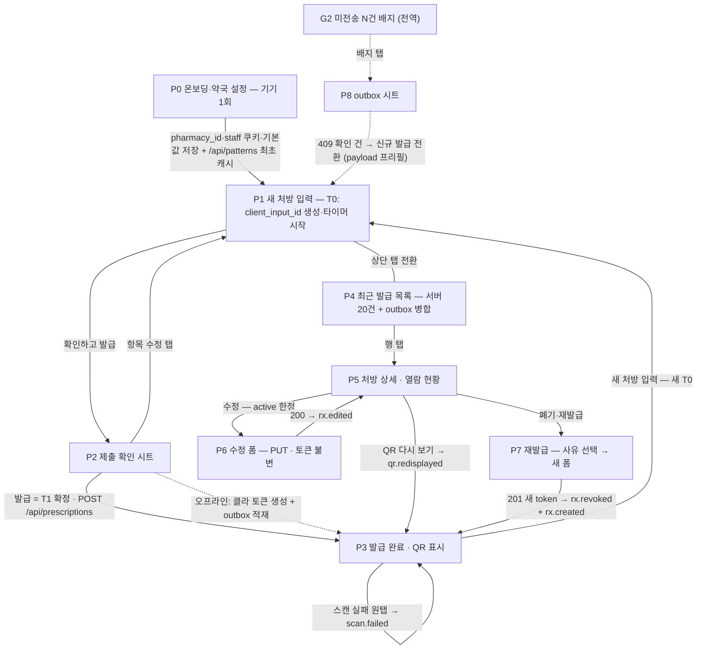

# indoro 약사 측 화면 인벤토리 v1.0 (v0 웹폼 · Flutter 공유 구조)

데이터플로우 설계 v1.0을 화면으로 사상한다. v0 웹폼과 이후 Flutter 앱은 **화면 구조·API 계약·계측 배치를 동일하게 공유**하고, 플랫폼 차이는 §11에만 격리한다.

## 0. 화면 목록과 공통 규칙

| ID | 화면 | 목적 (한 줄) | v0 형태 |
|---|---|---|---|
| P0 | 온보딩·약국 설정 | 약국 기기 1대를 발급 단말로 등록 — `pharmacy_id`·staff 쿠키·기본값을 1회 심는다 | 온보딩 URL 전용 페이지 |
| P1 | 새 처방 입력 폼 | 수기 처방전을 **항목당 20~40초**에 구조화 — 발급의 유일한 입력 지점 | 메인 탭 |
| P2 | 제출 확인 시트 | 발급 직전 전 항목을 1스크롤 대조 — 오입력의 환자 노출(§7.4-5) 최종 차단 | P1 위 전체화면 시트 |
| P3 | 발급 완료·QR 표시 | QR(인쇄 기본/화면 폴백)·코드를 환자에게 전달 — 도달 퍼널의 물리 접점. 최초 발급·재표시 겸용 | 페이지 |
| P4 | 최근 발급 목록 | "아까 그 손님" 재조회 진입 허브 | 목록 탭 |
| P5 | 처방 상세·열람 현황 | 단건 상태 확인과 후속 조치(재표시/수정/재발급) 분기 | 페이지 |
| P6 | 수정 폼 | 내용 정정 — 토큰·URL·QR 불변(D4) | P1 변형 |
| P7 | 폐기·재발급 | 잘못된 링크 즉시 종결(410) + 새 링크 발급(D5) | 2단 플로우 |
| P8 | outbox·연결 상태 | 미전송 건 가시화와 flush 신뢰 확보(§7.1) | 전역 배지 + 시트 |
| G1 | staff 쿠키 배너 | 쿠키 소실 self-check + 원탭 재등록(§6.3) | 전역 컴포넌트 |
| G2 | 연결 상태 점·미전송 N건 배지 | 오프라인 인지와 P8 진입점 | 전역 컴포넌트 |

**공통 규칙 (전 화면)**

1. **계측 경로는 2개뿐**: ① `POST /api/prescriptions` 본문의 `client_metrics` ② 약사 액션에 대응하는 서버 이벤트(`rx.*`, `qr.redisplayed`, `scan.failed`). 약사 UI 클라 비콘·픽셀은 없다(D16, §6.1) — `POST /api/events`는 환자 웹뷰 전용.
2. 모든 `/api/*` 호출에 `X-Pharmacy-Id` 자동 첨부(P0에서 저장한 `pharmacies.id`). 이 값은 자격증명 취급 — 화면에 마스킹 표시, URL 비노출(§3.3).
3. **QR은 제시 순간에만 노출**: P4 목록·P5 상세 본문에 QR 미표시(어깨너머 촬영 방지, §8.2). 전체화면 QR은 P3에서만.
4. UI 문자열은 `pharmacies.ui_lang` 기반 i18n 카탈로그에서 — Jinja/위젯 하드코딩 금지(H10).
5. 패턴 칩·검증 규칙의 단일 소스는 `GET /api/patterns`(ETag=파일 해시) — **클라 하드코딩 금지**(§4.8). 응답은 localStorage에 캐시하고, 최초 캐시는 P0 완료 조건에 포함(오프라인 첫 폼 오픈 보장).
6. 폼 상태는 메모리 + outbox(localStorage)만 영속 — "폼 탭을 닫지 마세요" 수칙(§2.3)을 G2 영역에 상시 문구로 노출.
7. 폼 초기화 시 `crypto.getRandomValues` 가용성 검사 — 미존재면 오프라인 발급 비활성(C안 폴백, `Math.random` 금지 — H4).

**카운터 타임라인(§2.1) ↔ 화면 매핑**

| 카운터 단계 | 화면 |
|---|---|
| ② 조제 병행 | P1 입력(항목 카드 단위 — 인터럽트 안전) |
| ②' 봉투 번호 유성펜 기입 | P1 카드의 색+숫자 배지와 동일 번호 |
| ③ 계산 | P2 확인 → 발급 |
| ④ 약 전달 | P3 QR 제시(인쇄 기본 D21 / 화면 폴백) |

## 1. 화면 간 이동

## 2. P0 온보딩·약국 설정

**목적**: 팀 발급 온보딩 URL로 약국 기기 1대를 등록 — 이후 모든 발급의 기본값을 여기서 한 번만 결정한다.

**핵심 요소와 바인딩**

| 요소 | 바인딩 | 규칙·기본값 |
|---|---|---|
| 약국 정보 확인 카드 | `pharmacies.name` / `area` / `pincode` | 서버 사전 등록값 확인만(타이핑 0) — H14 백필 불가 차원 |
| 프린터 보유 토글 | `pharmacies.has_printer` | P3의 기본 경로(인쇄 vs 화면) 결정(D21) + 보유 시 인쇄 테스트 버튼 |
| UI 언어 / 환자 기본 언어 | `pharmacies.ui_lang` / `default_patient_lang` | 후자는 P1 `lang` 필드의 프리필 원천 |
| 기기 식별 저장 | `pharmacies.id` → localStorage | `X-Pharmacy-Id` 헤더 소스. 화면엔 끝 4자만 표시 |
| staff 쿠키 설정 확인 | staff 쿠키(§6.3) | 설정 성공 표시 + "테스트는 약국 기기로만" 교육 문구(§10-8) |
| 기기 점검 체크리스트 | — | Chrome 최신 / SIM 데이터 / `crypto.getRandomValues` 가용 / 기기 밝기 최대 고정(§2.3·§2.5) |

**상태 변형**: 로딩 — 약국 정보 조회 스피너 / **오프라인 — 온보딩 불가**("온라인에서 1회 필요") / 에러 — 무효 온보딩 URL 안내 / 재등록 — 기존 등록 기기 감지 시 덮어쓰기 확인.

**핵심 인터랙션**: 전부 확인·토글. `crypto` 미지원 감지 시 "오프라인 발급 비활성" 플래그를 기기 설정에 저장하고 경고.

**20~40초 기여**: "기본값은 온보딩에서 한 번만" 원칙 — `default_patient_lang`·`has_printer`가 매 발급의 탭 2~3회를 제거한다. `/api/patterns` 최초 캐시로 폼 오픈 지연 0.

**계측 포인트**: 없음(서버 `pharmacies` 행 갱신뿐 — KPI 무관, D16).

## 3. P1 새 처방 입력 폼

**목적**: 수기 처방전 1장을 항목 카드 1..N으로 구조화 — 입력 KPI(`active_input_ms / n_items` 20~40초)가 측정되는 유일한 화면.

**핵심 요소와 바인딩**

*(a) 처방 헤더 — 1행 고정, 별칭은 접힘*

| 요소 | 바인딩 | 규칙·기본값 |
|---|---|---|
| 안내 언어 칩 | `prescriptions.lang` | 프리필 `pharmacies.default_patient_lang`, 자기표기 "हिन्दी / English"(국기 금지). **환자와 구두 확인 후 확정**(§3.3) — QR 직스캔의 기본 렌더 언어(D2)이므로 접힘 금지 |
| 별칭(선택) | `prescriptions.patient_label` | ≤20자, placeholder "예: R.K. / Amma" + "실명을 쓰지 마세요"(§8.1). 기본 접힘 — 스킵이 기본 동선 |

*(b) 항목 카드 (폼 오픈 시 카드 1 자동 확장)*

| 요소 | 바인딩 | 규칙·기본값 (20~40초 장치) |
|---|---|---|
| 번호 배지 | `prescription_items.position` | **색+숫자 이중 부호화**(1=파랑, 2=주황…) — 봉투 유성펜 번호와 동일(§2.1 ②'·§3.3). 항목 삭제 시 자동 재부여 + P3에서 번호 재확인이 안전망 |
| 약명 입력 | `drug_name_raw` (정본) / `drug_id` (채택 시만) | **유일한 타이핑 필드.** 2자부터 `GET /api/drugs?q=`(디바운스 300ms, ≤8건: `brand_name — generic_name strength form`). 후보 채택 → `drug_id` 세트 + `default_pattern_key`·`default_timing_food`·`default_dose_unit` 프리필. **후보 0건·미채택도 동일 경로로 발급** — "등록 안 된 약" 류 차단 문구 금지(§4.5, DB-optional의 UI 표현) |
| 최근 약 레일 | 로컬 캐시(이 기기 최근 제출의 `drug_name_raw`+`pattern_key`+`doses`+`dose_unit`+`timing_food`+`duration_days` 튜플 상위 8) | 칩 1탭 = **항목 전체 프리필**. 서버 변경 없음 — 파일럿 약국의 처방 반복성 활용 |
| 패턴 칩 그리드 | `pattern_key` ← `GET /api/patterns` | 코어 8 + CUSTOM, `sort_order` 순, 라벨 = `icon_key` 아이콘 + 파생 표기(1-0-1). 칩 탭 → `patterns.yaml`의 `slots`·`display_rules` defaults로 용량 슬롯 자동 채움 |
| 용량 슬롯 행 | `doses.M/N/E/H` (저장 시 `dose_morning…dose_night`) | 아침/점심/저녁/밤 4스테퍼(±, REAL — 0.5 지원). `slots` 밖 슬롯은 비활성=0 강제(§4.3 검증의 거울). 숫자 키보드 미사용 |
| 단위 셀렉터 | `dose_unit` | enum 7종 칩. 기본 tablet이되 **항상 노출**(숨은 기본값 금지 — 시럽 '1 गोली' 사고 방지 §3.3), 자동완성 시 `default_dose_unit`로 교체. `ml` 선택 시 총량 라벨도 ml로 |
| 식전후 칩 | `timing_food` | `before_food/after_food/with_food/empty_stomach` + "미지정"(NULL). 패턴과 독립 축(D14), 자동완성 시 프리필 |
| 기간 | `duration_days` | 빈도 칩 3/5/7/10/15/30 + 스테퍼. 첫 항목은 기본값 없음(오입력 방지 > 탭 1회 절약), **2번째 항목부터 직전 값 승계** |
| 총량 뱃지 | `total_quantity` | Σ슬롯×일수 자동 산출, 탭 시 수정(서버는 경고만 — §3.3) |
| 패턴 가변 영역 | `extra_params_json` / `prn_*` | WEEKLY_ONCE → 요일 칩 7(`day_of_week` 필수) · PRN → `prn_reason_key` 셀렉트 + `prn_max_per_day`·`prn_min_gap_hours` 스테퍼 · STAT_SINGLE → 1회분만, 기간 비활성 · CUSTOM → `instructions` textarea + **"구두로 설명했습니다" 체크 필수**(`verbal_counseling_given`) + "환자 화면엔 영상 대신 주의 카드" 고지(§3.4) |
| 메모(선택) | `prescription_items.note` | 기본 접힘 |

*(c) "약 추가" 버튼 · (d) 하단 고정 바*: 추가 시 새 카드(`position`+1), 직전 카드는 **1행 요약으로 접힘**(약명 · 1-0-1 · 식후 · 5일) — 탭으로 재확장. 하단 바 = 항목 수 + "확인하고 발급" + G2 연결 상태 점.

**상태 변형**

- 로딩: 패턴 칩은 ETag 캐시 즉시 렌더(네트워크 대기 없음).
- 오프라인: 자동완성만 조용히 비활성(최근 약 레일은 로컬이라 생존), 상단 오프라인 배지, 제출 버튼 라벨 "오프라인 발급 — QR 즉시"로 변경(§2.3). `crypto` 미지원 기기는 제출 차단 + "복구 후 발급" 안내(C안 폴백).
- 에러: 422 → `fields[].path`를 카드·필드에 매핑해 인라인 표시 + 해당 카드 자동 확장. 제출 타임아웃 → **동일 `client_input_id` 자동 재전송**(`retry_count`++) → 연속 실패 시 outbox 전환.
- 빈 상태: 없음 — 폼 오픈 = 카드 1 자동 생성(탭 절약).
- 인터럽트: 카드 접힘으로 문맥 보존, 30초+ 무입력은 active에서 자동 제외라 지표 미오염(§6.3).

**핵심 인터랙션**: 약명 타이핑 → (자동완성 채택) → 패턴 칩 → 스테퍼 미세조정 → 기간 칩 → "약 추가" 반복 → "확인하고 발급".

**20~40초 설계 결정 (이 화면이 KPI의 본체)**

1. **타이핑은 약명 1필드** — 나머지 전부 칩/스테퍼/프리필(키보드 최소화, 숫자 키보드 0회).
2. 자동완성 채택 1탭 = 패턴·식전후·단위 3필드 동시 채움(`drugs.default_*` — 자동완성의 가치는 검색이 아니라 프리필).
3. 최근 약 칩 1탭 = 항목 전체 완성(반복 처방 최속 경로).
4. 패턴 칩이 용량 기본값을 채움 — "BD 탭 = 1-0-1 완성", 수정만 스테퍼.
5. 선택 필드(`patient_label`·`note`)는 시야 밖(접힘) — 기본 동선에서 0초.
6. 2번째 항목부터 `duration_days` 승계 + 카드 접힘 요약이 P2 대조 재료 — 확인 단계 추가 비용 상쇄.
7. 첫 주 해석 전제: 시드 5~10종 상태에선 풀타이핑이 기본 — 초기 수치는 목표 대비 높게 나옴(§6.3), `used_autocomplete_count` 교차 분석으로 분리.

**계측 포인트**

- **[T0] 폼 오픈**: `client_input_id` 생성(UUIDv4, D10) + gross 타이머 시작(`performance.now` 단조시계) + active 버킷 계측 개시(§6.3).
- 입력 중: keydown/tap 타임스탬프 버킷 합산 — 30초+ 갭 제외(`active_input_ms`), 갭마다 `idle_gaps_count`++.
- 자동완성 채택 시 `used_autocomplete_count`++, 재전송 시 `retry_count`++.
- 이 화면 자체의 서버 이벤트·비콘 없음(`rx.form_opened` 미도입 — D16). 전부 [T1]에 `client_metrics`로 동봉.

## 4. P2 제출 확인 시트

**목적**: 수기 처방전과 입력본을 마지막으로 1:1 대조 — 정정(D4)보다 싼 유일한 방어선.

**핵심 요소와 바인딩**: 항목별 요약 행 = `position` 색+숫자 배지 + `drug_name_raw` + 슬롯 파생 표기(1-0-1-0) + `dose_unit` 라벨 + `timing_food` 아이콘 + `duration_days` + `total_quantity`(순서는 `position` 고정 — 처방전 대조용). 헤더 = `lang`(발급 언어) + `patient_label`. CUSTOM 항목은 `instructions` 원문 + 구두 설명 체크 상태. 경고 존 = `total_quantity` 불일치(비차단) + ml 항목의 "총량 단위 = ml(병 아님)" 확인(§3.3).

**상태 변형**: 제출 중 — 스피너 + 버튼 잠금(더블탭은 멱등키 D10이 방어하지만 UX로도 억제) / 오프라인 — "오프라인 발급: QR은 즉시, 코드는 동기화 후"(§10-9) 고지 / 에러 — 422는 P1 복귀 + 인라인, `TOKEN_COLLISION` 409는 P8 확인 목록 등재 안내(§2.3) / 빈 상태 — 없음(항목 0이면 진입 불가).

**핵심 인터랙션**: 행 탭 → 해당 카드로 복귀(시트 닫기) / "발급" → `POST /api/prescriptions`(온라인) 또는 클라 토큰 생성 + outbox 적재(오프라인).

**20~40초 기여**: 별도 라우트가 아닌 시트 — P1 접힘 요약의 재배치라 렌더 비용 0, 항목 3건 기준 대조 목표 5초. "발급" 버튼 엄지 존 고정.

**계측 포인트**: **[T1] "발급" 탭** — gross 확정 → `input_duration_ms`, active 확정 → `active_input_ms`, `issued_at_client` 스탬프(+05:30 허용). `client_metrics`(+ `idle_gaps_count`, `used_autocomplete_count`, `retry_count`, `app_version:"v0-web"`) 동봉. 서버가 커밋 트랜잭션에서 `rx.created` 기록 — **도달률 분모 발생 지점**(§6.2). 확인 시트 열람 시간은 gross에 포함(§6.3 정의 준수 — 대조도 입력 원가).

## 5. P3 발급 완료·QR 표시

**목적**: 발급된 링크를 환자 손에 물리적으로 옮기는 화면 — 최초 발급과 재표시(P5 경유) 겸용.

**핵심 요소와 바인딩**

| 요소 | 바인딩 | 규칙 |
|---|---|---|
| 항목 번호 나열 | `items[].position` 색+숫자 | "봉투에 같은 번호를 기입했는지 확인하세요"(§2.1 ③) — 삭제로 번호가 바뀐 경우의 안전망 |
| QR | 201 응답 `url` (쿼리 없음 — D2) | **클라 JS 렌더 단일 경로**(~5KB 인라인, D18), quiet zone 4모듈. 인쇄는 ECC Q·≥2cm(§2.1) |
| 인쇄 뷰 | `pharmacies.has_printer=1` | **기본 경로**(D21): 약국명 + QR + `short_code_display` + "카메라로 스캔" hi/en 픽토그램. v0는 브라우저 인쇄, ESC/POS는 §10-3 확정 후 |
| 화면 제시(폴백) | — | "크게 보기" 전체화면·흰 배경 고대비. 웹은 시스템 밝기 제어 불가 — 기기 밝기 최대는 P0 수칙으로 대체 |
| 짧은 코드 병기 | `short_code_display` "K7F3-9Q2M" | 오프라인 발급 건은 **"QR만" 모드**(코드 없음 — sync 후 발급, §2.3·§10-9) |
| 유효기간 | `expires_at` | "8월 5일까지 유효" |
| 보조 액션 | — | "재출력"(로컬 재인쇄 — 서버 호출 없음) / "환자에게 시연" = `GET /api/prescriptions/{id}` **미리보기 렌더**(환자 라우트 미경유 — §6.3 2중화) / "스캔 실패" 원탭 / "새 처방 입력" 최상단 |
| 스캔 실패 원탭 | `POST /api/prescriptions/{id}/scan-failure` | 사유 4택: 폰에 카메라QR 없음 / 카메라 고장 / 피처폰 / 거부(§2.5) |

**상태 변형**: 인쇄 실패 → 화면 제시 폴백 / 오프라인 발급 → QR 정상(로컬 렌더) + "동기화 대기" 배지 + 코드 영역 플레이스홀더 + 구두 안내 문구 표시("지금 안 열리면 집에서 다시 열어보세요" — §2.3 교육 스크립트) / 재표시 모드 → 발급 성공 배너 없이 QR·코드만.

**핵심 인터랙션**: `has_printer=1`이면 도착 즉시 인쇄 다이얼로그 자동 호출(1탭 절약). "새 처방 입력" → 폼 리셋 + **새 [T0]**.

**20~40초 기여**: 이 화면은 입력 시간 밖(gross는 T1에서 종료) — 카운터 회전율 관점에서 "새 처방 입력"을 최상위 배치.

**계측 포인트**: `rx.created`는 이미 기록됨(P2). "스캔 실패" → 서버 `scan.failed`(스캔 불가 단말 비율 실측 — §2.5). 인쇄·전체화면·시연 탭은 v0 미계측(이벤트 사전 밖 — 필요 시 서버 기록 API로만 확장, D16 원칙).

## 6. P4 최근 발급 목록

**목적**: "아까 그 손님 QR 다시" 요청을 20초 내 해결하는 재조회 전용 화면.

**핵심 요소와 바인딩**: `GET /api/prescriptions`(고정 `ORDER BY created_at DESC LIMIT 20`, §4.2) + **로컬 outbox 미전송 건을 상단 병합**(서버 목록엔 아직 없으므로). 행 = `created_at`(IST 표시) · `patient_label` 또는 "(별칭 없음)" · 항목 수 · 상태 칩(**계산 status 5종** — `viewed`는 `first_viewed_at` 존재 = "환자 열람 ✓", 약사 동기부여 피드백) · `short_code_display` · `origin=offline` 아이콘 · `version>1` "수정됨" 배지. **행에 QR 미노출**(§8.2).

**상태 변형**: 로딩 — 스켈레톤 5행 / 오프라인 — 마지막 응답 캐시 + outbox 건 + "오프라인" 배지 / 에러 — 재시도 버튼 / 빈 상태 — "첫 처방을 입력해 보세요" + P0 완료 여부 점검 링크.

**핵심 인터랙션**: 행 탭 → P5. 상단 "새 처방 입력" 고정.

**20~40초 기여**: 검색·필터·페이징 없음 — 파일럿 물량에서 20건 스크롤이 더 빠르고, 커서 페이징 삭제(§9.2)와 정합. 입력 동선과 완전 분리(목록 경유 강제 없음).

**계측 포인트**: 없음(약사 UI 비콘 미도입 — D16). 서버 접근 로그가 §7.4-11(타인 처방 열람) 감사를 담당.

## 7. P5 처방 상세·열람 현황

**목적**: 단건의 현재 상태를 확인하고 재표시/수정/재발급으로 분기하는 허브.

**핵심 요소와 바인딩**: `GET /api/prescriptions/{id}` — 상태 칩(계산 5종) · `version` · `created_at` · `expires_at`(D-3 이내 "곧 만료" 배지) · `reissue_of` 체인 링크 · **열람 현황**(`first_viewed_at` "7월 6일 14:02 첫 열람" / 미열람 시 "아직 열람 없음", `scan_count`) · 항목 요약 리스트(P2 포맷 재사용, 읽기 전용) · **환자 화면 미리보기 = 이 API의 미리보기 렌더**(`/p/{token}` 직접 열람 금지 — staff 쿠키 사망 시에도 first_view 오염 원천 차단, §6.3) · 액션 바: "QR 다시 보기" / "수정"(active 한정) / "폐기·재발급"(만료 건은 이것만 — §4.4).

**상태 변형**: 로딩 — 스켈레톤 / 오프라인 — 서버 조회 불가 안내(outbox 건이면 로컬 payload 요약 표시) / 에러 — 404(타 약국·미존재, 존재 은닉 §4.1) "찾을 수 없음" / revoked — 액션 숨김 + 후속 처방(reissue) 링크만.

**핵심 인터랙션**: "QR 다시 보기" = `GET /api/prescriptions/{id}/qr` → `url` 클라 재렌더 → P3 재표시 모드.

**20~40초 기여**: 가장 빈번한 재방문 사유인 "QR 다시 보기"를 첫 액션·1탭 전체화면으로.

**계측 포인트**: "QR 다시 보기" → 서버 `qr.redisplayed`(**발급 아님** — 도달률 분모 오염 방지 §6.3-②). 미리보기는 first_view 비소모(§6.3-④).

## 8. P6 수정 폼

**목적**: 오입력 정정 — 환자 손의 QR·URL을 살린 채 내용만 교체(D4).

**핵심 요소와 바인딩**: P1 컴포넌트 재사용 + 기존값 전체 프리필(PUT은 전체 교체본 — §4.4) + `edit_reason` 입력(선택) + 상단 고정 고지 "QR·링크는 그대로 — 환자 화면에 '수정됨' 배지가 표시됩니다".

**상태 변형**: 오프라인 — **수정 비활성**("온라인에서만" — outbox는 생성 전용 큐, PUT 큐잉은 v0 범위 밖 §2.3/D19) / 에러 — 422 인라인 / 만료·revoked — 진입 차단, 재발급 유도.

**핵심 인터랙션**: 변경 필드만 탭 → `PUT /api/prescriptions/{id}` → 200(token 불변) → P5 복귀 + "버전 2" 확인.

**20~40초 기여**: 전량 프리필이라 변경 원가만 지불.

**계측 포인트**: 서버 `rx.edited`(version, fields_changed — 정정률·§7.4-6 경과시간 계측). PUT 본문엔 `client_metrics` 없음(§4.4) — **수정은 입력시간 KPI 비산입**(KPI는 신규 발급 한정, 명시적 결정).

## 9. P7 폐기·재발급

**목적**: 환자 뒤바뀜 등 오발급 링크를 즉시 죽이고(410) 올바른 새 링크를 발급(D5).

**핵심 요소와 바인딩**: 1단 — 사유 선택(`reason: wrong_patient | input_error | other`) + 경고 확인 "기존 QR·링크는 즉시 열리지 않게 됩니다". 2단 — P1 컴포넌트: **`input_error`는 구건 프리필, `wrong_patient`는 빈 폼 기본**(타인 내용 승계 = 같은 사고 반복). 새 `client_input_id`로 `POST /api/prescriptions/{id}/reissue` → 201 새 `token`·`short_code`(`reissue_of` 링크) → P3(새 QR). 만료 건 재발급도 동일 API(구건 부활 없음 — D5).

**상태 변형**: 오프라인 — 비활성(구 토큰 410 처리가 서버 필요) / 에러 — 422 인라인 / 이미 revoked — 재진입 차단(후속 처방 링크 안내).

**핵심 인터랙션**: 사유 → (프리필 정책 자동 결정) → 편집 → 발급.

**20~40초 기여**: 사유가 프리필을 결정해 재입력 시간을 최소화하되, 안전이 시간에 우선(wrong_patient 빈 폼).

**계측 포인트**: 서버 `rx.revoked` + `rx.created`(reissue_of) 쌍(§6.2). 2단 폼은 신규 발급이므로 **[T0]/[T1] 동일 적용** — `client_metrics` 정상 동봉. 스캔 전 폐기 토큰은 도달률 분모 제외(§6.3 SQL과 정합).

## 10. P8 outbox·연결 상태 시트 (+ G1/G2)

**목적**: "미전송 N건"의 실체를 보여주고 flush를 신뢰 가능하게 — 약사가 오프라인 발급을 두려워하지 않게 한다.

**핵심 요소와 바인딩**: 연결 상태(navigator.onLine + 최근 제출 성패) · outbox 건 목록(`issued_at_client`, `patient_label?`, 항목 수, 백오프 재시도 상태 1s→2s→4s — §7.1, **24h 초과 경고**) · **409 `TOKEN_COLLISION` 확인 목록**("환자 재스캔 필요 — 신규 발급 전환" 버튼: outbox payload 프리필 + 서버 토큰으로 재발급 + RNG 결함 신호로 팀 보고, §2.3) · 수동 "지금 재전송"(백오프 1회 무시) · 수칙 리마인더("이 탭을 닫지 마세요" / Chrome·SIM 요건).

**상태 변형**: 빈 상태 — "모두 전송됨 ✓" / 오프라인 — 재전송 버튼 비활성 + 대기 표시 / `crypto` 미지원 기기 — "오프라인 발급 비활성(복구 후 발급 폴백)" 고지 / flush 진행 중 — 건별 진행 표시(오래된 순 단건 POST — D19).

**핵심 인터랙션**: G2 배지 탭 → 시트. flush 성공 건은 목록에서 제거 + P4 서버 목록에 등장.

**20~40초 기여**: 발급은 P1~P3에서 이미 종결 — 이 화면은 입력 동선 밖 배지로만 존재(0초 추가).

**계측 포인트**: flush 재전송마다 해당 건 `client_metrics.retry_count` 갱신. 서버 `rx.created`의 `origin=offline`·`issued_at_client_utc`가 오프라인 코호트·동기화 지연 산정 원천(§6.3), `view.pending` 소급(`src=pre_sync`)은 서버 자동 — UI 관여 없음.

**G1 staff 쿠키 배너**: P1 상단에서 주기 self-check — 쿠키 부재 시 "기기 재등록 필요" + 원탭 재설정(온보딩 URL 재방문, §6.3). **G2**: 전 화면 하단 연결 상태 점 + 미전송 N건 배지.

## 11. 입력 소요시간 계측 배치 맵 (요약)

| 마커 | 화면·시점 | 심는 것 | 흘러가는 곳 |
|---|---|---|---|
| **T0** | P1 폼 오픈(신규 / P3 "새 처방" / P7 2단 진입) | `client_input_id` 생성 + gross 시작(단조시계) + active 버킷 개시 | 메모리 |
| T0+ | P1 모든 keydown/tap | 버킷 합산, 30초+ 갭 제외 | `active_input_ms`, `idle_gaps_count` |
| T0+ | P1 자동완성 채택 | 카운터 증가 | `used_autocomplete_count` |
| — | P2 대조 열람 | gross 포함·active 미증가(무입력) — §6.3 정의 그대로 | `input_duration_ms` |
| **T1** | P2 "발급" 탭 | gross·active 확정 + `issued_at_client` 스탬프 | POST 본문 `client_metrics` |
| T1' | 타임아웃 재전송·P8 flush | 동일 `client_input_id`, 카운터 증가 | `retry_count` |
| 서버 | POST 커밋 | `rx.created` props에 전량 복제 | events — **KPI 원천**(`active_input_ms / n_items` p50/p90, gross−active = 카운터 혼잡 프록시, §6.3) |

수정(P6)은 미계측(PUT에 `client_metrics` 없음), 재발급(P7)은 신규 발급으로 정상 계측 — KPI 분모·입력시간 모두 "신규 발급 폼 세션" 단위로 일관된다.

## 12. Flutter 이관 시 달라지는 것 (화면 구조·계약은 불변)

| 화면 | v0 웹폼 | Flutter 승계 시 |
|---|---|---|
| P0 | 온보딩 URL + localStorage 저장 | 기기 등록 화면 내장, 설정 영속 강화 |
| P1·P8 | localStorage outbox + "탭 닫지 마세요" 수칙 | 로컬 DB 영속 — 오프라인 중 재시작·미동기화 유실 리스크 해소(§7.4-3, §10-11) |
| P3 | 브라우저 인쇄 + 밝기 수동 수칙 | ESC/POS 직결(§10-3 확정 후) + 화면 밝기 API 제어 |
| 공통 | `/api/patterns` ETag 캐시, `client_metrics` 계측 | 동일 — API 계약·계측 배치 그대로(`app_version`만 교체) |
