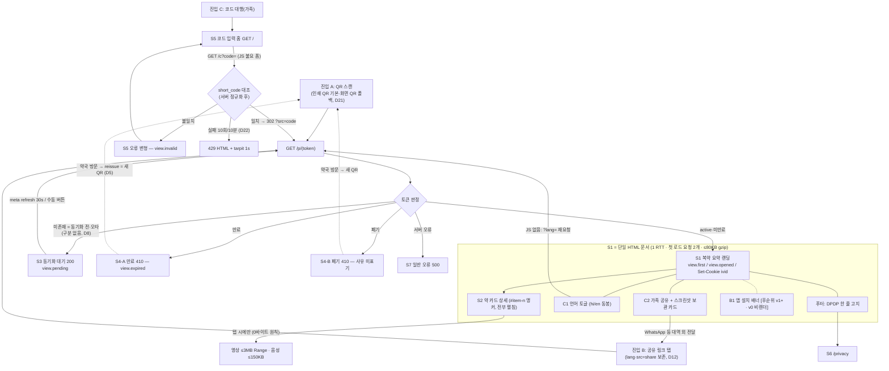

# indoro 환자측 화면 인벤토리 v1.0 (초기 와이어프레임 기록)

> **2026-07-10 구현 정정:** 아래 v1.0의 약×시간 매트릭스, 전개 카드, 미디어 placeholder는 초기 탐색 기록이다. 인도 레퍼런스 조사와 모바일 QA 후 실제 서버 정본은 [`server/templates/patient.html`](../server/templates/patient.html)의 **아침→점심→저녁→밤 하루 흐름 포스터**로 바뀌었다. 약별 상세는 핵심 흐름 아래의 네이티브 `details`, 미구현 음성·영상 UI는 제거, `/privacy`는 구현, `OD_NIGHT`는 H(밤) 슬롯으로 정리했다. 선택 근거는 [`05-india-medication-poster-research.md`](05-india-medication-poster-research.md), 검증 결과는 [`06-mobile-poster-visual-qa.md`](06-mobile-poster-visual-qa.md)를 정본으로 본다.

**TL;DR**

1. 환자측 물리 라우트는 사실상 4개(`/p/{token}`, `/` + `/c`, `/privacy`, 오류 페이지)뿐 — **"약 상세·언어 토글·가족 공유"는 전부 `/p/{token}`이 반환하는 단일 HTML 문서의 내부 상태**다(1 RTT 원칙 §1.2-4, D18과 동형의 "경로 1개" 사고).
2. 정보 위계는 **약국(신뢰) → 하루 시간표(언제) → 약 카드(무엇을·어떻게) → 공유/보관(나눔)** 순. 카드가 복용 지시의 단위이고, 카드 번호(색+숫자)는 봉투 유성펜 번호(§2.1)와 1:1 대응한다.
3. 저문해 문법 3종을 전 화면에 고정: **항목 색+숫자 배지**(봉투 번호와 동형), **해/달 슬롯 아이콘의 고정 순서 M→N→E→H**("1-0-1" 관행과 동형), **음성 버튼이 영상보다 항상 위**(§7.2).
4. 무게: S1 첫 로드는 **요청 2개(HTML+공용 포스터)·≤80KB gzip**, 대기/410은 ≤8KB `no-store`. 영상·음성은 탭 전 0바이트 — 시간표·카드는 최악 10항목에서도 예산 내(§2.3 검증 규칙 포함).
5. 데바나가리 제약은 공통 규칙으로 격리: 웹폰트 0KB(내장 Noto), line-height ≥1.6·고정 높이 금지·말줄임 전면 금지·숫자는 ASCII 고정. hi/en 동봉은 **텍스트 노드 단위 이중화**(구조·SVG는 단일)로 구현해 토글 시 리플로우를 최소화한다(D12).

---

## 1. 화면 단위 정의와 인벤토리

### 1.1 논리 화면 vs 물리 라우트

환자 웹뷰는 "외부 블로킹 리소스 0, 1 RTT 완결"(§1.2-4)이 최상위 제약이므로, 화면 전환이 곧 네트워크 왕복이 되는 구조를 만들지 않는다. 따라서:

- **약 상세(S2)는 별도 라우트가 아니라 S1 문서 내 카드 섹션**이다. 카드는 기본 **전부 펼침**(아코디언 금지) — "탭하면 열린다"는 학습을 저문해 사용자에게 요구하지 않고, 영상이 탭 전 0바이트라 펼침의 무게 비용도 0이다. 항목 상한 10(§4.3)이라 최악 길이도 유한하다. 앵커 `#item-{position}` + `:target` 하이라이트로 딥링크(약사 시연·시간표 칩 점프)를 제공한다.
- 언어 토글(C1)·가족 공유(C2)·앱 배너(B1)는 S1 문서의 전역 컴포넌트다.
- 대기(S3)·만료/폐기(S4)는 같은 `GET /p/{token}`의 응답 변형이고, 코드 입력(S5)만 독립 진입 화면이다.

### 1.2 인벤토리 요약

| ID | 화면 | 라우트/트리거 | 응답 | 캐시 | 첫 로드 무게 | 핵심 계측 |
|---|---|---|---|---|---|---|
| S1 | 복약 요약 랜딩 | `GET /p/{token}` (active·미만료) | 200 HTML | `private, no-cache` + ETag | ≤80KB·요청 2 | `view.first` `view.opened` |
| S2 | 약 카드 상세 | S1 문서 내 `#item-{position}` | (S1에 포함) | — | 증분 0 (미디어는 탭 시) | `media.*` |
| C1 | 언어 토글 | S1 상단 고정 바 | (S1에 포함) | — | — | `ux.lang_switched` |
| C2 | 가족 공유·스크린샷 보관 | S1 하단 섹션 | (S1에 포함) | — | — | `share.clicked` |
| S3 | 동기화 대기 | `GET /p/{token}` (토큰 미존재 — D8) | 200 HTML | `no-store` | ≤8KB·요청 1 | `view.pending` |
| S4 | 만료(A)/폐기(B) | `GET /p/{token}` (만료/`revoked_at`) | 410 HTML | `no-store` | ≤8KB·요청 1 | `view.expired` |
| S5 | 코드 입력 홈(가족 대행) | `GET /` → `GET /c?code=` / `/c/{short_code}` | 200 / 302 / 429 | 기본 | ≤10KB·요청 1 | `view.invalid` |
| S6 | 개인정보 상세 고지 | `GET /privacy` (라우트명 제안) | 200 HTML | 기본 | ≤10KB | 없음 |
| S7 | 일반 오류 | 500 시 | 500 HTML | `no-store` | ≤5KB | 서버 로그(request_id)만 |
| B1 | 환자 앱 설치 배너 **[후순위 v1+]** | S1 최하단 슬롯 | v0 비렌더 | — | 0 | (v1: 화이트리스트 등재 후) |

### 1.3 화면 이동 맵



---

## 2. 전 화면 공통 규칙

### 2.1 저문해 디자인 문법

**원칙: 아이콘 단독 금지 — 항상 "아이콘 + 숫자 + 짧은 라벨" 삼중화.** 아이콘 문해력도 보편 전제가 아니므로 색은 언제나 보조 부호이고 숫자가 정본이다(색각 이상·저품질 패널 안전).

**슬롯 사전 (해/달 아이콘 — 전 화면 공통, 순서 고정)**

| 슬롯 | 스키마 필드 | 아이콘(`assets.yaml` icon, `lang='any'`, 인라인 `<symbol>`) | 라벨(i18n) | 비고 |
|---|---|---|---|---|
| M 아침 | `prescription_items.dose_morning` | 지평선 위로 뜨는 반원 해 + 빛살, 밝은 톤 | `ui.slot.morning` (सुबह / Morning) | 시계 시각 미표기 — 의미는 "아침 밥때" |
| N 점심 | `prescription_items.dose_noon` | 중천의 온전한 해 | `ui.slot.noon` (दोपहर / Noon) | |
| E 저녁 | `prescription_items.dose_evening` | 지평선으로 지는 반원 해, 어스름 톤 | `ui.slot.evening` (शाम / Evening) | 일출과의 혼동은 명도 차 + **고정 순서**가 1차 부호 |
| H 밤 | `prescription_items.dose_night` | 초승달 + 별 | `ui.slot.night` (रात / Night) | HS(취침 전) 관행 대응 |

슬롯 표시는 **모든 화면·모든 컴포넌트에서 항상 M→N→E→H 좌→우 고정** — 이 순서 자체가 "1-0-1" 수기 관행과 동형이라 가장 강한 학습 전이 수단이다.

**식전후 사전 (`prescription_items.timing_food`, D14 독립 축)**

| 값 | 아이콘 | 라벨(i18n) |
|---|---|---|
| `before_food` | 알약 → 식사 접시 (좌→우 순서 화살표) | `timing.before_food` |
| `after_food` | 식사 접시 → 알약 | `timing.after_food` |
| `with_food` | 접시 위 알약 동시 | `timing.with_food` |
| `empty_stomach` | 빈 접시 + 알약 | `timing.empty_stomach` |
| `NULL` | 미표시 | — |

**항목 색+숫자 배지 (`prescription_items.position`)**: 원형 배지, 흰 숫자, 배경색은 10색 고정 팔레트 — 1 파랑 `#1565C0` · 2 주황 `#E65100` · 3 초록 `#2E7D32` · 4 보라 `#6A1B9A` · 5 갈색 `#4E342E` · 6 청록 `#00695C` · 7 마젠타 `#AD1457` · 8 남색 `#283593` · 9 올리브 `#827717` · 10 암회청 `#37474F` (흰 숫자 대비 4.5:1 이상 기준의 제안값, 최종 확정은 디자인 검수 — 정영민). 색은 CSS 상수(설정 파일 아님) — 봉투에 기입되는 것은 숫자뿐이므로(§2.1) 색 변경이 운영 절차에 영향을 주지 않는다.

**기타 공통**: 주 행동 버튼(음성·영상·공유·언어·제출)은 전폭·min-height 56px, 그 외 터치 타깃 ≥48×48px·간격 ≥8px. 텍스트는 문장 대신 명사구 라벨, 요소당 2줄 이내. 자동재생·소리·진동 없음(§7.2). 이모지 금지(단말별 렌더 파편화). 다크모드 미대응 — 라이트 고정(저품질 패널·직사광 가독 우선). 가로 스크롤 전면 금지.

### 2.2 데바나가리·이중 언어 레이아웃 제약 (전 화면 공통)

- **웹폰트 0KB**: `font-family: system-ui, "Noto Sans Devanagari", "Noto Sans", sans-serif` — Android 내장 Noto 의존, 깨짐 실측 시에만 서브셋 WOFF2(§7.2 그대로).
- **셰로레카(상단 연결선)·상하 마트라 클리핑 방지**: 본문 line-height ≥1.6, 버튼·배지는 고정 height 금지(padding 기반, min-height만), `overflow: hidden` 텍스트 컨테이너 금지.
- **말줄임(…) 전면 금지** — 용법 정보의 절단은 안전 사고다. 힌디 라벨이 영문보다 길어지는 경우가 흔하므로 모든 라벨은 2줄 랩 허용, 그리드 셀 고정폭 금지.
- **숫자는 ASCII 0-9 고정**(데바나가리 숫자 ०-९ 미사용) — 용량·슬롯·기간의 표기가 약국의 "1-0-1" 기입과 동형이 되게. 0.5는 단일 글리프 "½".
- **`drug_name_raw`는 라틴 원문 그대로** — 번역·음차 금지(약명 오전달 위험). 혼합 스크립트 줄의 line-height는 데바나가리 기준으로 통일.
- 합성 볼드 뭉개짐 방지: font-weight 400/700 2단만, 강조는 굵기 대신 크기·색. `letter-spacing` 금지(결합 문자 분리 위험), `text-transform` 무의미.
- 기본 크기: 본문 17px·line-height 1.65, 핵심 수량 숫자 24px+, 약명 20px+.
- **양 언어 동봉 구현(D12)**: 문서 구조·SVG는 단일, 텍스트 노드만 이중화 —

```html
<span lang="hi">खाने के बाद</span><span lang="en">After food</span>
```
```css
html[data-lang="hi"] [lang="en"], html[data-lang="en"] [lang="hi"] { display: none }
```

이 방식이 hi/en 동봉의 HTML 증분을 텍스트로 한정해 ≤25KB 예산을 지키고(§7.2 — 양 언어 텍스트는 gzip 효율이 높음), 토글 시 아이콘·레이아웃 골격이 움직이지 않게 한다. 날짜 표기는 서버 렌더(`ui.month.*` i18n) — JS `Intl` 미의존. 힌디 문자열 예시는 전부 자리표시이며 확정은 파일럿 지역·언어 결정(§10-1) 후 현지 감수를 따른다.

### 2.3 무게 예산 → 화면 매핑

| 화면 | 문서 상한(gzip) | 첫 로드 외부 요청 | 구성 |
|---|---|---|---|
| S1(+S2·C1·C2 동일 문서) | **≤80KB, 하드 120KB** | **2** = HTML 1 + 공용 포스터 WebP 1(lazy) | HTML ≤25KB · CSS ≤8KB 인라인 · JS ≤5KB 인라인 바닐라 · SVG 심볼 ≤15KB 인라인 · 포스터 ≤20KB. favicon은 `data:` URI로 요청 억제. beacon POST는 비차단·예산 외 |
| S3 대기 / S4 410 | ≤8KB | 1 | 최소 CSS 서브셋 ~2KB + 심볼 1~2개 인라인, `no-store` |
| S5 코드 입력 / S6 고지 / S7 오류 | ≤10KB / ≤10KB / ≤5KB | 1 | JS 불요 |
| 영상 / 음성 | 개당 ≤3MB / ≤150KB (예산 외) | 탭 시에만 Range | `preload` 없음 — 탭 전 0바이트 |

- SVG 심볼셋(≤15KB) 내역: 슬롯 4 + 식전후 4 + 패턴 아이콘 9(`patterns.yaml icon_key`) + 단위 7(`unit.*` 아이콘) + 기능 아이콘(재생·스피커·공유·복사·카메라·경고·모래시계·달력·봉투·체크) — 전부 단색 스트로크 단순 도형(저해상도 가독), 카드에서는 `<use>` 재사용이라 항목 수와 무관하게 증분 0(§3.6).
- 항목당 HTML 증분(hi+en 텍스트 이중화 포함) 약 1.2KB gzip — **최악 10항목에서도 HTML ≤25KB 성립**. §7.2의 로컬 체크 스크립트에 **10항목·전 패턴 픽스처**를 포함해 검증한다.
- 렌더 순서: RTT 1에 헤더+시간표+카드 텍스트/SVG 완결 → lazy 포스터 → 유휴 beacon → 탭 시 미디어(§7.2).

---

## 3. S1 — 복약 요약 랜딩 (`GET /p/{token}` 200)

**목적**: QR 스캔 직후 첫 페인트에서 "누가 준 안내이고, 매일 언제 무엇을 먹는지"를 텍스트 독해 없이 성립시킨다.

**핵심 요소 · 데이터 바인딩**

| 순서 | 요소 | 바인딩(스키마 필드) | 표시 규칙 |
|---|---|---|---|
| 1 | 상단 고정 바: 로고 + C1 토글 | 초기 언어 = §3.5 협상 체인(C1 참조) | 높이 44px, `<title>`·og는 "복약 안내 (indoro)" 고정(§8.2) — `patient_label`·약명 미포함 |
| 2 | 신뢰 헤더 | `pharmacies.name`, `pharmacies.area`, `prescriptions.created_at`(IST 표기) | "이 약국이 준 안내"라는 신뢰 앵커. 문자 밀도가 높은 유일 구역 — 소자 처리(가족 문해자 대상) |
| 3 | 별칭 줄 | `prescriptions.patient_label` (있을 때만) | 공용 폰에서 처방 구분용. `<title>`·og·공유 문구에는 미노출(§8.1). 존치 여부는 §10-13 |
| 4 | 상태 배지 | 수정됨: `prescriptions.version`>1 + 최신 `prescription_revisions.created_at` / 곧 만료: `access_tokens.expires_at` D-3(§4.6) | 수정 배지는 "7월 6일 수정됨"(hi/en), 만료 배지는 달력+시계 아이콘 |
| 5 | 처방 메모 | `prescriptions.note` (있을 때만) | 말풍선 아이콘 + 소자 |
| 6 | 봉투 대조 안내 스트립 | 정적 `ui.match_envelope` + 봉투·번호 아이콘 | "봉투의 번호와 같은 번호 카드를 보세요" — §2.1 유성펜 기입 절차의 화면측 짝 |
| 7 | **하루 시간표(매일 고정형)** | 슬롯 행(사용 슬롯만) × 항목 칩: `position`(색+숫자) + `dose_*` 수량 + `dose_unit`→`unit.*` 축약형 | daily 패턴만 본체에. 칩 탭 = `#item-n` 앵커 점프(JS 불요) |
| 8 | 시간표 특수 행 | WEEKLY_ONCE: `extra_params_json.day_of_week` 요일 / STAT_SINGLE: "한 번만" / PRN: `prn.*` "필요할 때만" / CUSTOM: 경고 아이콘 + "카드 확인" | `patterns.yaml schedule_type` 기준 분리 — daily 매트릭스를 오염시키지 않음 |
| 9 | 약 카드 리스트 | S2 × `prescription_items` (`position` 오름차순) | 전부 펼침 |
| 10 | 공유·보관 섹션 | C2 | |
| 11 | 푸터 | DPDP 한 줄 고지(§8.4) + `/privacy` 링크 + `pharmacies.name` 재표기("문의는 약국에") | |
| — | B1 슬롯 | v0 비렌더 | §12 |

- **시간표를 "오늘" 기준이 아니라 매일 고정형으로 렌더하는 이유**: 스크린샷이 저사양 환경의 사실상 표준 오프라인 사본(§7.3-①)인데, 날짜 의존 렌더("오늘은 비타민D 먹는 날")는 스크린샷을 하루 만에 낡게 만든다. 날짜 계산·시계 신뢰 문제도 제거된다. JS가 있으면 현재 시간대 행에 은은한 배경 하이라이트만 추가(순수 장식 — 전 행이 항상 보이므로 틀려도 정보 손실 0).
- 단위 축약형(`unit.tablet.short` 등)은 i18n 카탈로그에 full/short 2형으로 추가 제안(H10 범위 내).

**상태 변형**

| 상태 | 처리 |
|---|---|
| 로딩 | 서버 스트리밍 점진 페인트 — 스켈레톤·스피너 없음. 포스터 자리에는 인라인 회색 placeholder+재생 아이콘. 목표 First Paint <2.5s(3G), 핵심 판독 ~8s(2G)(§7.2) |
| 오프라인 (a) 최초 스캔부터 | 브라우저 기본 오류(v0 감수 — SW 없음). 완충: 인쇄 QR 재스캔 기회(D21) + 약사 구두 "집에서 다시 열어보세요"(§2.3) |
| 오프라인 (b) 로드 후 단절 | 문서가 자족적이라 전 정보 열람 유지(§1.2-4). 영상·음성 탭 실패 시 아이콘 토스트("나중에 다시") + 버튼 유지 |
| 오프라인 (c) 재방문 | ETag 재검증 실패 시 보유 사본 표시 허용(§4.6) — 보장 아님. 1차 대책은 스크린샷 카드(C2) |
| 에러 | 500 → S7. 자산 키 결측은 기동 시 설정 검증(§3.4)으로 사전 차단 + H11 폴백 |
| 빈 상태 | 성립 불가 — `items` 1..10 스키마 보장(§4.3). 렌더는 항상 현행 버전(D4) |

**핵심 인터랙션**: 시간표 칩 → 카드 앵커 점프(`:target` 하이라이트, JS 불요) · 세로 단일 스크롤 · pull-to-refresh 기본 동작 유지(no-cache라 수정 반영 — D4와 짝).

**계측 포인트**: 서버 — `view.first` 원자 선점(src/ua_class/lang/secs_since_issue; `is_bot`·`is_internal`은 판정 스킵 §6.3), `view.opened`(viewer_id=ivid, is_first, src, lang) 매 200 렌더, `Set-Cookie: ivid`(1년, D15). WhatsApp 링크 프리뷰 봇은 `is_bot=1` 플래그 저장으로 도달률 미오염(§6.3-③). 클라 — 랜딩 노출 자체는 이벤트 없음(서버가 이미 앎).

**저문해·데바나가리 적용**: 위계 = 아이콘·숫자 크게(수량 24px+), 텍스트는 라벨만. 슬롯 아이콘과 항목 배지의 시각 충돌 방지 — 슬롯은 무배경 아이콘, 항목은 진한 원형 배지로 형태 자체를 분리. 약국명·별칭의 라틴/로컬 혼재는 `overflow-wrap`으로 흡수.

**무게**: §2.3 표 그대로. 첫 로드 요청 2개.

---

## 4. S2 — 약 카드 상세 (S1 문서 내 `#item-{position}`)

**목적**: 약 1종의 "무엇을·언제·몇 개·식전후·며칠"을 카드 한 장 안에서 인포그래픽+음성+영상 3중 채널로 전달한다.

**핵심 요소 · 데이터 바인딩** (카드 상단→하단 순)

| 요소 | 바인딩 | 표시 규칙 |
|---|---|---|
| 번호 배지 | `prescription_items.position` | 색+숫자 원형 40px+ — 봉투 유성펜 번호와 대조(§3.3). 카드 좌상단 고정 |
| 약명 | `prescription_items.drug_name_raw` | 라틴 원문 그대로 20px+(정본 — §3.3). 번역·음차 금지 |
| 부가 정보 | `drugs.generic_name`, `drugs.strength` (`drug_id` 매칭 시만) | 소자 회색 — 장식(enrichment). 미매칭 항목과 렌더 경로 완전 동일(§3.6) |
| 음성 버튼 | `patterns.yaml audio_key` → `assets.yaml`(kind=audio, lang, variant) 폴백 체인 | **카드 행동 최상단 — 영상보다 항상 위(§7.2)**. 스피커 아이콘+"듣기", 재생 중 파형 피드백. 자산 결측 시 비렌더(H11). **포함 여부 §10-6 미결정** |
| 패턴 이름 | `pattern_key` → i18n `pattern.{key}.name` + `icon_key` 심볼 | 예: "दिन में 3 बार" |
| **4칸 스트립 인포그래픽** | `patterns.yaml slots` + `dose_morning/noon/evening/night` + 슬롯 아이콘 | M/N/E/H 고정 순서. 사용 칸 = 해/달 아이콘 + 수량 숫자, 미사용 칸 = 흐림. 스트립 아래 **"1-0-1" 숫자열 병기** — 약사 구두 설명·봉투 기입 관행과의 브리지. 0.5 → "½" |
| 식전후 행 | `timing_food` → `timing.*` + 아이콘 | NULL이면 행 자체 미표시 |
| 기간·총량 행 | `duration_days` + `ui.days_suffix`(달력 아이콘) / `total_quantity` + `unit.*`(알약 더미 아이콘) | `dose_unit='ml'`이면 총량도 ml — "시럽이 गोली로 렌더되면 안전 사고"(§3.3) 규칙의 화면측 집행. 예: "5일 · 총 15 गोली" / "5 ml씩 · 총 100 ml" |
| PRN 블록 (`schedule_type=prn`) | `extra_params_json.dose_per_use`, `prn_reason_key`→`prn.*`, `prn_max_per_day`, `prn_min_gap_hours` | 스트립 대신 "필요할 때만" 카드: **"매번 N 단위"** + "하루 최대 **N**회 · 최소 **N**시간 간격" — 세 수치 모두 발급 필수, 기존 누락 데이터는 약국 확인 경고, 숫자 대자, 경고 톤 |
| CUSTOM 변형 | `extra_params_json.instructions` 원문 | 영상·음성·스트립 없음. 경고 아이콘 + `ui.custom_warning`("약사의 설명을 따르세요" hi/en) + 원문 — 잘못된 패턴 영상이 무영상보다 위험(§3.4) |
| 영상 블록 | `patterns.yaml video_key` → payload `pattern.video.url/.duration_sec/.size_label` | 공용 포스터 1장(무언어, `loading=lazy`, 전 카드 동일 URL이라 요청 1회) + 재생 오버레이 + "동영상 보기 · 약 3MB · 30초" 라벨(§7.2 용량 고지) |
| 주의 배지 | `drugs.caution_keys_json` → `caution.*` (매칭 시만) | 경고 아이콘 + 한 줄 |
| 항목 메모 | `prescription_items.note` (있을 때만) | 말풍선 아이콘, 소자 |

**상태 변형**: 로딩 — S1과 동일 문서라 없음(영상 탭 후 버퍼링은 브라우저 기본). 오프라인 — 미디어 탭 실패 시 토스트+버튼 유지, 인포그래픽은 항상 성립(영상 = 순수 progressive enhancement §7.2). 에러 — 자산 결측·404는 폴백 체인(요청 lang → std → any → hi, §3.4), 최종 결측 시 해당 버튼만 비렌더(카드 성립 무영향 — H11). 빈 — daily는 슬롯 합>0 검증(§4.3)이라 빈 스트립 불가, PRN/CUSTOM은 전용 블록.

**핵심 인터랙션**:
- 음성: 1탭 재생(≤150KB), 재탭 정지.
- 영상: 라벨로 용량을 사전 고지했으므로 확인 다이얼로그 없이 1탭 재생 — JS가 `data-src`를 `<video controls playsinline>`로 승격(§4.6), 탭 전 0바이트. **JS 없으면 mp4 직링크 `<a>`로 네이티브 플레이어 이동** — 전 정보·전 미디어가 JS 없이 성립(§7.2).
- 카드 텍스트는 선택·복사 가능(가족이 의사·약사에게 문의할 때).

**계측 포인트** (전부 클라 beacon, 유실 허용 §6.1): `media.audio_play`(pattern, lang) — 저문해 가설 검증, `media.video_play`(pattern, lang), `media.video_complete`(ended 시, watched_pct) — 완주율. 카드 노출 자체는 별도 이벤트 없음(스크롤 계측 미도입 — YAGNI).

**저문해·데바나가리 적용**: 카드 경계는 두꺼운 회색 밴드로 물리적 구분(카드=봉투 1개의 멘탈 모델). 힌디 `pattern.{key}.instruction`은 2줄 랩 허용. 라틴 약명+데바나가리 혼합 줄은 데바나가리 기준 line-height.

---

## 5. C1 — 언어 토글 (전역 컴포넌트)

**목적**: 저문해 환자에게 1차 언어를 보장하면서, 영어 선호 가족의 전환을 1탭으로 지원한다.

**핵심 요소 · 바인딩**: 상단 고정 바 우측 pill 토글, 자기표기 "हिन्दी | English"(국기 금지 — §3.5). **첫 방문 언어 결정 로직 = §3.5 협상 체인**:

| 우선순위 | 소스 | 대표 시나리오 |
|---|---|---|
| 1 | URL `?lang=` (hi/en 화이트리스트, 그 외 무시) | 공유 링크 유입 — 보낸 사람의 표시 언어 보존(D12) |
| 2 | 명시 토글(세션 내) | 페이지 안 전환 |
| 3 | 쿠키에 보존된 직전 선택 | 재방문 |
| 4 | `prescriptions.lang` — 약사가 환자와 확인해 확정한 값 | **QR 직스캔의 사실상 기본**(QR에는 쿼리 없음 — D2). 코드 유입(`?src=code`)도 여기로 폴백 |
| 5 | `hi` | 최후 폴백. `Accept-Language` 미사용(§3.5) |

**핵심 인터랙션**: JS 있음 — `html[data-lang]` 즉시 전환 + `history.replaceState`로 `?lang=` 동기화 + 쿠키 갱신 + beacon. JS 없음 — `<a href="?lang=en">` 재요청으로 서버 재렌더(2번째 RTT 허용, ETag로 저렴). 전환 후 공유 URL(C2)에 현재 언어 반영(D12).

**상태 변형**: 오프라인 — **JS 토글은 오프라인에서도 동작**(양 언어 동봉의 실질 가치), JS 없는 재요청 경로만 실패. 에러 — 결측 번역은 요청 언어→hi→en→키 노출 폴백(§3.4, 기동 시 결측 리포트로 사전 차단). 로딩/빈 — 해당 없음(문서 동봉).

**계측 포인트**: 클라 `ux.lang_switched`(from, to) — "초기 언어 적중률"(§6.2)로 `prescriptions.lang` 확정 절차의 품질 검증. JS 없는 전환은 `view.opened`의 lang 변화로 서버측 근사(각주 고정).

**적용 범위**: C1은 S1 전용. S3/S4/S5 같은 경량 페이지는 분량이 짧으므로 hi/en **동시 병렬 표기**(토글 없음)로 단순화.

---

## 6. C2 — 가족 공유 + 스크린샷 보관 (S1 하단 섹션)

**목적**: 가족 분담 문화(의사-환자-가족 3자)를 1탭 공유로 지원하고, 스크린샷으로 오프라인 사본을 만든다.

**핵심 요소 · 바인딩**:

| 요소 | 바인딩/내용 | 규칙 |
|---|---|---|
| 공유 버튼(전폭 56px) | 생성 URL = `/p/{token}?lang={현재 표시 언어}&src=share` (D12) | ① `navigator.share` OS 시트(method=webshare) ② `wa.me/?text=` 링크 — **JS 없이도 성립**(method=whatsapp) ③ 링크 복사(method=copy, JS) |
| 공유 메시지 본문 | 일반적인 "복약 안내" 문구 + 불투명 토큰 URL | wa.me URL·메타데이터에 약명·용법·`patient_label`을 넣지 않는다. |
| 스크린샷 보관 카드 | 정적 `ui.save_screenshot` + 카메라 아이콘 | "화면을 캡처해 보관하세요"(§7.3-①) — 저사양 환경의 사실상 표준 오프라인 사본. 계측 불가(감수) |

**상태 변형**: `navigator.share` 미지원(구형 WebView) — wa.me+복사 폴백 자동 표기. 오프라인 — 시트·복사는 로컬 동작(전송은 메신저 몫). 에러/빈 — 해당 없음.

**핵심 인터랙션**: 1탭 → 시트. 복사 성공 시 체크 아이콘 2초 피드백.

**계측 포인트**: 클라 `share.clicked`(method). 도달 검증은 서버 — `src=share` + 새 ivid의 `view.opened`(가장 신뢰 가능한 공유 신호 §6.4). 한계 각주 고정: WhatsApp 인앱 웹뷰 쿠키 분리(과대), URL 직접 복사 시 src 소실(하한선).

**프라이버시 정합**: og/`<title>` 고정 "복약 안내 (indoro)"이고 공유 문구도 일반 문구+불투명 토큰 링크만 사용해 프리뷰·URL에 약명·별칭을 노출하지 않는다. `wa.me`는 환자 페이지의 **유일한 외부 링크 예외**다.

---

## 7. S3 — 동기화 대기 페이지 (`GET /p/{token}` 미존재 토큰, 200 — D8)

**목적**: 오프라인 발급 건의 "스캔이 sync보다 빠른" 공백을 환자 이탈 없이 흡수한다(D7의 KPI 방어선).

**핵심 요소 · 바인딩**: 모래시계 아이콘(CSS 애니메이션, JS 불요) + "준비하고 있어요 — 잠시 후 자동으로 다시 열려요"(hi/en 병기) + `meta refresh 30s` + 전폭 "다시 열기" 버튼(같은 URL — meta refresh 미신뢰 브라우저 대비) + "계속 안 되면 약국에 문의". **바인딩 없음(전부 정적)** — 토큰이 DB에 없으므로 약국명 표시 불가이며, 이는 존재 은닉(D8)과도 일치. 문구 최종안은 §10-7 미결정.

**상태 변형**: 이 화면 자체가 "로딩의 화면화". 오프라인(환자측) — refresh 실패 시 브라우저 오류(감수). 반복 재시도 후에도 동일 화면 — 미존재/동기화 대기를 서버가 구분할 수 없으므로(D8) **오타 토큰도 영원히 이 화면**이고, "약국 문의" 문구가 유일한 출구(§10-7의 문구 수위 논점). 에러/빈 — 해당 없음.

**핵심 인터랙션**: 30초 자동 재시도 + 수동 버튼 1개. 그 외 없음.

**계측 포인트**: 서버 `view.pending`(token은 FK 없는 자유 TEXT라 미존재 토큰도 기록 — §3.1). 반복 기록 = 대기 체류·동기화 지연 프록시(§6.2). sync 커밋 시 텍스트 매칭으로 `view.first(src=pre_sync)` 소급 인정(§2.3) — 이 화면에 도달했던 스캔이 도달률 분자에서 유실되지 않는다.

**저문해 적용**: 진행 은유는 모래시계 하나, 텍스트 2줄 이하, 버튼 1개. 무게 ≤8KB · `no-store` · 요청 1.

---

## 8. S4 — 만료 / 폐기 페이지 (410)

**목적**: 죽은 링크를 혼란 없이 "약국으로"라는 단일 다음 행동으로 회수한다.

**변형 A — 만료** (`access_tokens.expires_at` 경과, 파생 상태 §5.2):

| 요소 | 바인딩 |
|---|---|
| 달력+시계 아이콘, "안내가 만료되었습니다 — 약국에 문의하세요"(§4.6) | 정적 i18n |
| 약국명 | `pharmacies.name` (토큰→처방→약국 조인 — 만료 토큰은 DB에 존재) |
| 일반 복약 안전수칙 3개 이하(아이콘 리스트) | 정적 `ui.safety.*` |

**변형 B — 폐기** (`access_tokens.revoked_at` 기록, D5): 일반 문구 "이 링크는 더 이상 사용되지 않아요 — 약국에서 새 안내를 받아 주세요". **사유 미표기(§2.4)이며 약국명도 미표기(제안)** — `wrong_patient` 폐기의 구 링크 소지자는 제3자일 수 있으므로 정보 0이 방어적이다(§4.6이 약국명을 명시한 것은 만료 변형뿐).

**상태 변형**: `no-store` — 오프라인 재방문 시 브라우저 오류(만료 사본은 가치가 없으므로 감수). 처방 내용은 어떤 변형에서도 미표시. 에러/빈/로딩 — 해당 없음(정적 단일 응답).

**핵심 인터랙션**: 없음 — 새 QR 발급은 물리 세계의 일(약국 방문 → reissue → 새 처방·새 토큰, D5). 화면은 그 동선을 지시할 뿐이다.

**계측 포인트**: 서버 `view.expired`(reason: expired|revoked) — 만료 정책(D6 TTL) 적정성 검증: "복용 기간 중 링크 사망" 빈도가 임계면 TTL 정책 변수 조정(§5.2).

**저문해 적용**: 부정 상태지만 빨간 X 남발 금지 — 만료는 사고가 아니므로 중립 회색+안내 톤. S1의 D-3 "곧 만료" 배지와 톤 연속성 유지.

---

## 9. S5 — 코드 입력 홈 (`GET /` → `GET /c?code=`)

**목적**: QR 스캔 실패 사다리 3단 — **글을 읽는 가족이 대행하는** short_code 열람 경로(§2.5 재규정. 저문해 환자 본인의 URL 타이핑은 제품 전제와 모순이라 상정하지 않음).

**핵심 요소 · 바인딩**:

| 요소 | 바인딩 | 규칙 |
|---|---|---|
| 코드 입력 1필드 | 서버에서 `access_tokens.short_code` 대조 | 8자, 표시 `K7F3-9Q2M`(4-4), monospace 24px, `autocapitalize=characters` `autocomplete=off` `spellcheck=false` |
| 제출 버튼(전폭) | `<form method="get" action="/c">` — JS 불요(§2.5) | 성공 시 302 `/p/{token}?src=code` |
| 보조 문구 | 정적 | "약국에서 받은 메모지/영수증의 코드" + 메모지 아이콘 |

서버 정규화가 오타를 흡수: 대문자화·하이픈/공백 제거·O→0·I/L→1(§2.5) — **관용이 이 화면 UX의 본체**다.

**상태 변형**: 오류(코드 불일치) — 동일 폼 + 붉은 배지 "코드를 다시 확인하세요" + 입력값 유지. 429 — 별도 HTML "잠시 후 다시 시도하세요"(tarpit 1s, D22). 빈 제출 — HTML `required` + 서버 검증. 로딩 — 일반 폼 제출. 오프라인 — 브라우저 기본. **오프라인 발급 건은 short_code가 없어(§2.3, §10-9) 이 경로 자체가 불가** — QR 전용임을 약사 안내 자료에 명시.

**핵심 인터랙션**: JS는 하이픈 자동 삽입만(프로그레시브 — 없어도 서버 정규화가 동일 결과).

**계측 포인트**: 서버 `view.invalid`(reason=code_mismatch) + `/c` 실패율 알람(§4.9). 성공 유입은 `view.first`/`view.opened`의 `src=code` 분해로 — QR이 실제 병목인지 검증(§2.5의 M1 학습 목표).

**저문해·데바나가리 각주**: 이 화면만 문해자(가족) 전제라 원칙 적용 수위가 낮다. 코드는 라틴 고정 — 안내문만 hi/en 병기. 무게 ≤10KB · 요청 1.

---

## 10. 보조 화면

**S6 — 개인정보 상세 고지 (`GET /privacy`, 라우트명 제안)**: 목적 — DPDP 고지(수집 항목·목적·보존기간, §8.4)의 상세면. 정적 i18n, S1 푸터에서만 링크(동일 origin이라 외부 링크 0 원칙과 정합). `X-Robots-Tag: noindex` 동일 적용. 상태 변형·계측 없음. ≤10KB.

**S7 — 일반 오류 (500)**: 아이콘 + "잠시 후 다시 열어 주세요" + 같은 URL 재시도 링크, hi/en 병기, `no-store`. 환자 라우트는 어떤 경우에도 JSON을 반환하지 않는다(§4.1)의 마지막 조각. `request_id`는 화면 미노출(혼란 방지) — 서버 로그로만 추적. 계측 없음(서버 5xx 로그가 소스).

---

## 11. B1 — 환자 앱 설치 유도 배너 **[후순위 v1+ — v0 비렌더]**

- **위치 슬롯**: S1 최하단, C2(공유·스크린샷) 아래 — 도달률·공유 퍼널의 어떤 요소보다도 아래(첫 화면 단순성 불침해).
- **v0에서 하지 않는 근거**: 계정/앱이 §9.2 후순위(수신자 없는 CTA), 무게 예산, M1 KPI(도달·자가 열람) 퍼널에 노이즈.
- **v0에 예약만 하는 것**: Jinja 템플릿 슬롯 + i18n 키 네임스페이스 `ui.app_banner.*` + 이벤트 후보명 `ux.app_banner_tap`(§4.7 화이트리스트 미등재 — 등재 전 전송분은 자동 폐기되므로 안전).
- **v1 노출 조건 후보**: 첫 방문 미노출, 재방문 2회+(ivid 기준) 또는 자가 열람 발생 후. CTA 시맨틱은 "토큰 소지 = 클레임 자격"(§9.1)과 짝 — 현재 URL을 앱에 전달하는 딥링크 설계는 v1 몫.

---

## 12. 화면 × 계측 매트릭스 (요약)

| 화면/컴포넌트 | 서버 권위(유실 없음) | 클라 보조(beacon, 유실 허용) |
|---|---|---|
| S1 | `view.first`(1회 선점) · `view.opened`(매 렌더) · ivid 발급 · is_bot/is_internal 플래그 | — |
| S2 | — | `media.audio_play` · `media.video_play` · `media.video_complete` |
| C1 | JS 없는 전환은 `view.opened` lang 변화로 근사 | `ux.lang_switched` |
| C2 | `src=share` 유입의 `view.opened`(+새 ivid) | `share.clicked` |
| S3 | `view.pending` (→ sync 시 `view.first src=pre_sync` 소급) | — |
| S4 | `view.expired`(reason) | — |
| S5 | `view.invalid` · `/c` 실패율 알람 | — |
| S6 / S7 / B1 | 없음 / 5xx 로그만 / v1 화이트리스트 등재 후 | — |

이벤트 타입은 §6.2 사전에 있는 것만 사용 — 화면 설계가 새 이벤트를 요구하지 않는다(B1만 v1 등재 예약).

## 13. 미결정 사항과의 연동

| 화면 | 걸려 있는 §10 미결정 | 화면측 영향 |
|---|---|---|
| S1·S2 전체 | 10-1 파일럿 지역=1차 언어 | hi 텍스트·자산 언어 교체(구조 무변경 — H9~H11) |
| S2 음성 버튼 | 10-6 음성 클립 포함 여부 | 미포함 결정 시 버튼 비렌더(H11 폴백) — 카드 레이아웃 무변경 |
| S2 영상 | 10-5 제작 파이프라인 · 10-14 low variant | 미완성 패턴은 버튼 비렌더로 부분 출시 가능 |
| S1 별칭 줄 | 10-13 patient_label 존치 | 폐기 시 요소 제거만 |
| S3 문구 | 10-7 대기 페이지 문구 | 텍스트 교체만 |
| S5 | 10-4 도메인(구두 전달 가능성) · 10-9 오프라인 건 코드 없음 | 도메인 확정 후 안내문 반영 / "QR 전용" 각주 유지 |
