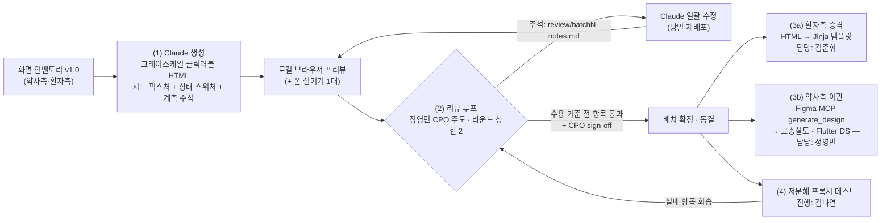

# indoro 와이어프레임 제작 계획 v1.0

## 0. 목적 · 도구 전제 · 운영 원칙

**와이어프레임이 답해야 하는 질문은 3개뿐이다.** 이 3개에 답이 나오는 순간 해당 화면은 확정하고 폴리싱을 멈춘다.

1. **동선이 KPI를 성립시키는가** — 약사 입력 항목당 20~40초(탭 수·타이핑 필드 수로 사전 검증), 환자 랜딩 3초 이해.
2. **저문해 문법이 텍스트 없이 작동하는가** — 아이콘+숫자+라벨 삼중화, M→N→E→H 고정 순서, 색+숫자 배지(와이어프레임에선 숫자만으로).
3. **팀 3인이 같은 화면을 상상하고 있는가** — 인벤토리 표의 요소가 화면 어디에 어떤 크기로 놓이는지 합의.

**도구 체인 (확정 사실)**

| 도구 | 역할 |
|---|---|
| Claude Code | 클릭 가능한 로컬 HTML 와이어프레임 생성·수정 + 브라우저 프리뷰 즉시 확인. 생성·수정은 분 단위 — **병목은 리뷰이므로 일정은 리뷰 슬롯 기준으로 설계한다** |
| Figma MCP (`generate_design`) | 확정된 약사측 HTML과 의도 요약을 Figma 디자인으로 이관 → 정영민이 고충실도 + Flutter 디자인 시스템으로 발전 |
| Jinja 승격 | 환자 웹뷰는 실제 제품도 서버렌더 경량 HTML — 환자측 와이어프레임은 다듬으면 그대로 Jinja 템플릿 뼈대가 된다. 따라서 **환자측에만 제품 수준 구조 제약(단일 문서·전부 인라인·무게 예산·JS 최소)을 와이어프레임 단계부터 적용**한다 |

**비대칭 원칙**: 환자측 HTML은 "제품의 전 단계"(구조 제약 준수), 약사측 HTML은 "동선 검증 도구"(HTML 품질 제약 없음 — 클릭 동선·요소·상태 충실도만). 단 약사측도 v0 웹폼 구현 시 확정 마크업을 출발점으로 재사용할 수 있다(§2.3 부기).

---

## 1. 제작 순서와 배치

**우선순위 기준**: ① 관통 데모(약사 입력→QR→환자 웹뷰) 크리티컬 패스에 있는가 — 인도 방문 전 완성 목표의 본체. ② M1 KPI를 담지하는가 — 입력 20~40초(P1·P2), 스캔율 30%의 물리 접점(P3)과 이해 성립(S1). ③ 뒤 배치일수록 빈도가 낮거나(복구 플로우), 사용자가 팀·운영자거나(P0·P8), 앞 배치 컴포넌트 재사용으로 증분이 작다(P6·P7).

| 배치 | 화면 | 파일 수 | 선정 근거 |
|---|---|---|---|
| **B1 관통 코어** | P1(+P2 확인 시트, G1·G2 자리 표시), P3, S1(S2 카드·C1 토글·C2 공유 포함 단일 문서), index 플로우 허브 | 4 | 관통 데모 = M1 KPI 전부. 입력 시간 KPI의 본체(P1·P2), 도달 퍼널의 물리 접점(P3), 3초 이해·가족 공유(S1). **B1 확정이 Jinja 승격·Figma 이관 두 트랙의 출발 신호** |
| **B2 도달 실패·재조회 경로** | S3, S4(A/B 변형), S5, P4, P5 | 5 | 현장에서 실제로 자주 만나는 상태 — 오프라인 발급 sync 공백(S3), 만료·폐기(S4), 가족 코드 대행(S5), "아까 그 손님"(P4→P5). S군은 ≤10KB 정적에 가까워 반나절 분량 |
| **B3 운영·설정·복구** | P0, P6, P7, P8(+G1·G2 상태 변형), S6, S7 | 6 | 데모에는 불요하나 현장 운영 전 필요. P0는 팀이 조작(온보딩 URL), P6·P7은 P1 컴포넌트 재사용이라 증분 소 |
| 제외 | B1 앱 설치 배너 | — | v0 비렌더 확정 — s1에 슬롯 주석만 남긴다 |

배치 간 의존: B2·B3 생성은 B1 확정을 기다리지 않고 착수 가능하되, `shared/` 공통 컴포넌트(배지·슬롯·칩)가 리뷰로 바뀌면 전 배치에 소급 반영한다(공통 CSS 1파일이므로 비용 미미).

---

## 2. 파이프라인 (4단계)



### 2.1 단계 1 — Claude가 저충실도 클릭러블 HTML 생성

생성 규칙(전 배치 공통):

- **뷰포트**: 360×640 기준 제작, 320px에서 가로 스크롤 0 검증. 모바일 단일 컬럼만.
- **전면 그레이스케일** — 항목 배지도 예외 없음. "색은 보조 부호, 숫자가 정본" 원칙(§2.1)을 와이어프레임이 직접 검증하는 기회다. 10색 팔레트는 `?color=1` 토글로 시안 비교만 하고, 확정(대비 4.5:1 검수)은 Figma 단계의 정영민 몫.
- **더미 데이터는 `shared/fixtures.js`만** — 화면별 하드코딩 금지. 약사 입력 화면과 환자 뷰가 같은 픽스처를 읽어야 관통 데모의 정합성이 성립한다.
  - **FX-A 기본**: daily 3항목(자동완성 히트 시나리오) — 3초 이해 테스트·탭 수 계측의 기준 세트.
  - **FX-B 전 패턴**: 코어 8패턴 전부 + CUSTOM 포함 10항목(상한) — 시간표 특수 행, 최악 길이, 무게 예산 검증.
  - **FX-C 엣지**: 시드 밖 약명(자동완성 미스 — DB-optional UI 검증), ml 시럽(단위 사고 방지 규칙), 0.5정(½ 글리프), PRN, 별칭 유/무, version 2 "수정됨" 배지, D-3 "곧 만료".
- **상태 스위처**: 우상단 개발 툴바(빗금 배경으로 "제품 아님" 명시), `?state=`(offline/error422/empty/…), `?lang=hi|en`, `?color=1`. 인벤토리 각 화면의 "상태 변형" 행 전부를 스위처 값으로 등록 — 리뷰에서 상태 누락을 클릭으로 검사.
- **계측 배치 주석**: 인벤토리 §11(약사)·§12(환자) 매트릭스의 마커를 해당 DOM 위치에 `<!-- 계측: [T0] client_input_id 생성 -->`, `<!-- beacon: media.video_play -->` 형식으로 심는다 — **와이어프레임이 곧 계측 배치 스펙**이 되어 구현 단계 인계 문서를 겸한다.
- **환자측 추가 제약(승격 대비)**: CSS/JS 전부 인라인·외부 요청 ≤1(포스터 자리 더미만), S1은 단일 문서(S2·C1·C2 포함, 아코디언 없음), 앵커 점프는 `:target`(JS 불요), hi/en 텍스트 노드 이중화 구조(`<span lang="hi">`/`<span lang="en">`)를 처음부터 채택, 숫자 ASCII·0.5는 ½, line-height ≥1.6, 말줄임 전면 금지, 데바나가리는 **실제 자리표시 문자열 사용**(라틴 로렘 입숨 금지 — 클리핑·랩·혼합 스크립트 줄높이를 지금 검증).
- **약사측**: 위 제약 없음. 미디어·QR은 회색 placeholder + 라벨("QR", "약 3MB · 30초").

### 2.2 단계 2 — 팀 리뷰 루프

- **오너**: 정영민 CPO — 수용 기준(§3) 판정권과 sign-off 권한.
- **주기**: 배치 생성 후 24시간 내 **라운드 1**(동기 30분 — `index.html` 허브로 클릭 워크스루, 폰 실기기 1대 필수) → Claude 당일 일괄 수정·재배포 → **라운드 2**(비동기 체크리스트 confirm, 24시간 내). **라운드 상한 2** — 초과 쟁점은 notes에 "디자인 단계 이슈"로 이월하고 배치는 확정한다(일정 보호).
- **채널**: 주석 정본은 `review/batchN-notes.md` 단일 파일 — Claude Code가 이 파일을 직접 읽어 일괄 반영하므로 **주석 채널이 곧 수정 백로그**다. 팀 메신저는 알림·일정 조율용으로만.
- **주석 형식**: `- [ ] 화면ID/요소: 문제 — 수정 지시` (예: `- [ ] P1/용량 스테퍼: 터치 영역 40px — 48px 이상으로`). 리뷰 시 인벤토리의 "핵심 요소와 바인딩" 표를 체크리스트로 사용해 **요소 누락 0**을 대조한다.
- **확정**: 수용 기준 전 항목 통과 + CPO sign-off → notes에 확정 선언, 파일 동결. D1에 `git init` 하고 배치 확정마다 태그를 남긴다(리뷰 diff·롤백용).

### 2.3 단계 3 — 확정안 처리 분기

**3a. 환자측 → Jinja 템플릿 승격 (김준휘)**

1. 확정 `s1-landing.html`의 픽스처 주입부를 Jinja 변수·루프·조건으로 치환(``, ``) — DOM·CSS는 그대로 유지.
2. 텍스트 노드를 i18n 카탈로그 키로 치환 — 이중화 구조를 와이어프레임부터 채택했으므로 기계적 치환.
3. S3/S4/S5/S7을 개별 템플릿으로 분리, 상태 스위처·개발 툴바 코드 제거.
4. 무게 검증(FX-B 10항목 기준 gzip ≤80KB·외부 요청 ≤2)을 로컬 체크 스크립트로 이식.
5. **승격 후 해당 와이어프레임은 동결** — 이후 변경은 템플릿에서만(이중 관리 금지).

**3b. 약사측 → Figma MCP 이관 (정영민)**

1. 확정 HTML + 인벤토리 요소표 요약을 입력으로 `generate_design` 호출 — P1·P3부터 화면 단위로.
2. 생성 초안을 컴포넌트화: 칩(패턴/기간/단위/식전후), 스테퍼, 색+숫자 배지, 항목 카드(펼침/접힘), 하단 고정 바, 상태 칩 5종 — **Flutter 위젯 1:1 매핑 표**를 함께 유지(§12 "화면 구조·계약 불변" 원칙의 디자인측 집행).
3. 고충실도에서 확정할 것: 10색 배지 팔레트(흰 숫자 대비 4.5:1 검수), 아이콘 파이널(SVG 심볼셋 ≤15KB 예산), 타이포 스케일.
4. **정본 규칙**: 동선·요소 구성의 정본은 인벤토리 + 확정 와이어프레임. Figma에서 구조를 바꾸고 싶으면 인벤토리 개정을 거친다.

**부기 — 약사 v0 웹폼**: v0 웹폼 구현(김준휘)은 Figma 고충실도를 기다리지 않고 확정 와이어프레임 마크업을 출발점으로 기능 구현을 병행할 수 있다(스타일은 후속 반영). 인벤토리(API 계약·계측 배치) + 확정 와이어프레임 + 계측 주석 3종이 곧 구현 스펙이다.

### 2.4 단계 4 — 저문해 사용자 검증 프로토콜 (인도 현지 전, 한국 프록시)

원칙: **아이콘 문법 검증(한국에서 가능)과 문구·문화 적합성 검증(인도 현지 몫)을 구분**한다. 이 단계는 전자만 노린다.

| # | 테스트 | 방법 | 대상 | 통과선 |
|---|---|---|---|---|
| T1 | 무텍스트 판독 (데바나가리 프록시) | S1을 **힌디 모드**로 데바나가리 비문해 한국인 5인에게 제시 — 텍스트 채널이 사실상 차단된 상태에서 아이콘+숫자만으로 4문항: "2번 약은 하루 몇 번?" / "아침에 먹는 약은?" / "식전? 식후?" / "며칠 치?" | S1·S2 | 문항별 4/5인 정답 |
| T2 | 3초 노출 | S1(FX-A)을 3초 노출 후 가리고 "이 약 언제 먹어요?" 질문 — 슬롯(아침/저녁 등) 회상 | S1 | 4/5인 정답 |
| T3 | 고령·저숙련 스마트폰 | 60대+ 지인 2~3인: 인쇄 QR 목업 스캔 → S1 열람 → 시간표 칩으로 특정 약 카드 찾기 | P3 인쇄물+S1 | 무보조 완주 2/3인 |
| T4 | 환경 스트레스 | 320px 뷰포트 · 3G 스로틀 · 그레이스케일 필터(저품질 패널 프록시) · 야외 직사광+밝기 50%에서 판독·스캔 | S1, P3 | 가로 스크롤 0 · QR 스캔 성공 · 핵심 판독 성립 |
| T5 | 약사 태스크 | 약사/약대생 지인 1~2인: 수기 처방전 샘플 3장(시드 히트 1 · 시드 밖 2 — DB-optional 검증)을 P1으로 입력 완주, think-aloud | P1~P3 | 완주율 100%, 항목당 시간 기록(참고치), 막힘 지점 목록화 |

- **보너스**: KAIST 내 힌디 화자 유학생 1~2인 섭외 시 자리표시 문구·아이콘의 문화 적합성 예비 감수(강력 추천 — 현지 감수 전 저비용 선별).
- **게이트**: T1·T2 통과 전에는 아이콘 파이널(Figma) 작업 착수 금지 — 저충실도에서 문법 실패를 잡는 것이 이 프로토콜의 존재 이유다.
- 결과는 `review/proxy-tests.md`에 기록, 실패 항목은 해당 배치 notes로 회송해 수정 루프에 재진입.

---

## 3. 화면별 수용 기준 (acceptance criteria)

**판정 방법**: 탭 수는 스위처·개발 툴바 제외 실사용 탭만 계수, 타이핑은 필드 진입 1회로 계수. 시간은 팀원 3인 각 1회 스톱워치 워크스루 평균. 3초 이해·판독은 §2.4 프로토콜로 판정.

**전 화면 공통**

- 360×640 기준, 320px 가로 스크롤 0. 터치 타깃 ≥48×48px, 주 행동 버튼 전폭·min-height 56px.
- 인벤토리 "핵심 요소와 바인딩" 표 대비 요소 누락 0, "상태 변형" 전부 스위처로 재현.
- 계측 마커(T0/T1·이벤트명) HTML 주석 명기 — 인벤토리 §11·§12와 1:1.
- 이모지 0, 라이트 모드 고정, 말줄임 0(환자측), 데바나가리 클리핑 0.

**약사측**

| 화면 | 수용 기준 |
|---|---|
| P1 | 1항목 발급 완주(P2 "발급" 탭 포함) 탭 상한 — **최근 약 칩 경로 ≤4탭 / 자동완성 채택 ≤5탭+약명 타이핑 1회 / 시드 밖 풀입력 ≤8탭+타이핑 1회**. 숫자 키보드 호출 0회. FX-A 3항목 워크스루 항목당 ≤40초(참고치 — 네트워크 지연 미반영 낙관치임을 기록). 2번째 항목 `duration_days` 승계, 카드 접힘 1행 요약 동작. 422 인라인+카드 자동 확장, 오프라인 변형(자동완성 비활성·버튼 라벨 전환) 재현 |
| P2 | FX-A 3항목이 총높이 ≤2화면·1스크롤 대조, 대조 워크스루 ≤5초. 행 탭→해당 카드 복귀. ml 항목 총량 단위 경고 존 표시. "발급" 하단 고정(엄지 존) |
| P3 | QR이 스크롤 0 첫 화면 중앙. "새 처방 입력" 1탭(최상단). 스캔 실패 신고 2탭(버튼→사유 4택). 인쇄/화면 폴백/오프라인(코드 없음·동기화 대기 배지)/재표시 4변형 재현 |
| P4 | 행에 QR 미노출(대조 확인). 행 탭→P5 1탭. 서버 20건+outbox 병합 상단 표시, 상태 칩 5종·"수정됨"·offline 아이콘 표현 |
| P5 | "QR 다시 보기"가 첫 액션, 1탭→P3 재표시 모드. active/만료/revoked 3상태의 액션 노출 분기 재현. 미리보기의 환자 라우트 미경유 주석 명기 |
| P6 | 전량 프리필 확인, 1필드 수정→저장 ≤3탭. "QR·링크 불변" 고지 상시 노출. 오프라인 비활성 상태 재현 |
| P7 | 사유별 프리필 분기(wrong_patient=빈 폼 / input_error=프리필) 재현. 경고 확인 필수 단계 존재. 2단 폼에 [T0] 주석(신규 발급 계측) |
| P8 | 건 상태 4종(대기/백오프 재시도/24h 경고/409 확인) 표현. 409→"신규 발급 전환"이 P1 프리필로 연결. G2 배지 탭→시트 1탭 |
| P0 | 타이핑 0(전 항목 확인·토글). 기기 점검 체크리스트·crypto 미지원 경고 상태 재현. 완료→P1 진입 |

**환자측**

| 화면 | 수용 기준 |
|---|---|
| S1 | **3초 이해 테스트(T2) 4/5인 통과**. FX-A(3항목)에서 신뢰 헤더+하루 시간표가 스크롤 0 첫 화면 내 완결. 시간표 칩→`#item-n` `:target` 점프+하이라이트가 JS 없이 동작. M→N→E→H 순서가 전 컴포넌트에서 일치. 언어 토글 시 아이콘·그리드 골격 이동 0. **FX-B 10항목 기준 gzip ≤80KB·전부 인라인·외부 요청 ≤1**. JS 비활성에서 전 정보 열람+언어 전환(`?lang` 링크)+공유(wa.me) 성립 |
| S2 | 카드 1장에 5요소(무엇을·언제·몇 개·식전후·며칠) 완비, 수량 숫자 24px+, 4칸 스트립 아래 "1-0-1" 숫자열 병기, 0.5→½. **음성 버튼이 영상보다 위**. PRN·CUSTOM·STAT·WEEKLY 변형 카드 각 1개(FX-B) 재현 — CUSTOM은 영상·스트립 없음+경고 카드 |
| C1 | 1탭 전환, 자기표기 "हिन्दी | English"(국기 없음). 첫 언어 협상 체인 5단계를 주석으로 명기하고 스위처로 시나리오 데모 |
| C2 | 공유 1탭→시트 목업. 메시지 미리보기에 약명+숫자열+기간 포함, `patient_label` 미포함(대조 확인). JS 없음 경로(wa.me 링크) 존재 |
| S3 | 요소 3개 이하(아이콘 1·문구 2줄·버튼 1). 30초 자동 재시도 표기. 데이터 바인딩 0(전부 정적) 확인 |
| S4 | A(만료)/B(폐기) 분리. B는 정보 0 — 사유·약국명·처방 내용 미표기 대조. A는 약국명+안전수칙 ≤3. 중립 톤(경고색·빨간 X 금지 주석) |
| S5 | 코드 1필드+제출이 JS 없이 form GET으로 동작(성공/실패는 스위처로 모사). 4-4 monospace 24px. 오류 시 입력값 유지. 429 변형 |
| S6·S7 | 각 1화면. 외부 링크 0, S7은 같은 URL 재시도 링크만 |

---

## 4. 산출물과 파일 구조

```
indoro/
└─ wireframes/
   ├─ README.md               # 본 계획 + 수용 기준 체크리스트 + 배치별 진행 현황
   ├─ index.html              # 플로우 허브: 두 이동 맵을 클릭러블로 — 리뷰 워크스루·관통 데모 진입점
   ├─ shared/
   │  ├─ fixtures.js          # FX-A/B/C 처방 픽스처 — 약사·환자 화면 공용 (관통 정합성)
   │  ├─ wf.css               # 그레이스케일 토큰, 배지·슬롯·칩·스테퍼·카드 공통 컴포넌트
   │  └─ wf.js                # 상태 스위처(?state/?lang/?color), G1·G2 목업 등 최소 JS
   ├─ pharmacist/
   │  ├─ p1-input.html        # P2 확인 시트 포함(오버레이 상태)
   │  ├─ p3-qr.html           # 인쇄·화면·오프라인·재표시 4변형
   │  ├─ p4-list.html
   │  ├─ p5-detail.html
   │  ├─ p6-edit.html         # P1 컴포넌트 재사용
   │  ├─ p7-reissue.html      # 1단 사유 + 2단(P1 재사용)
   │  ├─ p8-outbox.html
   │  └─ p0-onboarding.html
   ├─ patient/
   │  ├─ s1-landing.html      # S2 카드·C1 토글·C2 공유 포함 단일 문서 (제품 동형 — 승격 대상)
   │  ├─ s3-pending.html
   │  ├─ s4-expired.html      # A/B 변형 스위처
   │  ├─ s5-code.html
   │  ├─ s6-privacy.html
   │  └─ s7-error.html
   └─ review/
      ├─ batch1-notes.md ~ batch3-notes.md   # 리뷰 주석 백로그 겸 결정 로그
      └─ proxy-tests.md                      # T1~T5 결과·회송 링크
```

정적 파일이므로 서빙은 1줄 서버(`python3 -m http.server`)면 충분. D7 리허설에서는 LAN IP로 폰 접속 + P3의 QR을 그 주소로 실제 인코딩해 물리 관통을 확인한다(선택 — 수용 기준 외).

**산출물 목록**

| 산출물 | 형태 | 비고 |
|---|---|---|
| 클릭러블 와이어프레임 세트 | HTML 15개 내외 + index 허브 | 전 화면·전 상태 스위처 포함 |
| 공용 시드 픽스처 | `shared/fixtures.js` | 이후 백엔드 시드 픽스처의 원형으로 재사용 |
| 리뷰·결정 기록 | `review/batch{1..3}-notes.md` | 이월 쟁점("디자인 단계 이슈") 포함 |
| 수용 기준 감사 결과 | `README.md` 체크리스트 | 배치 확정의 근거 |
| 프록시 테스트 결과 | `review/proxy-tests.md` | T1~T5, 실패→수정 회송 |
| 계측 배치 주석 | 각 HTML 내 주석 | 구현 단계의 계측 스펙 인계물 |
| (승격) 환자측 Jinja 뼈대 | `templates/` | 승격 후 원본 와이어프레임 동결 |
| (이관) 약사측 Figma 파일 | Figma 프로젝트 | 컴포넌트 라이브러리 + Flutter 위젯 매핑 표 |

---

## 5. 일정 — 상대 일정, 3인 병렬 (D1 = 착수일)

생성은 Claude가 반나절 내 처리하므로 **일정의 고정점은 리뷰 세션 3회(D2·D4·D6)와 프록시 테스트 2회(D5·D6)**다.

| 시점 | 김준휘 CTO (Claude Code 운전) | 정영민 CPO | 김나연 CSO |
|---|---|---|---|
| **D1 (이번 주)** | `git init`·스캐폴드·`shared/` 생성 → **B1 생성**(P1·P3·S1·index) | 리뷰 기준(§3) 숙지, 아이콘 러프 도형 지시 | FX-A/B/C 픽스처 데이터 초안(시드 5~10종, 8패턴 전부) |
| **D2** | B1 라운드 1 주석 당일 반영·재배포 | **B1 리뷰 라운드 1**(동기 30분, 폰 실기기) 주도 → 주석 작성 | 태스크 시나리오·프록시 4문항 스크립트 작성 |
| **D3** | **B2 생성** + S1 Jinja 승격 착수 | B1 라운드 2 확정·sign-off → **P1·P3 Figma MCP 이관 시작** | 테스터 리크루팅(한국인 5, 60대+ 2~3, 약사 1~2, 힌디 화자 탐색) |
| **D4** | B2 주석 반영, Jinja 계속 | **B2 리뷰 라운드 1** | 프록시 테스트 리허설(도구·기록지) |
| **D5** | **B3 생성** | B2 확정, Figma 컴포넌트화 | **T1 무텍스트 판독 + T2 3초 노출 실행** → 결과 회송 |
| **D6 (주말)** | B3 주석 + 프록시 실패 항목 반영 | **B3 리뷰·확정**, 아이콘 파이널 착수(T1·T2 통과 시) | **T3 고령자 + T4 환경 스트레스 실행** |
| **D7 (주말)** | **관통 데모 리허설** — LAN 서빙 + 실QR로 P3→S1 물리 관통 | 전체 수용 기준 최종 감사 | **T5 약사 태스크 실행**(섭외 일정 따라 D5~D7 유동), 리허설 판정 |

D7 종료 시점의 상태: 전 화면 확정본 + 환자측 Jinja 뼈대 진행 중 + 약사측 Figma 컴포넌트화 진행 중 + 프록시 검증 1순회 완료 → 다음 주부터 실제 구현(FastAPI 라우트 + v0 웹폼)에 인계.

---

## 6. 와이어프레임 단계에서 하지 않을 것

| 하지 않음 | 이유 · 대신 |
|---|---|
| 컬러·고충실도 비주얼 (항목 배지 포함 전면 그레이스케일) | 숫자 정본 원칙의 검증 기회. 10색 팔레트는 `?color=1` 시안 비교만 — 확정은 Figma 단계(대비 검수: 정영민) |
| 브랜딩·로고·커스텀 폰트 | 제품도 시스템 폰트(웹폰트 0KB). 로고 자리는 회색 박스 |
| 애니메이션·트랜지션·마이크로인터랙션 | S3 모래시계 포함 전부 정지 표현. 동적 상태는 스위처가 대신 |
| 실제 미디어 자산(영상·음성·아이콘 파이널) | 회색 placeholder + 용량 라벨("약 3MB · 30초"). 아이콘은 단순 도형 — 파이널 SVG 심볼(≤15KB 예산)은 디자인 단계 |
| 실제 QR 인코딩·API·DB 연동·계측 코드 | QR은 더미(D7 리허설만 LAN 실QR 옵션). 계측은 주석 스펙만 — 구현은 v0 웹폼 단계 |
| 힌디 문구 확정 | 자리표시 유지 — 확정은 파일럿 지역 결정 + 현지 감수 후. 단 데바나가리 렌더 검증을 위해 실문자는 사용 |
| 데스크톱·태블릿 레이아웃, 다크모드 | 모바일 320~412px·라이트 고정(제품 제약과 동일) |
| B1 앱 설치 배너 | v0 비렌더 확정 — s1에 슬롯 주석만 |
| Flutter 코드, 완전 접근성 감사 | Figma 이후 단계 / 저문해 필수 항목(타깃 크기·랩·대비)만 이 단계에서 |
| 리뷰 3라운드 이상 폴리싱 | 라운드 상한 2 — 미합의 쟁점은 이월하고 배치 확정(일정 보호). 와이어프레임의 완성 조건은 §0의 질문 3개에 대한 답이지, 예쁨이 아니다 |
