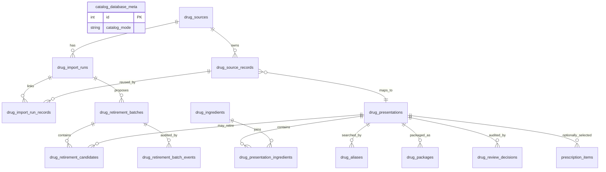

# 인도 의약품 데이터 기반 설계

- 목적: 약사가 수기 처방전을 빠르고 안전하게 전사하도록 돕는 검색 카탈로그
- 조사 및 접근일: 2026-07-10
- 적용 범위: FastAPI + SQLite 자동완성, 처방 입력, 출처 추적, 품질 검토
- 비적용 범위: 진단 추정, 의약품 추천, 대체약 추천, 용량 계산, 상호작용 판정

## 결정 요약

indoro는 **성분 온톨로지 전체**나 **온라인 약국 상품 DB 복제본**을 만들지 않는다. 현재 제품에 필요한 최소 단위인 `출처 -> 원본 레코드 -> 의약품 표시 단위(presentation) -> 성분/별칭/포장`을 분리한 B-lite 구조를 사용한다.

핵심 결정은 다음과 같다.

1. 상업 사이트 참고분이 섞인 기존 627건 시드는 저장소와 searchable DB에서 제거한다. 자동완성 UX는 프로젝트가 작성한 가상 이름의 합성 fixture 16건을 별도 demo DB에 격리해 시연한다.
2. 운영 데이터는 출처, 버전, 원본 ID, 원문, 입력 해시, 라이선스 상태를 모두 추적할 수 있을 때만 임포트한다.
3. 상품명, 성분, 함량, 제형, 경로, 방출 특성이 식별 키의 일부다. 확실하지 않은 항목은 병합하지 않고 `needs_review`로 남긴다.
4. 자동완성은 약을 찾는 도구다. M/N/E/H, 복용량, 식전/식후, 기간, PRN 규칙을 자동으로 채우지 않는다.
5. 처방에는 약사가 본 원문과 선택 당시 카탈로그 스냅샷을 보존한다. 환자 화면은 이후 바뀔 수 있는 실시간 카탈로그가 아니라 발급 당시 약사가 확인한 표시명을 사용한다.
6. 인도 정부가 공개한 자료라는 사실만으로 상업적 재사용이 허용된다고 간주하지 않는다. 파일별 라이선스가 명확하지 않으면 Tier 2로 두고 현지 법무 검토 전에는 운영 임포트를 막는다.
7. production 패키지는 스스로 `approved`라고 선언할 수 없다. 별도 로컬 승인 레지스트리의 exact slug, records SHA-256, source metadata SHA-256, 승인일·승인 역할이 모두 일치해야 한다.
8. source가 계산한 `review_status`/`lifecycle_status`와 사람이 결정한 `workflow_review_status`/`operational_lifecycle_status`를 분리한다. source 품질이 `verified`여도 약사 승인 이력이 없으면 자동으로 `approved`가 되지 않는다.
9. 사람의 승인·반려·비활성화·복구·retirement 결정은 presentation 현재 상태와 append-only 감사 행을 같은 transaction에서 기록하고, `record_version`으로 동시 검토 덮어쓰기를 막는다.
10. `snapshot_mode=full`에서 빠진 원본 ID는 즉시 삭제·비활성화하지 않는다. 이전 성공 full snapshot과 비교해 retirement batch/candidate만 제안하고, 사람의 후보 결정 → batch 승인 → 별도 apply 뒤에만 `retired`로 바꾼다.

## 1. 정보 요구사항

### A. 약 식별과 출처 추적

| 정보 | 저장 이유 | 환자 기본 노출 |
| --- | --- | --- |
| 내부 고유 ID | 처방 항목과 카탈로그 레코드의 안정적 연결 | 아니오 |
| 상품명 원문/정규화명 | 상품명 검색과 철자 변형 처리 | 약사가 확인한 짧은 이름만 |
| 성분명/성분 조합 | 상품명 혼동 감소, 약사 검색 | 기본 비노출; 운영 정책에 따라 약사가 선택 |
| 성분별 함량과 단위 | 서로 다른 함량·복합제 구분 | 처방 용량과 혼동되지 않게 기본 비노출 |
| 제형 | tablet/capsule/syrup 등 제품 구분 | 필요할 때 짧은 라벨 |
| 투여 경로 | eye/ear/oral drops 등 오선택 방지 | 약사가 확인한 경우 표시 가능 |
| 방출 특성 | IR과 SR/ER/CR/XR/MR 구분 | 표시명에 포함된 경우 보존 |
| 제조사/마케팅 회사 | 동명 제품 구분과 약사 검색 | 아니오 |
| 포장 형태/수량 | 제품 구분과 재고 연계 기반 | 아니오 |
| 법적 분류 | 내부 검토 및 제한 표시 기반 | 단독 데이터로 환자 안내 생성 금지 |
| 출처/원본 ID/버전/갱신일 | 감사, 재임포트, 변경 추적 | 아니오 |
| 원본 JSON과 입력 해시 | 원본 보존, 멱등성, 변환 재현 | 아니오 |
| 활성/검토 상태 | 검색 포함 여부와 불완전 데이터 경고 | 아니오 |

가격, 재고, 광고 문구, 진단·치료군 추정은 환자 복약 화면의 약 식별에 필요하지 않다. 공식 가격 자료를 가져오더라도 이 기능과 분리한다.

### B. 약사 입력 보조

| 정보 | 사용 방식 | 안전 계약 |
| --- | --- | --- |
| 검색용 정규화 문자열 | 대소문자, 공백, 하이픈, `500mg/500 mg` 변형 검색 | 원문을 덮어쓰지 않음 |
| 상품/성분 별칭 | 확인된 별칭의 exact/prefix 검색 | 임의 별칭·자동 번역 생성 금지 |
| Devanagari 별칭 | 출처가 있거나 현지 검수된 경우 검색 | 자동 음역을 운영 데이터로 승격 금지 |
| 짧은 표시명 | 결과 목록에서 상품을 빠르게 비교 | 긴 이름을 말줄임표로 구분 불가능하게 자르지 않음 |
| 제형별 단위 후보 | 약사가 단위를 고를 때 후보 제시 | 자동 선택 또는 처방 확정 금지 |
| 약사 입력 원문 | 처방전 전사 충실도 보존 | 카탈로그 선택 후에도 별도 보존 |
| 선택 상태 | `free_text`, `selected`, `selected_then_modified` 구분 | 수정 사실을 숨기지 않음 |
| 불완전/검토 경고 | 성분, 함량, 제형 누락 표시 | 경고이며 처방 판단을 대신하지 않음 |

### C. 환자 표시 모델

환자 화면에는 카탈로그 원본 전체를 전달하지 않는다. 처방 발급 당시 약사가 확인한 다음 항목만 별도 표시 모델로 구성한다.

- 약 봉투 번호
- 약사가 확인한 표시용 약명
- 약사가 명시적으로 노출하기로 한 성분 또는 제형
- 약사가 입력한 복용량과 단위
- M/N/E/H
- 식전/식후
- 기간
- PRN 1회량, 최소 간격, 하루 최대 횟수
- 약사가 입력한 주의 문구
- 표시 언어와 번역 상태
- 번역되지 않은 경우의 원문

제조사, 마케팅 회사, 가격, 포장 MRP, 출처 내부 ID, 검토자 메모, 진단 추정은 기본 환자 응답에서 제외한다. 약품 ID나 약명은 환자 URL·QR·메타데이터에 넣지 않는다.

### 자동 결정하지 않는 정보

- 복용량, 1일 횟수, M/N/E/H
- 식전/식후와 정확한 식사 간격
- 복용 기간과 총 수량
- PRN 사유·최소 간격·하루 최대 횟수
- 성인·소아·신장기능별 용량
- 금기, 임신 안전성, 상호작용
- 진단명, 적응증, 대체약
- 제형에서 추정한 투여 경로 또는 동일 성분의 자동 대체

## 2. 데이터 출처 평가

### 등급 기준

- **Tier 1 - 직접 사용 가능:** 공식 기관, 파일별 재사용 조건 확인, 안정적인 원본, 출처·갱신일 추적 가능
- **Tier 2 - 검토 후 사용 가능:** 공공기관 또는 신뢰할 수 있는 자료지만 상업적 재사용, 자동 수집, 제3자 권리 중 하나가 불명확
- **Tier 3 - 참고 전용:** 상업 사이트, 사용자 생성 데이터, 출처·라이선스가 불명확한 저장소나 파일, 오래된 미관리 데이터

Tier는 기관 전체가 아니라 **개별 자료**에 부여한다. 같은 기관 안에서도 라이선스와 제3자 권리가 다를 수 있다.

### 공식·공공 출처 비교

요청한 필드를 한 행에 모두 넣으면 비교가 어려워 접근·내용과 권리·채택을 두 표로 나눴다. 두 표의 후보 순서는 같다.

#### 범위와 접근성

| 후보 | 운영 기관 | 데이터 범위 | 상품명 | 성분·함량·제형 | 제조사 | 갱신 주기 | 파일 형식·API/다운로드 |
| --- | --- | --- | --- | --- | --- | --- | --- |
| [Open Government Data Platform India](https://www.data.gov.in/) · [GODL](https://www.data.gov.in/godl) · [이용조건](https://www.data.gov.in/terms-of-use) | MeitY/NIC 및 개별 게시 기관 | 자원별 공공 데이터; 전국 의약품 제품 master는 확인하지 못함 | 자원별 | 자원별 | 자원별 | 각 자원 메타데이터에 따름 | 자원별 CSV/JSON 등 다운로드 또는 API |
| [NPPA](https://nppa.gov.in/en) · [저작권 정책](https://nppa.gov.in/en/copyrightpolicy) · [가격 목록](https://www.nppa.gov.in/en/therapeuticcategorywiseceilingpricelist) | National Pharmaceutical Pricing Authority | formulation, 단위, ceiling/retail price, 가격 명령 | 일부 명령에 제품 표현이 있을 수 있으나 채택 패키지는 generic formulation만 | 성분·함량·제형 일부 포함 | 채택한 formulation 목록에는 없음 | 명령·목록별 갱신; 고정 주기를 추정하지 않음 | PDF/웹 목록; 안정적 공개 bulk API는 확인하지 못함 |
| [CDSCO 승인 자료](https://cdsco.mohfw.gov.in/opencms/opencms/en/Approval_new/Approved-New-Drugs/) · [기능](https://cdsco.gov.in/opencms/opencms/en/About-us/Functions/) · [저작권 정책](https://cdsco.gov.in/opencms/opencms/en/Copyright-Policy/) | Central Drugs Standard Control Organisation | 승인 신약/FDC와 규제 자료; 주·중앙 허가 분담으로 전국 판매 브랜드 전체가 아님 | 자료별 일부 | 자료별 포함 | 신청자·firm이 자료별 존재할 수 있음 | 승인 목록·공지별 수시/연도별 | 동적 검색·PDF; 안정적 bulk API/다운로드는 확인하지 못함 |
| [NLEM 2022](https://cdsco.mohfw.gov.in/opencms/opencms/en/consumer/Essential-Medicines/) · [정부 발표](https://www.pib.gov.in/PressReleasePage.aspx?PRID=1896031) | Ministry of Health and Family Welfare | 384개 필수의약품 | 없음 | 성분과 일부 함량·제형 | 없음 | 비정기 개정 | PDF 다운로드; 공개 API 확인 못함 |
| [Jan Aushadhi Product/MRP List](https://janaushadhi.gov.in/productportfolio/ProductmrpList) · [저작권 정책](https://www.janaushadhi.gov.in/copyright) | Pharmaceuticals & Medical Devices Bureau of India | drug code, generic product, unit size, MRP | 일반 상업 브랜드는 없음 | generic product 문자열에 일부 포함 | 전국 제조사 master는 아님 | 웹 목록 갱신; 고정 주기 미표시 | 웹 목록/다운로드; 승인된 공개 API는 확인 못함 |
| [PvPI Drug Safety Alerts](https://www.ipc.gov.in/mandates/pvpi/pvpi-outcome/8-category-en/416-drug-safety-alerts.html) · [IPC 이용조건](https://www.ipc.gov.in/terms-conditions.html) | Indian Pharmacopoeia Commission | 성분 중심 안전성 신호·경보; 제품 식별 master가 아님 | 보통 없음 | 경보 대상 성분·반응 중심 | 없음 | 경보별 수시 | 웹/PDF; 제품 카탈로그 API 없음 |
| CDSCO NSQ·recall·banned/FDC 자료 | CDSCO | 특정 batch, 회수·금지·안전성 공지 | 공지별 가능 | 공지별 | 공지별 가능 | 월별 목록 또는 공지별 | PDF/웹; 자료별 다운로드 |
| [Indian Pharmacopoeia Online](https://iponline.ipc.gov.in/) · [이용조건](https://iponline.ipc.gov.in/jspui/terms-condition.jsp) | Indian Pharmacopoeia Commission | 약전 규격·모노그래프 | 제품 master 아님 | 성분 규격 중심 | 없음 | 약전 edition/보충판 | 구독형 웹; 허가된 bulk API 없음 |

#### 권리, 품질, 채택 판정

| 후보 | 라이선스 | 상업 서비스 재사용 | 출처 표시 | 자동 수집 | 주요 품질 한계 | indoro 직접 사용 | 현지 법무 검토·Tier |
| --- | --- | --- | --- | --- | --- | --- | --- |
| OGD Platform India | 개별 자원에 GODL이 표시된 경우 GODL-India | 해당 자원의 GODL 범위 안에서 가능; 제3자 권리·상표 제외 | 필수 | 개별 자원이 선언한 API/다운로드만 사용 | 필드·갱신·원출처가 자원마다 다름 | 현재 적합한 전국 제품 master를 찾지 못해 미채택 | GODL 표시 자원은 Tier 1; 개별 파일 권리 재확인 |
| NPPA | NPPA 저작권 정책 | NPPA 자체 작성 자료는 정확성·비훼손·비오해·출처 표시 조건으로 제한 사용; 제3자 자료 제외 | 필수 | 공식 파일을 고정·전사; 사이트 전체 수집 금지 | 가격 규제 목적이고 브랜드·제조사·route가 불완전 | **Tier 1 제한 채택:** 2026-03 formulation 11건만 production | 기술적 exact-hash gate 완료; 제3자 권리와 실제 상업 서비스 적용은 현지 법무 확인 필요 |
| CDSCO 승인 자료 | CDSCO 정책상 허가 확인 필요 | 서면 허가 전 불명확 | 필요 | 서면 허가와 version pinning 전 금지 | 전국 marketed-brand master가 아니며 형식이 분산 | 수동 규제 확인만; 운영 DB 미적재 | Tier 2, 현지 법무 필요 |
| NLEM 2022 | 파일별 상업 재사용 라이선스 확인 못함 | 불명확 | 필요 | 대량 임포트 금지 | 필수의약품 정책 목록이지 브랜드·제조사·포장 master가 아님 | 성분·제형 검토 참고만 | Tier 2, 현지 법무 필요 |
| PMBI Jan Aushadhi | 사전 허가 요구 저작권 고지 | 서면 허가 전 불가로 취급 | 허가 조건에 따름 | undocumented endpoint 수집 금지 | 공공 generic portfolio이며 일반 시장 전체가 아님 | 승인된 파일/API를 받은 뒤 후보 | Tier 2, 현지 법무 필요 |
| PvPI alerts | 운영 DB 재사용·자동 수집 조건 불명확 | 불명확 | 필요 | 자동 수집 금지 | 경보는 인과 확정·제품 master가 아니고 시점/대상이 제한됨 | 사람 검토용 안전 overlay 후보만 | Tier 2, 현지 법무·약사 필요 |
| CDSCO NSQ·recall·banned/FDC | 자료별 권리 확인 필요 | 불명확 | 필요 | 자료별 승인 전 금지 | batch·기간 범위를 제품 전체 상태로 확대할 위험 | 자동 비활성화 금지; 수동 overlay 후보 | Tier 2, 현지 법무·규제 약사 필요 |
| Indian Pharmacopoeia Online | 구독 이용조건; 상업 재사용·data mining 제한 | 별도 상업 라이선스 없이 불가 | 라이선스에 따름 | 금지 | 규격 참고용이며 제품 식별·판매 상태 master가 아님 | 미사용 | Tier 3, 계약 전 사용 금지 |

### 참고 전용·제외 출처

| 출처·운영자 | 범위·필드 | 갱신·형식/API | 라이선스·상업 재사용·표시 | 자동 수집 | 품질 문제 | indoro 사용·법무 판정 |
| --- | --- | --- | --- | --- | --- | --- |
| Tata 1mg, PharmEasy, Netmeds, Apollo Pharmacy 등 각 상업 운영자 | 상품명·성분·함량·제형·제조사 등 판매 페이지별 필드 | 수시 변경 웹/앱; 허가된 bulk 파일·API 없음 | 명시적 데이터 공급 계약 없이는 재사용·재배포 권리 없음; 출처 표시는 허가를 대체하지 않음 | 스크래핑 금지 | 판매·광고 목적, 품절·중복·표현 변화와 원출처 불명확 | 검색 구조·UX 수동 참고만. Tier 3, 계약 전 운영·demo 데이터로도 사용 금지 |
| Kaggle·GitHub 게시자 | 파일별로 상품/성분/제조사 필드가 섞임 | 비정기 CSV/JSON; 유지보수·원 API 불명확 | 저장소 license가 원 의약품 데이터 권리를 보장하지 않음 | 원출처 허가 전 금지 | 출처·갱신일·삭제·recall 반영 검증 곤란 | 미사용. Tier 3, 원출처·라이선스 전부 재검토 필요 |
| 검색 엔진 결과·라이선스 없는 PDF/스프레드시트의 불명 운영자 | 검색 snippet 또는 임의 목록 | 시점 불명 웹/PDF/XLS; 안정 API 없음 | 공개 노출은 재사용 라이선스가 아님 | 금지 | 원본성·변경 이력·누락 범위 불명 | 미사용. Tier 3, 권리 확인 전 금지 |
| 제거된 `data/drugs-seed.json` · indoro prototype team | NLEM 백본과 상업 사이트·보도 참고 브랜드 627건 혼합 | 정적 JSON; 지속 갱신 체계 없음 | 전체 원출처·상업 재사용 권리를 입증하지 못함 | 추가 수집 금지 | 필드별 provenance와 삭제·규제 상태 불충분 | working tree·importer에서 제거. Tier 3 reference; 과거 Git blob 처리는 법무·거버넌스 판단 필요 |
| `data/catalog/indoro-synthetic-demo-v1.json` · indoro prototype team | 가상 상품·성분 16건; 함량·제형·route·release·별칭·긴 이름 포함, 제조사도 가상/누락 | versioned local JSON; 외부 API 없음 | 프로젝트 작성 합성 fixture, 실제 데이터 재사용 아님 | 외부 수집 없음 | 의료·판매·규제 사실을 나타내지 않음 | 별도 demo DB와 `ph-demo-001`에서만. Tier 3 demo, production 승격 금지 |

`robots.txt`는 크롤링 접근 규칙이지 저작권·계약·데이터베이스 권리의 사용 허가가 아니다.

### 현재 채택 전략

- 운영 임포터가 허용하는 기본 경로는 **개별 파일의 재사용 승인이 기록된 Tier 1** 자료다.
- [`data/catalog/nppa-anti-diabetes-2026-03.json`](../data/catalog/nppa-anti-diabetes-2026-03.json)에 NPPA가 2026년 3월 기준으로 게시한 항당뇨 formulation 11건을 Tier 1 production 패키지로 담았다. NPPA 자체 작성 formulation·단위·price fact만 전사했고 브랜드·제조사·복용법은 추정하지 않았다.
- NPPA 패키지는 승인된 import/update 경로를 검증하는 최소 공식 데이터다. 11건을 전국 상품명 카탈로그 또는 처방 권고 목록으로 해석하지 않는다.
- CDSCO, NLEM, PMBI, PvPI는 소스 레지스트리에 후보로 기록할 수 있지만 `legal_review_required` 상태에서는 운영 임포트를 막는다.
- 전국 상품명 카탈로그가 필요하면 CDSCO/PMBI 또는 적법한 상업 데이터 제공자와 서면 라이선스를 확보해야 한다.
- 라이선스가 확보되기 전 실제 동작 검증은 명시적으로 표시된 demo source로 수행한다.

### production 승인 게이트

[`data/drug-sources.json`](../data/drug-sources.json)의 `approved_packages`가 production 임포트의 독립된 승인 레지스트리다. 임포터는 다음을 모두 확인한다.

- package slug와 승인 레지스트리 slug의 exact 일치
- canonical records SHA-256와 승인된 records SHA-256 일치
- 출처·라이선스·접근일을 포함한 source metadata SHA-256 일치
- `approval_status=approved`, ISO 승인일, 승인 역할 존재
- production source의 실제 `accessed_at`과 발행/갱신일 존재, 출처 날짜가 접근일보다 미래가 아님
- 안정적인 `source_record_id` 존재. 누락·중복·파싱 예외 레코드는 searchable presentation으로 만들지 않고 실행별 quarantine 증거로 남김

임포트 실행은 당시 source, license, approval registry entry와 각 해시를 snapshot으로 보존한다. 따라서 나중에 source row가 수정되더라도 처방 발급 시 사용한 import run의 근거를 복원할 수 있다. Tier 2를 production으로 쓰려면 레지스트리에 현지 법무 승인 범위와 고정 해시를 새로 기록해야 하며, Tier 숫자만 바꾸는 것은 승인 절차가 아니다.

현재 승인 entry는 `nppa-antidiabetes-formulations-2026-03`의 records SHA-256 `e06801716c56985d4a3d57d4c9c188b85aee95dbbde518861521dc23668a5ad7`, source metadata SHA-256 `2fb45152122f310af85980adb60d81d3172a0d65b7974a9473bc73b265d44d69`를 고정한다. source metadata 해시에는 `accessed_at`, 원본 artifact manifest·SHA-256·byte 수, 변환 방식, `snapshot_mode`, `package_schema_version`이 포함된다. 원본 NPPA PDF 자체는 SHA-256 `fd23814ae3a0009a0d8d6e14d079ff3e72605edfae6041e3529ccd988f311e62`(401,697 bytes)로 고정한다. 이 값은 데이터의 의학적 승인이 아니라 현재 파일·출처 메타데이터에 대한 import 허가 식별자다.

PDF 표는 자동 OCR 결과를 바로 약 식별자로 승격하지 않는다. 공식 호스트·TLS·크기·PDF signature·원본 해시를 `fetch_catalog_source.py`가 검증하고, 사람이 원문 11행을 대조한 CSV를 `nppa_package.py`가 결정적으로 JSON package로 변환한다. PDF hash나 reviewed CSV가 바뀌면 package check와 production approval gate가 실패하며 새 버전·약사/데이터 거버넌스 검토가 필요하다.

## 3. 정보구조 후보와 선택

| 기준 | A. 상품 중심 단일 테이블 | B-lite. 출처·표시 단위·성분 분리 |
| --- | --- | --- |
| 오선택 감소 | 상품 한 행에 문자열이 섞여 비교가 어렵다 | 함량·제형·경로·방출 특성을 분리해 비교 가능 |
| 복합제/함량 변형 | 성분 조합·강도 문자열 중복이 커진다 | 성분 순서와 원문 강도를 보존할 수 있다 |
| 출처 추적 | 마지막 import가 이전 출처를 덮기 쉽다 | 원본 레코드 버전과 canonical 표시 단위를 분리한다 |
| 자동완성 | SQL이 단순하다 | 인덱스와 search 문자열로 SQLite에서도 충분히 단순하다 |
| 자유 입력 | 별도 처리 필요 | 카탈로그 ID를 nullable로 두어 자유 입력을 정본으로 유지한다 |
| 향후 이전 | 단순하지만 정리 비용이 뒤로 이동한다 | Postgres 이전 시 관계를 그대로 유지할 수 있다 |
| 구현 비용 | 낮음 | 중간. 완전한 의약품 온톨로지보다 작다 |

**선택: B-lite.** 잘못된 병합과 출처 소실 위험을 줄이는 이점이 현재 추가 복잡도보다 크다. RxNorm 같은 범용 의료 온톨로지나 완전한 규제 시스템은 만들지 않는다.

## 4. 데이터 모델

### 주요 테이블

| 테이블 | 역할 | 핵심 키·제약 |
| --- | --- | --- |
| `catalog_database_meta` | SQLite 파일 자체의 카탈로그 역할을 production 또는 demo로 고정 | singleton `id=1`, `catalog_mode` check. 최초 apply가 역할을 기록하고 반대 scope의 후속 apply를 거부 |
| `drug_sources` | 운영기관·Tier·라이선스·재사용 상태 | `slug` unique, `reuse_status`, `usage_scope` |
| `drug_import_runs` | apply 버전·source/license/approval snapshot·수량·보고서와 importer/normalization/package schema/snapshot mode/code revision | `(source_id, version, input_sha256, mode)` unique. `input_sha256`는 package content와 처리 버전을 합친 replay key이고 순수 입력은 `package_content_sha256`에 별도 보존. dry-run은 운영 DB에 run row를 남기지 않음 |
| `drug_import_run_records` | 동일 불변 원본이 어느 실행에 참여했는지와 실행별 imported/needs_review/quarantined 상태 | `(import_run_id, record_ordinal)` unique. 현재/이전 normalized projection SHA-256, changed-field JSON, review 필요 여부 보존 |
| `drug_source_records` | 원본 레코드의 불변 JSON·해시 버전 | `(source_id, source_record_id, raw_sha256)` unique |
| `drug_presentations` | 약사가 한 검색 결과로 선택하는 상품/성분·함량·제형 단위 | source 계산 상태와 사람 운영 상태 분리, `record_version` optimistic lock, 현재 normalized projection JSON/SHA-256, 실제 적용된 `current_import_run_record_id` |
| `drug_ingredients` | 중복 가능한 성분명 사전 | 정규화명 unique, 원문 표시명 보존 |
| `drug_presentation_ingredients` | 복합제 성분 순서와 성분별 함량 | `(presentation_id, ordinal)` unique |
| `drug_aliases` | 상품·성분·언어별 확인된 검색 별칭 | presentation, alias type, language, review status |
| `drug_packages` | 포장 형태·수량 | 복용량 기본값과 분리 |
| `drug_review_decisions` | 승인·반려·재검토·inactive/active·retirement 적용의 append-only 감사 | reviewer, 역할, 이유, note, 이전/다음 review·lifecycle, expected/result version과 결정 당시 normalized snapshot/SHA-256. UPDATE/DELETE trigger 차단 |
| `drug_retirement_batches` | 후속 full snapshot의 누락 후보 묶음 | source, incoming/baseline run, `proposed -> under_review -> approved -> applied` 또는 cancelled, batch version |
| `drug_retirement_candidates` | 누락된 presentation별 사람 결정 | `pending`, `keep_active`, `retire`, `needs_investigation`; 후보 생성만으로 lifecycle 불변 |
| `drug_retirement_batch_events` | batch 생성·후보 결정·승인·적용·취소 append-only ledger | `candidate_decided`를 포함해 actor, 역할, 이유, note, 이전/다음 상태와 expected/result batch version을 연속 기록; UPDATE/DELETE trigger 차단 |
| `prescription_items` | 약사가 전사한 처방 | `drug_name_raw` 정본, nullable catalog ID, 선택 상태, 발급 스냅샷 |

기존 `drugs` 테이블과 ID는 호환 레이어로 보존한다. 마이그레이션은 additive하게 수행하며 기존 처방의 `drug_id`를 재번호화하지 않는다.

canonical presentation의 안정 키는 `(source_id, source_record_id)`이고, 같은 원본 ID의 내용 변경은 `(source_id, source_record_id, raw_sha256)`가 다른 불변 `drug_source_records` 버전으로 추가된다. `dedupe_fingerprint`와 품질 queue는 후보 탐지에만 쓰며 source·함량·제형·route가 다른 presentation을 자동 합치지 않는다. 같은 raw 버전이 후속 릴리스에 다시 등장하면 새 원본 행을 만들지 않고 `drug_import_run_records`로 각 실행 참여를 연결한다. presentation의 `current_import_run_record_id`는 현재 projection을 실제로 적용한 성공 run-record를 가리킨다. 가장 최근 실행이 같은 raw를 재사용하다 실패·격리돼도 이 포인터는 바뀌지 않으며, 최신 실패 evidence는 별도 run-record로 남는다.

재처리는 raw hash와 별도로 normalized projection을 비교한다. importer/normalization version만 달라지고 projection SHA-256이 같으면 별도 import run과 source evidence audit를 남기되 기존 사람 승인·반려는 유지한다. projection이 바뀌면 top-level changed-field diff를 기록하고 승인(`approved`)만 `needs_review`로 되돌린다. 사람의 반려(`rejected`)는 유지한다 — `needs_review`는 검색 가능한 상태이므로 자동 리셋은 사람이 건 검색 차단을 상류 변경만으로 해제하게 된다(09 §7의 excluded 재등장 처리와 동일 원칙). 반려 레코드의 재검토는 사람의 `review_requested` 전이로만 연다. 어느 경우든 presentation `record_version`은 증가하므로 이전 source evidence에 기반한 retirement 후보는 stale이 된다. 사람 결정 원장에는 당시 normalized snapshot 자체가 남아 이후 projection이 바뀌어도 검토자가 본 내용을 복원할 수 있다.

예를 들어 NPPA `anti-diabetes-009`는 원본 formulation `Metformin 500 mg tablet`, 성분 `Metformin`, 함량 `500 mg`, 제형 `tablet`, 제조사·route 미제공으로 저장된다. `500`과 `mg`는 단순 강도 규칙으로 구조화할 수 있지만 제조사·route·복용법은 추정하지 않는다. 처방 선택 시 이 presentation과 정확한 raw/import provenance를 스냅샷으로 보존하고, 환자에게는 약사가 확인한 표시명과 별도 입력한 복약 정보만 전달한다.

### 처방 스냅샷

처방 항목은 다음 상태를 구분한다.

- `free_text`: DB 결과를 선택하지 않은 원문
- `selected`: DB 결과를 선택하고 약사가 그 표시명을 확인함
- `selected_then_modified`: 선택 후 약명이 수정됨. 최초 검색 원문과 수정 사실을 보존하되 잘못된 catalog ID 연결은 제거

서버는 클라이언트가 보낸 성분·함량·제형을 신뢰하지 않고 선택된 ID를 다시 조회해 스냅샷을 만든다. 스냅샷에는 `current_import_run_record_id`가 지정한 exact source record raw hash, import run/version/input hash, 당시 source/license/approval snapshot을 포함한다. 단순히 가장 최근 실행을 고르지 않으므로 실패한 재처리의 provenance가 처방에 섞이지 않는다. 환자 화면은 이 내부 provenance를 노출하지 않고 약사가 확인한 표시명만 사용한다. 이후 카탈로그가 갱신돼도 이미 발급한 안내가 조용히 변하지 않는다.

## 5. 정규화와 중복 방지

### 두 종류의 정규화

1. **identity normalization:** Unicode NFKC, casefold, 앞뒤 공백 제거, 연속 공백 축소. 구두점과 하이픈은 보존한다.
2. **search normalization:** identity 결과에 검색용 구두점/하이픈 공백화와 숫자-문자 경계 분리를 추가해 `500mg`, `500 mg`, `500-mg`를 같은 검색 토큰으로 찾는다.

원본 문자열은 항상 별도 컬럼과 `raw_json`에 보존한다.

함량은 `500 mg`처럼 단일 수치+단위가 명확한 경우만 `strength_value=500`, `strength_unit=mg`로 구조화한다. `/`, `+`, `equivalent`, salt/base 기준 표현이 있으면 원문만 보존하고 수치·단위를 추정하지 않는다.

### 명시적 매핑

- `Tab`, `Tablet`, `Tablets` -> `tablet`
- `Cap`, `Capsule`, `Capsules` -> `capsule`
- `Syp`, `Syrup` -> `syrup`
- `Susp`, `Suspension` -> `suspension`
- `Eye Drop(s)`, `Ophthalmic Solution` -> `drops` + `ophthalmic`
- `Ear Drop(s)`, `Otic Solution` -> `drops` + `otic`
- `Oral Drop(s)` -> `drops` + `oral`
- `SR`, `ER`, `CR`, `XR`, `MR`은 명시적으로 존재할 때만 각각 보존

### 자동 병합 금지

- IR과 SR/ER/CR/XR/MR
- tablet과 capsule
- eye/ear/oral/nasal drops
- cream과 ointment
- syrup과 suspension
- 같은 성분의 다른 함량
- 같은 상품명의 다른 제조사·마케팅 회사·제형
- salt 기준 함량과 equivalent 기준 함량
- 성분 순서가 다른 복합제
- `pediatric`, `forte`, `plus`, `duo`가 포함된 이름
- 브랜드명 안의 숫자와 실제 함량
- `/`로 나뉜 강도의 성분 대응이 원본에서 명확하지 않은 복합제

불확실하면 `needs_review`로 남기고 자동 병합하지 않는다.

## 6. 제형·경로와 입력 단위 후보

| 제형/경로 | 제시 가능한 단위 후보 | 주의 |
| --- | --- | --- |
| tablet | tablet | 반 알은 별도 unit이 아니라 약사가 입력하는 tablet 수량 `0.5`. 분할 가능 여부를 DB가 단정하지 않음 |
| capsule | capsule | half capsule 제안 금지 |
| syrup/suspension/oral solution | ml, marked 5 ml measuring spoon | 가정용 teaspoon을 정확한 ml로 간주 금지 |
| oral drops | oral drop | eye/ear drop과 분리 |
| ophthalmic drops | eye drop | 처방 경로가 확인되지 않으면 제안하지 않음 |
| otic drops | ear drop | oral/eye drop과 분리 |
| inhaler | puff | 장치별 지시를 자동 생성하지 않음 |
| counted inhalation | inhalation | puff·ml로 자동 치환하지 않음 |
| sachet | sachet | 물에 타는 방법은 약사 입력 영역 |
| packet/powder | packet 또는 sachet 후보 | 포장 원문을 확인하고 약사가 선택 |
| cream/ointment/gel | application | 양·부위 자동 결정 금지 |
| suppository | suppository | route 확인 필요 |
| injection | injection | 환자 자가투여 가능 여부를 단정하지 않음 |
| patch | patch | 교체 간격 자동 결정 금지 |
| nasal/topical spray | spray | 분사 횟수·부위를 자동 결정하지 않음 |

이 매핑은 UI 후보와 충돌 경고에만 사용한다. 검색 결과 선택만으로 처방 단위를 변경하지 않는다.

## 7. 검색 계약

기본 순위는 다음과 같다.

1. 상품명 exact
2. 상품명 prefix
3. 출처가 제공한 상품 별칭 exact/prefix(별칭 검수 상태는 별도로 표시)
4. 성분명 exact
5. 성분명 prefix
6. 정규화 토큰 일치
7. 3자 이상 substring

같은 문자열 순위에서는 production을 demo보다 먼저, 그 안에서 사람 운영 상태 `approved -> unverified -> needs_review` 순으로 두되 불완전 레코드임을 숨기지 않는다. `rejected`, `operational_lifecycle_status != active`는 기본 검색에서 제외하고 demo source는 명시적 `include_demo` 컨텍스트에서만 포함한다. 초기 버전은 edit distance 기반 fuzzy matching을 사용하지 않는다. 유사 이름을 잘못 올리는 위험이 누락보다 크기 때문이다.

### FTS5 결정

V1은 FTS5를 사용하지 않는다. 현재 승인된 production 레코드는 11건이고 합성 demo를 합쳐도 27건이라, 정규화된 이름·별칭·성분을 메모리에서 결정적으로 순위화하는 경로가 더 단순하고 배포 환경의 SQLite FTS5 지원 차이를 피한다. 이는 대규모 운영 검색 방식이라는 뜻이 아니다. 승인 레코드가 5만 건에 접근하거나 실제 약국 트래픽에서 p95 검색 응답이 100 ms를 넘으면 FTS5/Postgres 후보를 벤치마크한다. 그때도 exact/prefix 우선과 fuzzy 비활성 안전 계약은 유지한다.

현재 검색은 활성 presentation을 scope로 제한해 읽은 뒤 정규화 문자열을 메모리에서 순위화하므로 사용자 입력을 SQL `LIKE` 패턴으로 조립하지 않는다. 검색 API에는 검색 문자열과 약국 컨텍스트만 전달하고 환자 식별자·전체 처방은 전달하거나 로그로 남기지 않는다.

## 8. 품질 보고서

각 dry-run/apply는 JSON과 Markdown으로 같은 수치를 남긴다. dry-run은 요청한 SQLite 파일을 열거나 생성하지 않고, 메모리 DB에서 관계형·교차 source 검사를 수행한 뒤 보고서 파일만 쓴다. 따라서 dry-run run row나 canonical presentation은 운영 DB에 남지 않는다.

- 원본, 정상 임포트, 제외, 검토 필요, 중복 후보 수
- 상품명·성분·함량·제형·제조사·출처 누락 수
- 알 수 없는 단위·제형 수
- 동일 상품명·상이한 성분 후보
- 동일 성분·함량·제형의 다중 상품 수
- 위험한 유사 이름 후보
- 실패 레코드 ID와 오류 코드

최종 생성 보고서는 다음과 같이 운영/데모 및 dry-run/apply/replay를 물리적으로 나눴다.

| 범위 | 원본 | imported | quarantined | needs review | 성분/함량/제형 누락 | 제조사 누락 | 위험 유사 이름 후보 |
| --- | ---: | ---: | ---: | ---: | ---: | ---: | ---: |
| production NPPA | 11 | 11 | 0 | 0 | 0/0/0 | 11 | 2 |
| isolated demo DB aggregate | 27 | 27 | 0 | 1 | 1/1/1 | 27 | 4 |

보고서: [`production`](../data/reports/production/drug-catalog-quality.md), [`production dry-run`](../data/reports/production-dry/drug-catalog-quality.md), [`production replay`](../data/reports/production-replay/drug-catalog-quality.md), [`demo`](../data/reports/demo/drug-catalog-quality.md), [`demo dry-run`](../data/reports/demo-dry/drug-catalog-quality.md), [`demo replay`](../data/reports/demo-replay/drug-catalog-quality.md). 제조사 누락은 NPPA formulation 자료에 제조사를 임의 추정하지 않은 의도된 결과다. 유사 이름 후보도 자동 병합이나 오류 확정이 아니라 사람 검토 queue다.

완료율 100%보다 잘못된 병합 0건을 우선한다. `needs_review`는 실패가 아니라 의도적인 안전 상태다.

## 9. 현지 약사·법무 검증 필요

### 약사·의료 운영

- 인도 약국에서 실제로 전사하는 브랜드, 제조사, 제형, 약어 분포
- route와 dosage form을 약사가 처방전 원문에서 확인하는 절차
- 성분명을 환자에게 표시할 시점과 언어
- unit 후보 충돌 경고가 입력 속도를 해치지 않으면서 오선택을 줄이는지
- 비활성·리콜·NSQ·금지 공지를 제품 전체와 특정 배치에 어떻게 적용할지
- Devanagari·지역어 별칭의 실제 검색 효용과 검수 책임

### 법무·데이터 거버넌스

- CDSCO, MoHFW NLEM, PMBI, IPC 자료의 상업적 DB 재사용과 자동 갱신 허가
- NPPA 개별 파일에 제3자 권리가 포함되는지
- 허가받은 상업 데이터 제공자의 재배포·파생 데이터·캐시 조건
- 인도 저작권, 계약, 데이터베이스 권리, 상표 표시와 의약품 광고 규제
- 출처 수정·철회·라이선스 종료 때 기존 처방 스냅샷을 보존할 법적 근거

이 문서는 기술적 출처 평가이며 인도 법률 의견이나 임상 승인 문서가 아니다.

### 현재 데이터로 가능한 것과 불가능한 것

- **가능:** 11개 NPPA formulation으로 성분/함량/제형 기반 검색 경로와 출처 승인·갱신·스냅샷을 운영 검증하고, 별도 합성 DB로 동명·상이 함량/제형, SR/ER, route, 긴 이름, 별칭, 자유 입력 UX를 시연한다.
- **불가능:** 전국 상품명·제조사·포장 전체 검색, 최신 판매/허가/리콜 상태 단정, 진단·적응증·상호작용·대체약·복용량 추천.
- **구현된 운영 경계:** package는 `snapshot_mode=delta|full`을 선언한다. delta는 누락 비교를 하지 않고, 첫 full은 baseline 부재를 보고하며, 후속 full은 이전 성공 full에 포함된 적이 있는 비-retired presentation의 누락을 retirement 후보로만 생성한다. 열린 batch는 중복 제안하지 않지만 취소/keep 뒤의 계속된 누락은 다음 full에서 다시 제안할 수 있다. 승인·적용 전까지 검색 상태는 바뀌지 않는다.
- **구현된 변경 이력:** 사람의 review/lifecycle 결정과 retirement batch 변경은 append-only ledger에 reviewer·역할·이유·note·상태·version과 함께 남는다. 기존 이력 수정·삭제 API는 없고 DB trigger도 이를 거부한다.
- **남은 운영 정책:** 어떤 source 누락을 `keep_active`, `retire`, `needs_investigation`으로 판단할지는 현지 약사·데이터 운영 책임자가 정해야 한다. 현재 내부 UI는 인증·권한·CSRF가 없는 loopback 전용 prototype이므로 production 노출은 금지한다.
